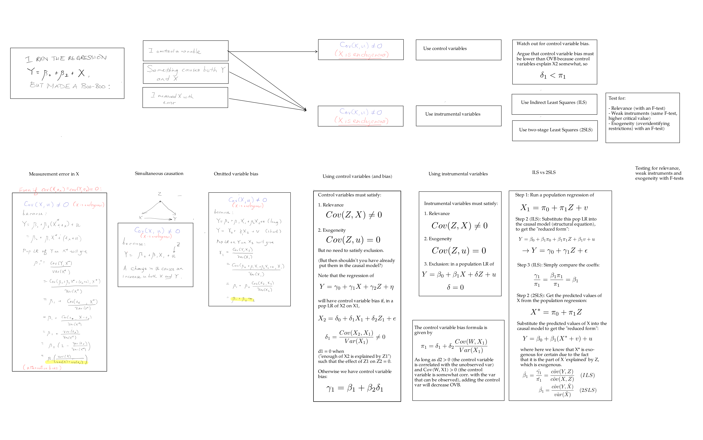

## Introduction

These are notes I (Lieu Zheng Hong) 
wrote for myself while preparing for my Oxford PPE Finals.
Some of my juniors asked for my notes and I am happy to oblige.

These notes are free to all but 
I ask that you do not reproduce them
without first obtaining my express permission.

There are lots of mistakes, omissions, and 
inadequacies in these notes.
I'd love your input to help make these notes better,
by emailing me or
by sending in a pull request at the GitHub repo
[here](https://github.com/lieuzhenghong/ppe-notes/).

Compilation of QE past year questions here:
[QE past-year questions](./QE_PYP_Questions.pdf)

I also have some worked attempts/answers here (which may be wrong!):
[2016 attempt PDF](./2016_attempt.pdf), 
[Hypothesis Testing Answers](./Hypo_Testing_Answers.pdf), 
[OLS Answers](./OLS_answers.pdf), 
[Tutorial 2 Answers](./Tutorial_2_Answers.pdf), 
[Tutorial 5 Answers](./Tutorial_5_Answers.pdf), 

---

## Table of contents

[toc]

---

# Things to take note

Always give economic intuition explanation especially for regression
interpretation questions. Put on your PolSoc hat.

When they ask for interpretation of the coefficient or whatever:
don't just talk about the straightforward interpretation, see if you can talk more about it. Is it (plausibly) the LATE? TOT? ATE of compliers?

When they ask for internal validity: check random assignment (exogeneity) and relevance.

When they ask for external validity: check how close the group under study is to 

# FAQs

## What is the sample average? Why is it a random variable?

Sample average is $\bar{Y}$. It is a random variable because it is a function
of random variables of the population.

## What is the mean, variance and standard error of a Bernoulli random variable?

Let $\hat{p}$ be the sample mean (equivalently written as $\bar{X}$).

$$E \hat{p} = p$$
$$var(X_i) = p(1-p)$$
$$var(\hat{p}) = p(1-p)/n$$
$$se(\hat{p}) = \frac{\hat{sd}(\hat{p})}{\sqrt{n}} = (\frac{\hat{p}(1-\hat{p})}{n})^{1/2}$$

## What is the sampling distribution? 

The distribution of $\bar{Y}$.

## What is the mean and variance of the sampling distribution? Derive them.

$$ E(\bar{Y}) = E(1/n \sum^N Y_i) = 1/n \sum^N EY_i = E[Y] (i.i.d) = \mu_Y $$

$$ var(\bar{Y}) = var(\frac{1}{n}\sum Y_i) = \frac{1}{n^2} var(\sum Y_i) = \sigma^2/n \quad (Y_i \perp Y_j) $$

## What is the Law of Large Numbers (LLN)?

If $Y_i$ are i.i.d with $E(Y_i) \mu_Y$ and $var(Y_i) \ sigma^2_Y < \infty$ then

$$\bar{Y} \rightarrow^p \mu_Y.$$

## What is the Central Limit Theorem (CLT)? What are its assumptions?

Assumptions: Ys must be i.i.d, $0 < var(Y_i) < \infty$.

As $n \rightarrow \infty$, the distribution of

$$\frac{\bar{Y} - \mu_Y}{\sigma^{\bar{Y}}} \sim N(0,1) $$

## What does it mean when we say that $\bar{Y}$ is an *estimator* of $\mu_Y$?

6. An estimator is a random variable that is a function of a sample of data drawn randomly from the population.

## What does it mean for an estimator to be unbiased?

7. An estimator $\hat{a}$ is a consistent estimator of $a$ iff $E(\hat{a}) = a$.

## What does it mean for an estimator to be consistent?

8. $\hat{a}$ is a consistent estimator of $a$ if as N gets large, for any $\epsilon > 0$, the probability that $\hat{a} - a < \epsilon$ tends to zero.

## What does it mean for an estimator to be efficient?

9. An efficient estimator is an estimator that has low variance.

## What does it mean when we say that $\bar{Y}$ is the BLUE of $\mu_Y$?

The Best Linear Unbiased Estimator (BLUE) is the estimator that has the
smallest variance.

## What does it mean for an estimator to be a least squares estimator?

An estimator $m$ minimises the sum of squared differences between the
observations of the sampleand $m$.

## Prove that $\bar{Y}$ is the least squares estimator of $\mu_Y$.

12. Lecture 4 slide 18/20.

## What is the t-statistic?

The t-statistic is any statistic of the form

$$ t = \frac{\hat{\beta} - \beta}{se({\hat{\beta}})} $$

where $se({\hat{\beta}})$ is the standard error of the estimated parameter.
Note the difference between that and $\hat{se}(\beta)$.

The former is the standard error of the estimated parameter, which is something
like the square root of the *variance of the sample mean.*

The latter is the square root of the *sample variance*.

We have the following (replace "sample mean" with "estimated parameter"):

- $Var(X) = \sigma^2$ is the population variance.
- $sd(X) = \sigma$ is the population standard deviation.
- $\hat{Var}(X) = s^2$ is the sample variance.
- $\hat{sd}(X) = \sqrt{\hat{Var}(X)} = s$ is the sample standard deviation.
- $Var(\hat{X})$ is the variance of the sample mean.
- $sd(\hat{X})$ is the standard deviation of the sample mean.
- $se(\hat{X})$ is the standard error of the sample mean. It estimates the
  standard deviation of the sample mean, which is unknown.

The relationship between them is the following:

The sample variance is an unbiased estimator of the population variance. That is,

$$\hat{Var}(X) \equiv s^2 \rightarrow \sigma^2.$$

The variance of the sample mean is equal to the population variance divided by n.

$$ Var(\hat{X}) = \frac{\sigma^2}{n}. $$

This allows us to write the following:

$$ se(\hat{X}) \rightarrow sd(\hat{X}) = \sqrt{Var(\hat{X})} = \sqrt{\frac{\hat{Var}(X)}{n}} =
\hat{sd}(X)/\sqrt{n}$$

## What is the p-value?

p-value or probability value is the probability of obtaining test results at
least as extreme as the results actually observed ($t^{act}$) during the test,
assuming that the null hypothesis is correct.

Entirely equivalently, the p-value is the lowest significance level under which
the null hypothesis would be rejected.

## What is the confidence interval?

An X% two-sided confidence interval for $\mu_Y$ is a random interval that
contains the true value of $\mu_Y$ X% of the time. Given the sample average we
observe in our randomly drawn sample, there is a 95% chance that the true
population mean lies in the interval between A and B. Note that this is a
property of the CLT --- sample means must follow a normal distribution, so we
can make claims about what the population mean *should* be.

- 90% confidence interval is +-1.64SE
- 95% confidence interval is +-1.96SE
- 99% confidence interval is +-2.58SE

## What is the sample covariance? What is its equation?

The sample covariance is the sample analogue of the population covariance. It
is

$$\hat{Cov}(X, Y) = \sum^N_{i=0}(X_i - \bar{X})(Y_i - \bar{Y})$$

## What is the difference between sample variance and the variance of the sample mean?

The sample mean $\bar{Y}$ is a random variable (it is after all a function of
random variables $Y_i$) and, being a random variable, it has a mean
$E[\bar{Y}]$ and a variance $\sigma^2_{\bar{Y}}$. It can be shown that
$E[\bar{Y}] = \mu_Y$ and $Var(\bar{Y}) \equiv \sigma^2_{\bar{Y}} =
\sigma^2_Y/n$.

But we don't know $\sigma_Y$, how can we know $\sigma_{\bar{Y}}$? We need to
estimate the variance of the sample mean. It turns out that we estimate the
*variance of the sample mean* $\sigma^2_{\bar{Y}}$ with what is called the
*sample variance*, $s^2_Y$.

$$ \sigma_{\bar{Y}} \equiv SD(\bar{Y})$$

This can be estimated by the *sample variance*.  $s^2_Y$, the sample variance,
is a random variable, and is a consistent estimator of the variance of the
sample and the population variance.

$$ \hat{sd}(X) = s^2_Y = \frac{1}{n-1} \sum^n_i (Y_i - \bar{Y})^2 \rightarrow
\sigma^2_Y$$

There is also the term "Standard error of $\bar{Y}$", or $SE(\bar{Y})$: this is
equivalent to $\hat{\sigma}_{\bar{Y}}$. The notation is a bit confusing but I
believe 

$$ \hat{\sigma}_{\bar{Y}} \equiv SE(\bar{Y}) $$
$$SE(\bar{Y}) \equiv \hat{\sigma}_{\bar{Y}} \rightarrow \sigma_{\bar{Y}},$$

that is to say that the standard error of $\bar{Y}$ is an estimator of the
standard deviation of $\bar{Y}$. From the previous two equations we can write

$$SE(\bar{Y}) \equiv \hat{\sigma}_{\bar{Y}} = \frac{s_Y}{\sqrt{n}}$$

Not sure what the relationship between all of these things is. I think standard
error of $\bar{Y}$, $SE(\bar{Y})$, is another way to say the sample standard
deviation $s_Y$ divided by $\sqrt{n}$, which is an (unbiased and consistent?)
estimator of the *standard deviation of the sample mean* $\sigma_{\bar{Y}}$.
But why must there be two different terms for the same fucking thing?

So when we are normalising

$$ \frac{(\bar{Y} - \mu_Y)}{\sigma_{\bar{Y}}} $$

we can simply write

$$ \frac{(\bar{Y} - \mu_Y)}{SE(\bar{Y})} $$

Similarly, when doing difference-in-means tests, we can write

$$ \frac{(\bar{Y_a} -\bar{Y_b})}{SE(\bar{Y_a} - \bar{Y_b})}$$

which equals 

$$ SE(\bar{Y_a} - \bar{Y_b}) = \sqrt{\frac{s^2_a}{n_a} + \frac{s^2_b}{n_b}}$$

by the variance rules $Var(A-B) = Var(A) - 2Cov(A,B) + Var(B)$ and here
$Cov(A,B) = 0$ by the fact that A and B are independent samples from different
populations.

## How do we differences-in-means? What is the t-statistic in a differences-in-means test?

### Define the null and alternative hypothesis.

$$H_0: \mu_w = \mu_m$$
$$H_1: \mu_w \neq \mu_m$$

### Under the null, what is the distribution of the test statistic?

The t-statistic for testing differences in means is 

$$ t = \frac{\bar{Y_m} - \bar{Y_w}}{SE(\bar{Y_m} - \bar{Y_w})} $$

When $n_m$ and $n_w$ are large, then by the CLT, the t-statistic has a standard
normal distribution when the null hypothesis is true.

### Specify the significance level of the test, find critical values, and formulate the decision rule.

Suppose we wanted to test the hypothesis at a 5% significance level.

Under the null hypothesis, the distribution of the test statistic is approxmiately standard normal.

At the 5% significance level, the critical value $c_\alpha = 1.96$.

**Decision rule**: reject $H_0$ if $| c_\alpha | > 1.96$.

### Calculate the actual value of the test statistic, $t^{act}$. 

The standard error can be calculated as 

$$ SE(\bar{Y_m} - \bar{Y_w}) = \sqrt{s^2_m/n_m + s^2_w/n_w} $$

Substitute this value into the t-statistic and find $t^{act}$.

### Follow our decision rule and come to a conclusion.

Given that $t^{act} > 1.96$, we reject the null that the means are equal at the 5% level.

## What is an F-test? When do we do an F-test?

- Checking if regression coefficients are significantly different from zero

## How do we do an F-test?

## Show that the residual in the CEF decomposition is mean independent of $X_i$.

## What is OVB with a regression with more than one variable (or with one variable and a set of controls)

Say $X_2$ is omitted but there is a set of controls $Z$.

## Under what circumstances does the LATE equal the TOT? Why?

Only compliers and defiers affect the LATE, because always- and never-takers
always workin a deterministic way. Without defiers, LATE reducse to the average
treatment effect of compliers, and without awlays-takers,  those who are taking
the treatment are the ones who have been offered treatment, so the LATE
recovers the TOT.

# Time-series questions

## What is the population autocorrelation?

The nth population autocovariance is the correlation between Y and its nth lag.

$$ corr(Y_t, Y_{t-j})$$

## What is the sample autocorrelation?

The sample autocorrelation is the sample version of the pop autocorrelation:

$$ \hat{corr}(Y_t, Y_{t-j}) = \frac{1}{T-j-1} \sum^T_{t=j+1} (Y - \bar{Y}_{j+1,
T})(Y_{t-j} = \bar{Y}_{T-j})$$

Why are the subscripts what they are? Let's use some numerical examples to
clear things up. Consider taking the 2nd sample autocorrelation: that is, the
sample correlation of $Y_t$ with $Y_{t-2}$. 

The first sample $\bar{Y}_{j+1, T}$ is the sample mean, counting from $t=3$ to
$t=T$. And the second sample $\bar{Y}_{1, T-j}$ is the sample mean, counting
from $t=1$ to $t=T-j$. This makes sense because when you are doing the
autocorrelation, you can't start measuring autocorrelations until you have
enough lags (in this case, t=3).

## What does it mean for a time series to exhibit *strict stationarity*?

A time series ${Y_t}$ exhibits strict stationarity iff its distribution does
not change over time.

## What does it mean for a time series to exhibit *weak stationarity*?

A time series ${Y_t}$ exhibits weak stationarity iff its first and second
moments (mean, variance and autocovariance) *exist* and are *constant over
time*. They must be finite.

## What is an AR(n) model?

Autoregressive model: a model with (up to) n lags of itself

$$Y_t = \beta_0 + \beta_1 Y_{t-n}$$

## What is the difference between an AR(n) model and an AR(n) process?

## How do we solve the AR(1) process?

We can solve the AR(1) process by backward substitution. Note that $Y_{t-1}$
can itself be written as an AR(1) process, so keep substituting in until we get
LHS $y_t$ and RHS $y_0$.

## What is the first moment, second moment and autocorrelation of the AR(1) process?

If $\beta_1 < 1$  (no unit root), and 
$var(u_t) = \sigma^2$ (constant),

$$ E(Y_0) = \frac{\beta_0}{1- \beta_1}$$
$$ var(Y_0) = \frac{\sigma^2}{1-\beta_1^2} $$

and we can derive the ACF as

$$\rho_j  = corr(Y_t, Y_{t-j}) = \beta^j_1$$

in a similar backwards substitution process.

## What are the sampling properties of OLS?

What allows us to estimate consistently the coefficient on $\beta_l$? In the
regular OLS regression we require i.i.d. But a similar result holds for
non-i.i.d data provided they are weakly stationary and "weakly dependent": that
is, the nth autocovariance $\rho_n \rightarrow 0$ as n tends to infinity.

This is precisely fulfilled when we don't have a unit root in the AR(1) model,
because $\rho_j  = corr(Y_t, Y_{t-j}) = \beta^j_1$, and anything <1 taken to a
power tends to 0.

> In the AR(1) model, the idea is that the influence of Y(t-j) on Y_t is going
> to be very small because $\beta_1 < 1$ and thus that raised to a power j is
> going to tend to 0 as t gets large.

## What is the difference between a predicted value and a forecast?

predicted values are in-sample, forecast are out-of-sample

## What's the difference between $\hat{Y}_{t | t-1}$ and $Y_{t | t-1}$?

$Y_{t | t-1}$ is the forecast given all the data from $t=0$ to $t-1$
using the population (true unknown) coefficients.

$\hat{Y}_{t | t-1}$ is the "sample" forecast using the coefficients
$\hat{beta_0}$, $\hat{beta_1}$ that were estimated in the OLS regression.

## What is RMSFE? Define it, give the equation.

The one-period ahead forecast error is

$$Y_t - \hat{Y}_{t | t-1},$$

that is to say, the difference between the actual out-of-sample value $Y_t$ and
the predicted value

*Root-mean-squared-forecast-error*

The RMSFE is 

$$\sqrt{E[Y_t - \hat{Y}_{t | t-1}]}, $$

a measure of the magnitude of the typical forecasting "mistake".

If we look at the error here,

$$Y_t - \hat{Y}_{t | t-1},$$

it can be decomposed into the genuinely unforecastable error (random shocks),
and the forecast error due to estimation error of our coefficients.  That is to
say, 

$$Y_t - \hat{Y}_{t | t-1} + (Y_{t|t-1} + \hat{Y}_{t|t-1}) = u_t + (\beta_0 +
\hat{\beta}_0) + (\beta_1 + \hat{\beta_1})Y_{t-1}$$

The bigger our sample, the lower the estimation error will become, but the
genuinely unforecastable error will not decrease.

## What is Granger causality?

$X_t$ Granger-causes $Y_t$ if including lags of $X_t$ helps to predict $Y_t$
over and above just lags of $Y_t$.

$$ E(Y_t|Y_{t-1}, Y_{t-2} ... X_{t-1}, X_{t-2}) \neq E(Y_t | Y_{t-1}, Y_{t-2} ..) $$ 

The Granger causality statistic is the F-statistic testing the hypothesis that
the coefficient on all the values of one of the variables are zero. This
implies that the regressors have no predictive content for $Y_t$ beyond that
contained in the other regressors.

### Worked example: **Does unemployment Granger-cause inflation?**

If we have an ADL(1,1) model

$$\Delta Inf_t = \beta_0 + \beta_1 |Delta Inf_{t-1} + \delta_1 Unrate_{t-1} +
\delta_2 Unrate_{t+2} + u_t$$

we test whether lags of Unrate are significant with the following F-test:

$$ H_0: \delta_1 = \delta_2 = 0 $$
$$ H_1: \delta_1 \neq 0 \quad \textrm{or} \quad \delta_2 \neq 0 $$

## What does it mean for a time series to exhibit a *deterministic trend*?

A time series exhibits a deterministic trend if it has a trend that is a
deterministic function of time:

$$Y_t + \alpha t + \beta_0 + \beta_1 Y_{t-1} $$

where $\alpha$ is some constant.

## What does it mean for a time series to be trend stationary?

If it exhibits stationary deviations from a deterministic trend (i.e. once you
remove the deterministic trend it becomes stationary)

## What does it mean for a time series to exhibit a *stochastic trend*?

Basically just a random walk (or a random walk with trend)

$$ Y_t = Y_{t-1} + u_t $$

or

$$ Y_t = \alpha_1 + Y_{t-1} + u_t $$

Solving backwards we obtain

$$ Y_t = \alpha_1 t + \sum^t_{j=1} u_j $$

## What is the equation of a random walk with drift?

$$ Y_t = \alpha_1 + Y_{t-1} + u_t $$

## What are the mean, variance and covariance of a random walk with drift?

We have the random walk with drift as 

$$ Y_t = \alpha_1 t + \sum^t_{j=1} u_j $$

Assuming that $u_j$ is *i.i.d* with distribution $(0, \sigma^2)$,

$$E(Y_t) = \alpha_1 t, $$
$$var(Y_t) = var(\sum^t_{j=1} u_j) = t\sigma^2,$$
$$cov(Y_t, Y_{t-j}) = (t-j)\sigma^2$$

## How do we detrend a determinstic trend?

Regress $Y_t$ on a deterministic function of time and take the residuals.

$$Y_t = \alpha_0 + \alpha_1 t$$

## How do we detrend a stochastic trend?

Take first differences.

## What is order of integration?

We say that $Y_t$ is integrated of order $x$ if $Y_t$ must be differenced $x$
times to remove its stochastic trend.

## What is a unit root? What issues arise when we have a unit root?

A unit root is a stochastic trend.

$$ Y_t = \beta_0 + \beta_1 Y_{t-1} + u_t$$

where $\beta_1 = 1$.

There are two issues with a unit root:

$$E(\hat{B_1}^{OLS}) = 1 - \frac{5.3}{T} $$

Firstly, the distribution of the OLS estimator and the t-statistic is not normal even in
large saples. We can't use normal critical values, we will get a biased OLS
estimate.

Secondly, you get *spurious regression*: stochastic trends can make two
unrelated time series appear related. Stochastically trending processes will
tend to correlate with any other process that exhibits a trend. We will
spuriously reject the null of no relationship as sample increases.

## How do we test for a stochastic trend/unit root? Be explicit about the procedure

Do an F-test: subtract $Y_{t-1}$ from both sides of an AR(1) model.

$$\Delta Y_t = \beta_0 + \delta Y_{t-1} + u_t ,$$

where $\delta = \beta_1 - 1$

Then test the null hypothesis with an F-test with $H_0 = delta=0$

Use the Dickey-Fuller critical values, *not* the normal critical values.

## What's the difference between the Dickey-Fuller, the DF with trend, and the ADF? When do we use what?

- Dickey-Fuller: standard unit test 
- DF with trend: unit test with deterministic trend
- ADF: Augment the DF regression model with lags of $\Delta Y_t$ in the RHS:

$$\Delta Y_t = \beta_0 + \alpha t + \delta Y_{t-1} + \sum^p_{j=1} \delta_j
\Delta Y_{t-j} + u_t $$

## What's the problem with a break?

They cause in-sample estimates of coefficients to be biased and destroy the
external validity of time series models

## How do we test for a break when the break date is known?

Chow test: just a standard F test. Have a dummy variable 0 before the break, 1
after the break.

Estimate

$$Y_t = \beta_0 + \beta_1 X_t + \gamma_0 D_{\tau, t} + \gamma_1 D_{\tau, t} X_t + u_t $$

Test the null hypothesis that $H_0 : \gamma_0 = \gamma_1 = 0.$

## How do we test for a break when the break date is unknown?

QLR test: do the Chow test for multiple breaks and take the maximum critical values

## How do we test for a break when there can be multiple breaks?

You can't

## What's the Chow test?

## What's the QLR test?

## What is cointegration?

When two variables are related by some common constant:

$Y_t = \theta X_t$

### What is the cointegrating coefficient?

The $\theta$ in $Y_t = \theta X_t$

## How do we test for cointegration when the cointegrating coefficient is known?

[TODO]

## How do we test for cointegration when the cointegrating coefficient is unknown?

[TODO]

If we know that Y and X are cointegrated, then by taking first difference of Y_t, we have removed the spurious regression.

The idea here is that if $\delta Y_t$ is positive, we subtract a bit
($\lambda$) from $Y_{t-1}$ to "correct" for this

The parameter $\lambda$ tells us how much $Y_t$ adjusts to disturbances in eqm

You have the short-run relationship (which is just the differences) and the
long run relationship

Where $\alpha$ and $\beta$ are known, estimate these with Engel and Granger.

## What is h-step ahead RMSFE? Derive it for h = 1, 2, 3, 4.

# Steps for hypothesis testing

1. Define the null and alternative hypothesis.
2. Under the null hypothesis, what is the distribution of the test statistic?
3. Specify significance levels, calculate confidence intervals and critical values.
4. Come up with a decision rule: "Reject $H_0$ if $t^{act} > c_\alpha$"
4. Calculate the actual value of the test statistic from the data.
5. Reject the null hypothesis if the t-statistic is larger than the critical value.

# How to actually run a hypothesis test

# Notes on hypothesis testing

In order to use the CLT,

$$\frac{\bar{Y} - \mu_Y}{\sigma_{\bar{Y}}} ~ N(0,1)$$

you need to derive that $E(\bar{Y}) = \mu_Y$ and $Var(\bar{Y}) =
\frac{\sigma_Y^2}{n}$ first.

The sample average $\bar{Y}$ is randomly distributed with $N ~ (\mu_Y, \sigma^2_Y/n)$.

The t-statistic is a random variable. It is given by

$$t = \frac{\bar{Y} - \mu_Y}{SE(\bar{Y})}$$

The actual calculated test statistic, $t^{act}$, is just a number that you get
when you plug all of that in.

# Hypothesis testing on regression parameters

$$ \omega_{\beta_1} = \frac{E(X_i - EX_i)^2 u_i^2}{[E(X_i - EX_i)^2]^2}$$

$$ sd(\hat{\beta_1}) = \frac{1}{\sqrt{n}} \omega_{\beta_1} $$

$$ se(\hat{\beta_1}) = \frac{1}{\sqrt{n}} \hat{\omega_{\beta_1}} $$

## p-values

## Testing the hypothesis that one sample mean is greater than another.

Remember that the standard errors must be added together.

# Regression analysis and interpretation

## Flowchart for regression testing

Check flowchart PNG

## I added a new variable in my regression. Should I expect the standard error on my coefficient of interest to go up or down?

**TLDR**: It depends on the covariances. On the one hand, the new variable
will explain somewhat the dependent variable, which causes standard error
to go down; on the other hand, ... 

Assuming homoskedasticity, the standard error for $\hat{\beta_1}$ can be written as 

$$ se(\hat{\beta}_1) = (\frac{1}{n}
\frac{\hat{var}(u)}{\hat{var}(\widetilde{X}_1)})^\frac{1}{2}$$

where $\widetilde{X}_1$ is the residual from an OLS regression of $X_1$
on $(X_2, ..., X_k)$.

Let's use an example to make things clearer. Suppose you had the regression

$$ Wages = \beta_0 + \beta_1 Experience + u $$

Now we want to add a new variable, gender, to the regression to get the "long"
regression:

$$ Wages = \gamma_0 + \gamma_1 Experience + \gamma_2 Gender + v $$

What will happen to the standard error of the coefficient? Well, gender should
explain wages to some extent, so we expect $var(u)$ to go down. On the other
hand, $\widetilde{Experience}_1$ is the residual from an OLS regression of
Experience on Gender:

$$ Experience = \pi_0 + \pi_1 Gender + \widetilde{Experience}_1 $$

and given that some of experience is explained by gender (maybe men have more
years in the workforce in general --- no break for childbearing), 
$var(\widetilde{X}_1)$ will decrease.

So the overall effect is ambiguous. But in general, if

$$ Cov(Gender, Wages) > Cov(Gender, Experience), $$

Cov(Gender, Experience) is $\pi_1$

Cov(Gender, Wages) is $\gamma_2$

that is, gender explains wages more than it explains experience, then the
standard error will go down when adding more regressors.

The intuition is that the former is the decrease in the residual $u$ of the
short regression: the higher Cov(Gender, Wages) is, the more of wages is
explained, and the lower $u$ falls.

The latter is the decrease in the variance of experience after it has been
explained by gender. The higher Cov(Gender, Experience) is, the more gender is
explained by experience, and the smaller the residual X_tilde_whatever is going
to be.

## Should I include a new variable in my regression?

**TLDR**: Not if your new factor is possibly endogenous, beacuse that will
cause all the other variables to be estimated with error. You should *only* add
new variables if they are exogenous with the error term!

Suppose you had the regression

$$ Wages = \beta_0 + \beta_2 Gender + u $$

and we had good reason to believe that gender was exogenous with the error
term (OR); that is, $Cov(Gender, u) = 0$.

Now suppose someone suggests that you add occupation into the regression to
get a "cleaner estimate" of the wage effect. That is,

$$ Wages = \gamma_0 + \gamma_1 Gender + \gamma_2 Occupation + v $$

It's true that if occupation was exogenous this would indeed increase the
precision of the estimate. This is because

$$ se(\hat{\beta_1}) = \frac{\hat{var}(u)}{\hat{var}(\widetilde{x})} $$

and given that occupation explains some part of wages, and is exogenous with
gender (what we assumed), only $var(u)$ will go down, $var(\widetilde{x})$ will
remain unchanged.

But this is only if $Cov(Occupation, v) = 0$! If occupation is endogenous (for
instance, if ability determines occupation and wages), then this would cause
the OLS estimates of all the variables (including the coeff on gender which was
previously the correct causal interpretation) to be wrongly estimated.

## What is the formula for omitted variable bias (OVB) for a regression with more than one variable?

Set up the "short" and "long" regressions, and substitute the long regression into the short regression giving you $\beta_1$:

$$ \beta_1 = \beta_1  + \beta_2 \frac{Cov(X_2, \widetilde{X_1})}{Var(\widetilde{X_1})} $$

## How do we test an instrument for exogeneity?

We run an F-test on the coefficients of the regressions agains the residuals.

$$ \hat{u} = Y - \hat{\beta_0} + \hat{\beta_1} X $$

and we check if $\beta_1 = 0$. We can never prove that an instrument is
exogenous. We can only fail to reject the null of exogeneity.

## How do we test an instrument for exclusion?

You can't! This is a story about the causal model you have to tell.

## What's the difference between exclusion and exogeneity?

Definition of exclusion: consider a (possibly endogenous) variable X and a
proposed instrumental variable Z. In a causal model of Y on X and Z, the
coefficient on Z should be zero: that is, Z has no effect on Y other than
through X.

Angrist (1990) gives an example of an exogenous instrumental variable that was
not endogenous. Angrist wanted to find the effect of serving in the military
on wages. So he would like to run the following regression:

$$ Wage = \beta_0 + \beta_1 MilSvc + u $$

But of course military service is endogenous with the error term here. So
instead he used the fact that people were drawn in a lottery to be drafted for
the Vietnam War. Is this IV exogenous? Surely so. It was randomly assigned i.e.
it can't be correlated with anything.

But does it satisfy *exclusion*? In fact, no. Because of the fact that you
couldn't be drafted if you were in school, people who got picked to join might
have stayed in school longer, continuing further study, which would have an
effect on their wages. So in the following causal model

$$ Wage = \delta_0 + \delta_1 MilSvc + \delta_2 Lottery + v $$

$\delta_2 \neq 0$ and thus exclusion is not satisfied.

## How do we test an instrument for relevance?

Suppose we have the "short" regression

$$ Y = \beta_0 + \beta_1 X + \beta_2 Z + u $$

where Z is a vector of control variables, and X is possibly endogenous. We wish
to instrument X with D and so we run the following first-stage regression:

$$ X = \gamma_0 + \gamma_1 D + \gamma_2 Z + v $$

We set up the following hypothesis test:

$$ H_0: \gamma_1 = 0 $$
$$ H_1: \gamma_1 \neq 0 $$

and we do an F-test by looking at the sum of squared residuals in the
*restricted model* setting $\gamma = 0$ and in the *unrestricted* model (that
ILS regression):

$$ LR = \frac {SSR_{rs} - SSR_{un}}{SSR_{un}/(n-k-1)} \rightarrow \chi_q^2$$

If the F-statistic is sufficiently greater then 0, than the instrument is
relevant; if the F-statistic is greater than 10, than the instrument is
relevant.

# Heterogeneity

We are interested in the causal effect of X on Y, and the magnitude of that
effect is $\beta_1$.

The key additional assumption to make in the case of heterogeneity is that 

$$\mathrm{E}[\beta_{1i} | X_i] = \mathrm{E}\beta_{1i} , $$

that is to say, that the average causal effect of the treatment does not vary
systematically with the treatment. For instance, if $X_i$ was a skills learning
program and smarter people were more likely to be offered the treatment $X_i =
1$, then 

$$\mathrm{E}[\beta_1 | X_i = 1] > \mathrm{E}[\beta_1 | X_i = 0]$$

This mean independence assumption is usually stated as a stronger independence
assumption: both $\beta_{0i}$ and $\beta_{1i}$ are independent of $X_i$.

## Selection bias

Selection bias is the difference in the untreated outcomes between people who
were treated, and people who were not:

Among the people who were treated, what would be their potential outcomes if
they were not treated? That is to say, what is $Y_{0i} | D_i = 1$, or entirely
equivalently, $\mathrm{E}[\beta_{0i} | D_i = 1]$?

And among the people who were *not* treated, what is their outcome?  That is to
say, what is $Y_{0i} | D_i = 0$, or entirely equivalently,
$\mathrm{E}[\beta_{0i} | D_i = 0]$?

The difference between these two groups is selection bias. Going back to the
running example, if you choose only smart people to participate in your skills
learning program, then selection bias would be positive.

When the independence assumption fails, the OLS regression consistently
estimates the TOT + SB where TOT is the treatment on the treated and the SB is
the selection bias term.

# R stuff

## F-test

`linearHypothesis(model, matchCoefs(model, "regex_string_of_coeffs_to_match"), test = "F"`

## Instrument exogeneity

Slide 123

1. Compute the 2SLS residuals
2. Perform a homoskedasticity-only F-test for the null that the
   coeffs on the instruments are null

## Instrumental variables estimation in R

Suppose we want to estimate this model

`lwage = \beta_0 + \beta_1 educ + {demog, family} + u`

using `nearc4` as an instrumental variable for `educ`.

We can do it in three ways: ILS, manual 2SLS, and full 2SLS

### ILS

First stage:

`fs = lm_robust(educ ~ nearc4 + demog + family, data=prox)`

Reduced form:

`rf = lm_robust(lwage ~ nearc4 + demog + family, data = prox)`

ILS estimate:

rf$coef['nearc4'] / fs$coef['nearc4']

### Manual 2SLS

Second stage: use `fitted.values`

`ss = lm_robust(lwage ~ fs$fitted.values + demog + family, data=prox)`

But standard errors are not valid.

### Automated 2SLS

`iv_robust(lwage ~ educ + demog + family | nearc4 + demog + family, data = prox)`

