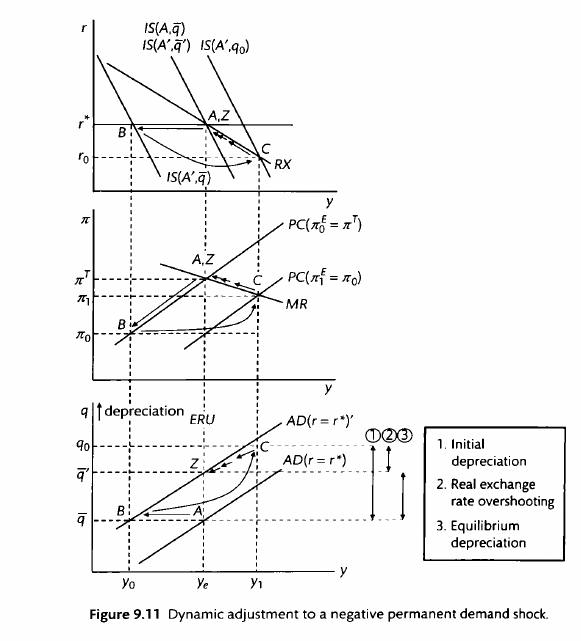

\pagebreak
\tableofcontents
\pagebreak

Download the PDF [here](notes.pdf).
**TODO:** autogenerate PDF using a GitHub action after every merged PR.

[toc]

# Key equations in all the models

## IS-PC-MR model

From Celine (rework):

> We assume a closed economy with imperfect competition on the supply side and
flexible wages and prices, which can be set according to the trade unions' and
firms' objectives respectively. Further, we assume an inflation targeting CB
with a static loss function and adaptive expectations of private sector agents.
The IS curve captures the negative correlation between interest rates and
output, as higher interest rates dampen investments and hence decrease output.
There is a one period transmission lag. The positive correlation between output
and inflation is denoted by the Phillips curve (PC). The PC is upward sloping,
because away from equilibrium, demands of higher wages lead to increases in
inflation as firms have a last mover advantage. 

The steepness of the PC is determined by the relative slopes of the WS and PS
curves - this captures how aggressive the wage-price mechanism between firms
and worker unions is. The Monetary Rule (MR) shows the CB’s set of best
responses, that is, the “optimal” trade-off between inflation and output. It is
obtained by minimizing the CB’s convex loss function subject to the PC
constraint. 

$$IS: (y_t - y_e) = -a(r_{t-1} - r_e)$$
$$AEPC: \pi_t = \pi_{t}^e + \alpha(y_t - y_e)$$
$$MR: \pi_t = \pi^T + \frac{y_t - y^T}{\alpha \beta}$$ 

Static loss function:

$$ L = (y_t - y^T)^2 + \beta(\pi_t - \pi^T)^2 $$

Dynamic loss function:

$$ L = \sum^{\infty}_{i=0} (\frac{1}{1+\delta})^i L_{t+i} $$

## NKPC

$$NKPC: \pi_t = E_t \pi_{t+1} + k(y_t - y_e) $$

where $k = \frac{\alpha \lambda}{1- \lambda},$ and $\lambda$ is the proportion
of firms who get to set prices costlessly.

There is also an equivalent formulation of the NKPC:

$$\pi_t = \pi^T + E_t \sum^\infty_{i=0} k(y_{t+i} - y_e) $$

## REPC

$$REPC: \pi_t = E_{t-1} \pi{t} + a(y_t - y_e), $$

Interpretation: inflation today is formed by expectations of all information
from the past that is available. $E_{t-1} \pi_t$ means expectation of $\pi_t$
from all information available at the end of period $t-1$.

## Long-term interest rates

$$ i^n_t = \frac{i_t + E_t i_{t+1} + E_t i_{t+2} + E_t i_{t+3} + ...}{n} + \theta^n_t $$

## Open economy model

$$UIP: i-i^{*} = e^E_{t+1} - e_t.$$
$$IS: y_t = A_t - ar_{t-1} + bq{t-1}$$

$$AD: A - ar^{*} + bq$$

The AD curve is defined as the output-exchange rate tradeoff in the MRE. It
combines the IS and the UIP to get a relationship between the real exhcange
rate and output. We cannot be off the AD curve. The AD is the medium-run
equilibrium. No time subscripts

$$BT: y^{BT} = B(\sigma, y^{*}, m) + cq$$

## Solow growth model

$$ Y = AK^\alpha N^{1-\alpha} $$
$$ \frac{Y}{N} = A \frac{K^\alpha}{N} \frac{N}{N^{\alpha}} $$
$$ y = Ak^\alpha $$

### Growth rate of capital and output

$$g_K = \frac{\dot{K}}{K} = sAk^{\alpha -1} - \delta$$

which tells us that the growth of the capital stock actually *decreases* with
per-capita capital. Because $\alpha - 1 < 0$, $k^{\alpha-1}$ decreases as $k$
increases. This makes sense precisely because of diminishing returns. The more
capital you have, the slower capital grows.
Finally, let's look at the growth rate of output, $g_Y$. We start with the
Cobb-Douglas production function (letting A =1 for simplicity), take logs, and
differentiate to get:

$$\begin{align}
Y &= K^\alpha N^{1-\alpha}\\
\log Y &= \alpha \log K + (1-\alpha) \log N\\
\frac{d \log Y}{dY}\frac{dY}{dt} &= \alpha \frac{d \log K}{dK} \frac{dK}{dt} + (1-\alpha) \frac{d \log N}{dN} \frac{dN}{dt}\\
\frac{\dot{Y}}{Y} &= \alpha \frac{\dot{K}}{K} + (1-\alpha) \frac{\dot{N}}{N}\\
g_Y &= \alpha g_K + (1-\alpha) n.
\end{align}$$

The expression is easily understood. The growth of output is a weighted sum of
the growth of capital and the growth of the labour force, with weights equal to
each factor of production's contribution to the production function.

### Harrod-Domar formula

$$\frac{K}{Y} = \frac{s}{n+\delta}$$

### Fundamental Solow Equation of Motion

$$\dot{k} = sAk^{\alpha} - (n + \delta)k.$$

### Steady-state values of capital and output under the Solow model

We know that at the steady state, the ratio of capital to labour does not
change: that is: $\dot{k} = 0$. With this, and the Fundamental Solow Equation
of Motion, we have:

$$\begin{align}
\dot{k} &= sAk^{\alpha} - (n + \delta)k \\
sAk^{\alpha} &= (n + \delta)k \\
\dot{k} &= (\frac{sA}{n+\delta})^{\frac{1}{1-\alpha}}
\end{align}$$

Given that $y = Ak^\alpha$, we can also solve for $y^{*}$, to obtain:

$$y^{*} = A^{\frac{1}{1-\alpha}} (\frac{s}{n+\delta})^{\frac{\alpha}{1-\alpha}}$$

## Romer and Jones

$$ Y = A ^\sigma L_y $$
$$ \dot{A} = A \delta L_A^\phi $$

Romer:

$$g_Y = \sigma \delta s L $$

Jones:

$$g_Y = \frac{\sigma n}{1 - \phi} $$

### Derivation of growth rates of capita and output

We know that $g_A = \dot{A}/A$ and thus $g_A = \delta L_A A^{\phi-1}$.

Take logs of both sides of $g_A = \delta L_A A^{\phi-1}$ and differentiating with respect to time gives us

$$ \frac{\dot{g_A}}{g_A} = n + (\phi-1)g_A.$$

Multiply both sides of the equation by $g_A$:

$$ \dot{g_A} = n g_A + (\phi-1) g_A^2$$

Given that $\phi<1$, and in the steady-state BGP the growth of the growth rate $\dot{g_A} = 0$, we divide both sides by $g_A$ to get:

$$n+ (\phi -1) g_A = 0 $$ 

Rearrange to get the desired expression:

$$g_A^* = \frac{n}{1-\phi}$$

The second equation is just the result above multiplied by $\sigma$:

$$g_Y = g_A \sigma =  \frac{\sigma n}{1-\phi}$$

## Acemoglu's directed technological change

$$Y = ((A_h H)^\rho + (A_l L)^\rho)^{1/\rho}$$ 

As this is a competitive labour market, the wages of high- and low- skilled workers must equal their marginal productivities $MPH$ and
$MPL$. Some algebra gives us the following: 

$$w_L = \frac{\partial Y}{\partial L} = Ap_l [Ap_l + Ap_h(H/L)p]^{\frac{1-p}{p}}$$ 
$$w_H = \frac{\partial Y}{\partial H} = Ap_h [Ap_h + Ap_l(H/L)^{-p}]^{\frac{1-p}{p}}$$ 

The skill premium, $\omega$, is given by the ratio of $w _H$ to $w_L$. After taking logarithms on both sides, we obtain 

$$\ln \omega = \frac{\sigma-1}{\sigma} \ln(\frac{A_h}{A_l}) -
\frac{1}{\sigma}\ln(\frac{H}{L})$$ 

where $\sigma$ is the elasticity of substitution: 
$\sigma \equiv \frac{1}{1-\rho}.$ 

This gives us

$$\frac{A_h}{A_l} = (\frac{H}{L})^{\sigma - 1}$$

This gives the result that when $\sigma > 1$, more technology will be produced
for the higher-skilled worker if H/L increases (i.e. the market size effect
dominates). This is something we previously assumed in the exogenous case, but
now we have derived it.

We've shown that if $\sigma > 1$, more technology will be produced for the
higher-skilled worker if $H/L$ increases. But what about the skill premium? The
relative wages of skilled workers (the *skill premium*) will increase if
$\sigma > 2$. The skill premium $\omega$ can be obtained as follows:

\begin{equation}
\omega \equiv \frac{w_H}{w_L} = \left(\frac{A_H}{A_L}\right)^\rho \left(\frac{H}{L}\right)^{-(1-\rho)}
\end{equation}

Substituting the result we got for $\frac{A_h}{A_l}$ into the equation, as
well as the fact that $\sigma \equiv \frac{1}{1-\rho}$, we obtain

$$ \omega = \left(\frac{H}{L}\right)^{\sigma-2} $$

## Intertemporal consumption

$$PV: E[\sum^\infty_{t=0} \frac{c_t}{(1+r)^t}] = E[\sum^\infty_{t=0}
\frac{y_t}{(1+r)^t}] + (1+r)A_0 $$

The interpretation of this budget constraint is that the expected total future
consumption (LHS) must be equal to the total expected income plus whatever
initial endowment the household had in the beginning ($A_0$). This is called
the present value (PV) constraint.

### Euler equation

The household maximises expected utility subject to the PV constraint. It can
be shown that the first order conditions imply that for any $t$,

$$MU(c_t) = \beta (1+r) E[MU(c_{t+1})]$$

This is the *Euler equation*.

### PIH

$$PIH: MU(c_t) = \beta (1+r) E[MU(c_{t+1})], $$

which holds for all values of t. That means that MU is expected to be constant
(assuming that $\beta(1+r) = 1$)

### Hall's random walk model

## RBC

In the RBC model, we assume a simple Cobb-Douglas production function that
depends on both labour and capital. We use a Solow-Swan growth model to
endogenise the savings rate, explaining *how* and why households save: because
they get the marginal productivity of capital.

The production function is given by

$$Y_t = A_tF(K_t, L_t) $$

We assume perfect factor markets. Profit maximisation by firms means that wages
and interest rates equal the marginal products of labour and capital
respectively:

$$r_t = A_t \frac{\partial F(K_t, L_t)}{\partial K_t} \equiv MPK_t$$
$$w_t = A_t \frac{\partial F(K_t, L_t)}{\partial L_t} \equiv MPL_t$$

Importantly, We can see that $r$ and $w$ depend positively on $A$, but $w$
increases with the $K/L$ ratio while $r$ decreases.

The Cobb-Douglas production function has constant returns to scale.

$$r_t K_t + w_t L_t = A_tF(K_t, L_t) = Y_t $$

Households optimally allocate time between labour and leisure, and trade-off
consumption and saving. All savings are invested and become capital in the next
period. Households maximise their intertemporal utility function

$$ max E[\sum^\infty_{t=0} \beta^t u(C_t, L_t). $$

Households' savings accumulate as capital according to the following capital
accumulation equation:

$$K_{t+1} = Y_t - C_t + (1-\delta) K_t $$

There are three key equations:

1. the consumption Euler equation (trading off consumption now v. consumption
   later),

$$ MU(C_t) = \beta E[MU(C_{t+1})(1-\delta+r_{t+1})].$$ 

2. the *intratemporal* labour supply equation (trading off labour and
   consumption within a singular period), and 

$$ w_t MU(C_t) = - MU(L_t) $$

3. the *intertemporal* labour supply Euler equation (trading off working now v.
   working later)

$$ -MU(L_t) = - \beta E[MU(L_{t+1})\frac{w_t}{w_{t+1}}(1 - \delta + r_{t+1})].
$$ 

One key assumption is that a permanent increase in the real wage (such as the
one associated with technical progress) generates exactly offsetting income and
substitution effects such that labour and leisure are left unchanged. This is
meant to match the empirical fact that despite increased labour productivity,
hours worked have not changed in many decades.

An implication of this is that labour supply will rise in response to a
temporary productivity increase, since the income effect is much smaller with a
temporary shock.

\pagebreak

# The IS-PC-MR model

## Microfoundations of the PC curve

WS-PS model

## The IS-PC-MR model

$$IS: (y_t - y_e) = -a(r_{t-1} - r_e)$$
$$PC: \pi_t = \pi_{t}^e + \alpha(y_t - y_e)$$
$$MR: \pi_t = \pi^T + \frac{y_t - y^T}{\alpha \beta}$$ 

Substituting the IS curve into the MR curve gives 

$$MR: r_{t-1} - r_e  = \frac{1}{a(\alpha + \frac{1}{\alpha\beta})} (\pi_{t-1} - \pi^T) $$

where $a$ is the economy's sensitivity to interest rate changes, $\alpha$ is
the slope of the Philips Curve, and $\beta$ is the central bank's inflation
aversion.

## Determinants of the PC

The slope of the PC is determined straightforwardly by the slopes of the WS and
PS curves. The slopes of the WS and PS curves are themselves determined by
marginal productivity of labour, bargaining power/monopsony power, etc.

## Determinants of the MR curve

The slope of the MR curve is determined by the $a$, $\alpha$ and the $\beta$
coefficient.

The effect of $a$ and $\beta$ are straightforward. A greater $\beta$ makes the
central bank more risk-averse and thus flattens the MR curve: the central bank
is willing to trade off more output in order to control inflation. A greater
$a$

The effect of $\alpha$ is ambiguous, however. It's basically identical to the
contrained optimisation problem of labour and leisure. As $\alpha$ increases
(denoting a steeper PC), monetary policy is more effective, and it's easier for
the central bank to control inflation, so it needs to do less of it.

At the same time, however, a steeper PC flattens the MR curve, and so the bank
is more willing to do more. (Substitution effect).

The overall effect is similar to a worker trading off labour and leisure, and
the wage rate increasing. By the income effect, the worker can afford to work
less, but at the same time, the substitution effect means the worker wants to
work more.

In Chris Bowdler slides, he takes the partial derivative of 
$\frac{1}{a (\alpha + \frac{1}{\alpha\beta})}$ 
and finds that the first effect dominates iff when
$\alpha^2\beta > 1$. That is to say, an increase in $\alpha$ causes a
decrease in the central bank's chosen inflation reduction when 
$\alpha^2\beta > 1$.

With what we know now, we can easily answer this PYP question:

> 2014 Part A: Suppose that at low levels of inflation, the coefficient on the
output gap in the Phillips curve decreases in size. If monetary policy makers
care equally about the output gap and inflation, what are the implications for
the monetary rule curve?

This is basically saying that $\alpha$ increases as the gap $\pi_t - \pi_e$
increases. What are the implications? Well, as we mentioned, the flatter
Philips Curve could have two effects: it makes monetary policy less effective,
which means the central bank wants to do more and less of it. Which effect
dominates depends on $beta$. The larger $beta$ is, the more likely that the
central bank will want to do more.

## Types of different shocks

- Demand shock 
- Cost-push shock
- Productivity shock
- Bargaining power shock

- Unobserved/observed? One period, two periods, permanent?
- Under AE? RE? Static or dynamic loss function?

We note that central banks can always react immediately, but changes
in interest rates need one period to take effect.

### A one-period positive demand shock

Consider the simplest possible shock: a one-period unexpected positive demand
shock under adaptive expectations and a static loss function. What happens?
This happens *all* the time, and it can be quite tricky. The key is to be very
clear about what happens when. I find it helpful to think of the central bank
as acting *between* periods, like a "end-of-turn" effect.

t=0: We start at O, the equilibrium. There is an unexpected demand shock that
causes the IS curve to shift to the right, from O to B. This causes inflation
and output to also move from equilibria of $\pi_e$ to $\pi_{'}$ and $Y_e$ to
$Y_{'}$ (in blue).

t=0: Upon observing the shock, the central bank responds immediately. It needs
to hike rates. But what rate should it choose? Knowing that inflation
expectations will rise next period from $PC$ to $PC^{'}$ (blue), it chooses a
rate that is its best response to that PC --- the intersection of $PC^{'}$ and
MR. Working under the assumption that the shock is temporary, and the IS curve
will go back to normal next period, it thus hikes rates to $r^{'}$ to reach
point C on the old IS curve (in green). But there is no effect of output due to
the one period lag of policy transmission.

t=1: The rates take effect. As mentioned, the PC shifts up due to heightened
inflation, and due to the bank's heightened interest rates the output drops
from $Y^{'}$ to $Y^{''}$. We are now at point C.

t=2 onward: We slowly move back to equilibrium. The bank slowly reduces
interest rates and the PC slowly falls until we are back at point O.

### A two-period positive demand shock

Now let's consider a simple extension of the one-period positive demand shock.
Consider a shock that is unexpected, but upon arrival we know that it will last
for exactly two periods. How does this change the analysis? Turns out, not much.

t=0: We start at O, the equilibrium. There is an unexpected demand shock that
causes the IS curve to shift to the right, from O to B. This causes inflation
and output to also move from equilibria of $\pi_e$ to $\pi_{'}$ and $Y_e$ to
$Y_{'}$ (in blue).

t=0: Upon observing the shock, the central bank responds immediately. It needs
to hike rates. But what rate should it choose? Knowing that inflation
expectations will rise next period from $PC$ to $PC^{'}$ (blue), it chooses a
rate that is its best response to that PC --- the intersection of $PC^{'}$ and
MR. In contrast with the one-period demand shock, it knows that the shock will
last for another period, and so it hikes rates not to $r^{'}$ in green, but
$r^{''}$ in red, to reach point C on the graph. Again, there is no effect of
output due to the one period lag of policy transmission.

t=1: The rates take effect. As mentioned, the PC shifts up due to heightened
inflation, and due to the bank's heightened interest rates the output drops
from $Y^{'}$ (blue) to $Y^{'}$ (red). We are now at point C. The central bank
knows that the IS curve will fall back to normal, and the PC will move from
$PC^{'}$ to $PC^{''}$, so it lowers rates to reach point D on the equilibrium.

t=2: We move to point D.

t=3 onward: We slowly move back to equilibrium. The bank slowly reduces
interest rates and the PC slowly falls until we are back at point O.

### A permanent negative demand shock

Finally, let's look at a permanent fall in demand. This is actually quite easy.
The IS moves permanently from $IS$ to $IS^{'}$. Everything else is the same.

The key is to look at the right hand side. We can see that while interest rates
fall immediately, the change isn't reflected in either output or inflation
until the next period.

### An unexpected one period cost-push shock

Figure \ref{one_period_cost_push} explains. The economy is initially at
equilibrium, with output = $Y_e$ on the VPC and inflation at target. This is
point O on the diagram.

An unexpected one-period cost-push shock in t=0 causes the PC to shift up to
$PC_1$, in red. Inflation rises from $\pi$ to $\pi_0$. The central bank knows
that the shock will dissipate in the next period, but inflation expectations
will be permanently elevated, causing the PC in period $t_1$ to be at $PC_1$.
It therefore raises rates to $r_0$ to reach point B on the MR curve (in blue).
However, because of the one period lag between interest rates and output, there
is no change in this period.

In period t=1, the PC remains at $PC_1$ as predicted, and we indeed move to
point B on the MR. The central bank knows that this will cause the PC in the
next period to fall, and again lowers rates to reach its preferred point on the
intersection of the MR and the new PC (not pictured). There is therefore a slow
fall in inflation and rise in output as the economy slowly returns to
equilibrium.

### A permanent cost-push shock

A cost-push shock permanently moves the PC upwards, which causes the rate of
inflation

Again, note that $\pi$ and $r$ react right away, but there is a one period lag
in the output $y$.

### A permanent increase in worker productivity

Consider an unexpected and permanent increase in worker productivity in period
$t=0$ as denoted in figure \ref{productivity_shock}.

An unexpected and permanent increase in worker productivity increases the MPL,
which in turn shifts the PS right, from $PS \to PS^{'}$. As the VPC is defined
as the intersection of the WS and PS curves, the VPC moves from $VPC \to
VPC^{'}$, in blue. This causes the PC and MR to move as well, as they must
intersect the VPC at equilibrium inflation $\pi_e$.

This unexpected increase in productivity means that goods are cheaper than
expected, which results in lower inflation, from $\pi_e \to \pi_1$. (point A to
point B). The unexpected lower inflation causes real wages to rise, from $W_0
\to W_1$ (in blue). The level of involuntary unemployment also increases,
because at this higher level of real wage there are more people who would like
to be employed but are not.

The central bank forecasts that this will cause the AEPC to move from $PC^{'}
\to PC^{''}$ (blue to green) in the next period, and lowers interest rates to
reach point C, the intersection of $PC^{''}$ and $MR{'}$. Because there is a
one period lag in the effect of real interest rates on output, however, this
does nothing this period.

In period $t=1$, the economy moves to the new output $Y_e^{'}$, and the AEPC
shifts down from $PC^{'} \to PC^{"}$, and as forecasted the central bank lowers
rates to reach point $C$ on the PC curve. Because output is greater than
equilibrium, real wages are depressed to $W2$, which in turn causes involuntary
unemployment to decrease.

From period $t=2$ onwards, there is a slow adjustment from $C$ to $O$.
Inflation rates slowly return to target and real wages go to the new steady
state $W_e$.

Figure \ref{prod_shock_adjustment_path} gives the adjustment paths for several
key variables. In period 0, the time of the shock, inflation falls right away
causing real wages to go up, which causes involuntary unemployment to go up. In
period 1, output rises above equilibrium, causing real wages and involuntary
unemployment to fall. In period 2 onwards, all variables slowly return to
steady state.

Whether involuntary unemployment increases or stays the same depends on the
difference in the gradient between ES and PS. As Figure \ref{ps_shift} shows,
involuntary unemployment shifts in period 1 as output is above equilibrium. But
at the new steady state O, involuntary unemployment could be the same (if ES is
parallel to WS) or it could be higher (if WS and ES diverge).

### An unobserved change in worker productivity

[TODO]

In Chris Bowdler's slides.

### A change in inflation target

A change in inflation target moves the MR.

### PYP 2016 Q2: A change in inflation target

2. Consider the standard IS-PC-MR model presented by Carlin and Soskice in
   which there is a one period lag in the effect of real interest rates on
   output in the IS curve and the Phillips Curve is based on adaptive
   expectations for inflation. Suppose that the inflation target is initially
   2%. In period t the central bank decides to raise the inflation target to 4%
   and its first opportunity to act on this new target is in setting real
   interest rates in period t.
   - Describe the process of adjustment for real interest rates, output and
     inflation from period t until the 4% inflation target is achieved.
   - In period t+1, how does the deviation of the inflation rate from the 4%
     target depend on the slope of the Phillips Curve in output-inflation
     space? Explain the intuition behind your answer.

The economy is initially at equilibrium, with inflation at the target 2% and
output at $Y_e$, where the VPC is. This corresponds to point O in the IS-PC-MR
diagram. In period t, the central bank decides to raise the inflation target to
4%.  This causes its MR curve to shift vertically upwards to intersect the VPC
where inflation is 4%, at point Z. At this new MR curve (in blue), the central
bank wants to locate itself on point A on $MR_2$. It thus lowers interest rates
from $r_e$ to $r_0$ in period t. Because of the one period transmission lag
between interest rates and output, however, nothing happens this period.

In period $t+1$, the shock has had time to hit and inflation and output indeed
rise, to the point A. The central bank forecasts that next period's PC curve
will rise and thus raises interest rates to locate on the point B on the new PC
curve (in red).

Henceforth, there is a slow adjustment of the economy---indicated by the red
arrows---to the new equilibrium level of output and inflation, Z.

**Now suppose that in period t+1 the central bank is advised that the new
inflation target was a mistake and reverts to a 2% inflation target. The
central bank sets real interest rates in t+1 based on the 2% inflation target.**

 - **Describe the process of adjustment for real interest rates, output and
   inflation from period t+1 until the 2% inflation target is achieved.**
 - **State a condition under which the central bank achieves inflation equal to
   the 2% target in period t+2 (continue to assume that inflation expectations
   are set adaptively).**

In period $t+1$, the bank again forecasts that the PC curve will shift upwards
to $PC_1$ and raises its interest rates to $r_1$ in order to locate on point B
on $PC_1$.

In period $t+2$, output and inflation fall, going to point B as forecasted, and
there is a slow adjustment back to equilibrium henceforth.

The condition under which the central bank achieves inflation equal to the 2%
target in period t+2 is if the central bank's MR curve is horizontal; that is,
if $\beta = \infty$ in the MR equation

$$ MR : \pi_t = \pi^T + \frac{y_t - y^T}{\alpha \beta}. $$

This represents a central bank that is so inflation-adverse as to be willing to
raise interest rates infinitely to cut inflation immediately.

## Dynamic loss functions

Previously central banks had a static loss function of

$$ L = (y_t - y^T)^2 + \beta(\pi_t - \pi^T)^2 $$

But of course central banks care also about the future, 

Central banks now have a dynamic loss function of

$$ \sum^{\infty}_{i=0} (\frac{1}{1+\delta})^i L_{t+i} $$

where they care about future deviations more

The effect is to flatten the MR curve, because a central bank is willing to eat
more losses *now* to have a smaller future stream of losses. In the degenerate
case where $\delta \to 0$ (central bank has an infinite time horizon), the
central bank's MR is essentially flat.

### PYP 2017 Q5: does a dynamic loss function lower current interest rates?

**"The more importance a policy-maker attaches to future inflation outcomes the
lower the current inflation rate will be." Discuss.**

On the face of it, the statement is obviously not true, because current
inflation rate depends not just on the central bank's inflation target (which
can be high or low, independent of how it views future outcomes), but also on
unexpected supply shocks. For instance, a central bank which targets a 10%
inflation and cares a lot about future inflation will have a higher inflation
rate than a central bank that targets a 2% inflation but is more laissez-faire.
Similarly, supply shocks like cost-push shocks or decreases in labour
productivity can have the effect of pushing up current inflation, and due to
the lag of interest rate transmission to output, current inflation can remain
high despite the central bank's best efforts.

However, *ceteris paribus*, a central bank with a
bliss level of output above equilibrium $y^T > y^e$ will generate less
inflation bias with a dynamic loss function, compared to a static one.

Let us first begin by setting up the model. The policy-maker/central bank has a
target level of output $y^T$ and inflation $\pi^T$, and has a quadratic loss
function of 

$$ L = (y_t - y^T)^2 + \beta(\pi_t - \pi^T)^2. $$

From this loss function, we can see that the central bank cares about
deviations from output and inflation. The degree to which the central bank
cares more about inflation is given by the parameter $\beta$. The higher this
parameter is, the more the central bank cares about inflation. At equilibrium,
the current inflation rate will be equal to the central bank's target inflation
rate, which can be high or low; thus the statement is not accurate.

We can construct the MR curve by taking the tangencies of the PCs with
"iso-loss" curves given by the loss function. Figure \ref{pc_mr} shows how the
MR is constructed.

Additionally, if central banks care about future inflation outcomes, then this
means that they care about the infinite sum of future deviations from output
and inflation, as follows:

$$ \sum^{\infty}_{i=0} (\frac{1}{1+\delta})^i L_{t+i} $$

I take the importance a policy-maker attaches to future inflation outcomes to
mean the central bank's discount rate $\delta$. The higher $\delta$ is, the
less the central bank cares about future inflation: when $\delta \to \infty$,
this reduces to the static loss function given earlier, and when $\delta \to
0$, the central bank is infinitely forward-looking.  While the MR always gives
the central bank's best response in this period, we can think of the "effective
MR curve" as the best response of the central bank taking into account future
deviations that will result. The "effective MR curve" is flatter, because a
central bank is willing to eat more losses *now* to have a smaller future
stream of losses. In the degenerate case where $\delta \to 0$ (central bank has
an infinite time horizon), the central bank's MR is essentially flat.

How does a flatter MR result in lower inflation? To do this, I introduce
inflation bias. Consider a central bank with a target output above equlibrium,
$y^T > y_e$. This could be a welfare-maximising central bank, which is trying
to reach the societally optimal level of employment where ES and MPL intersect.
Or it could be more venal considerations like trying to impress the electorate.

Figure \ref{inflation_bias} shows how inflation bias occurs.  While the
equilibrium level of output is where the VPC intersects the PC at $y^e$, the
central bank has an output target $y^T > y^e$. The economy starts off at with
output at equilibrium and inflation at target, point A. However, at this point,
the central bank wants io increase output to get to point B on the MR curve.
Under adaptive expectations, However, this unexpected inflation will cause the
PC to shift upward next period; the central bank's bliss point is now at C, and
it decreases rates to reach that point. Again, this causes the PC to move up
again.. This process repeats until point Z is reached, which lies on the
central bank's MR.

Under rational expectations, society essentially reasons by backward induction.
The central bank will best-respond to whatever belief they hold by moving onto
the MR curve. The only rational belief in inflation is thus point Z. While the
central bank would like to promise that it will remain at point A (which is a
Pareto-improvement over point B), such a promise is not credible: if society
did maintain inflation expectations at $\pi^T$, the central bank would want to
move to point B. This is called *time inconsistency*. Due to the time
inconsistency problem under RE, the inflation bias problem is inescapable and
more fundamental under RE than AE. While it seems plausible that society may
play a grim trigger strategy (deviation triggers a permanent move to Z) to
ensure central bank cooperation, this would fail renegotiation-proofness, and
thus would not be a feasible equilibrium. Less grim triggers that trigger Z for
a finite period can succeed in theory, but trigger strategies are normally
thought to work well only in micro contexts in which the players might be two
duopolists in a marker. Here player 1 is the central bank and 2 is the entire
private sector covering millions for firms and workers and it is generally
thought unrealistic that a decentralised private sector could coordinate the
use of punishment strategies against the central bank.

Therefore, inflation that is permanently above output can happen when central
banks have output targets above inflation. I now show how a central bank that
cares more about future inflation outcomes will reduce this inflation bias.
Consider the CB's dynamic loss function:

$$ L =  \sum^{\infty}_{i=0} (\frac{1}{1+\delta})^i L_{t+i} $$

Consider the degenerate case $\delta \to \infty$. What is the central bank's
best response at point A?  The central bank deviates if and only if

$$ \sum^{\infty}_{i=0}(\frac{1}{1+\delta})^i L_A \geq L_B + (\frac{1}{1+\delta}) L_C + \sum^{\infty}_{i=2}  (\frac{1}{1+\delta})^i L_Z. $$

While the central bank minimises its loss this period by deviating to point B,
it knows that it would incur an infinite sum of greater losses in the future at
point Z, which is further from its bliss point than point A is. 

As such, it would not ever deviate: the effective MR curve is essentially flat,
intersecting point A. Intermediate values of $\delta$ mean intermediate values
of inflation bias. Figure \ref{inf_bias_dynamic} illustrates: a central bank
with an intermediate value of $\delta$ would not deviate to B, because the
future sum of losses incurred $L_Z$ is too high. But if it deviates to $B^{'}$,
the future infinite sum of $L_{Z^{'}}$ is not that much higher than the future
infinite sum of $L_A$, which is an attractive deviation.

While I have focused on the difference between a dynamic and static loss
function (the *future* in "future inflation outcomes"), the central bank's own
inflation aversion will also decrease inflation bias (the *inflation* in
"future inflation outcomes"). A higher $\beta$ value in the central bank's loss
function makes the isoloss curves more of an ellipse, which flattens the MR and
thus reduces equilibrium inflation as previously analysed. 

## Rational expectations

People adjust their inflation expectations not according to last period's
inflation expectations, but rather from *predicted* inflation, given all the
information that they have at that point in time.

$$ \pi_t = E_{t-1} \pi_t + \alpha (y_t - y_e) $$

Here inflation today is formed by expectations of all information from the past
that is available. $E_{t-1} \pi_t$ means the expectation of $\pi_t$ from all
information available at the end of period $t-1$.

The key prediction of RE is that we essentially get costless disinflation!
Consider a simple one-period demand shock, the same as before:

Under AEPC, people expect inflation next period to be $\pi^{*}$ (in blue). But
this expectation would be thwarted as we know that the central bank would set
rates to C, causing inflation expectations to actually be $\pi^{''}$ (in
green). But if that's the case, then the central bank would set rates lower to
go onto the MR line ... which would cause actual inflation to be even lower ...
and thus the unique rational expectation would be $\pi^e = \pi_T$.

This means that the after shock path is $O \to B \to O$, with no central bank
intervention needed! 

## Inflation bias

Inflation bias is caused by $y^T > y_e$. This could be a welfare-maximising
central bank, which is trying to reach the societally optimal level of
employment where ES and MPL intersect. Or it could be more venal considerations
like trying to impress the electorate.

There are three cases to consider:

1. AE, static loss
2. AE, dynamic loss
3. RE, static or dynamic loss

Figure \ref{inflation_bias} shows how inflation bias occurs. While the
equilibrium level of output is where the VPC intersects the PC at $y^e$, the
central bank has an output target $y^T > y^e$. The economy starts off at with
output at equilibrium and inflation at target, point A. However, at this point,
the central bank wants io increase output to get to point B on the MR curve.
However, this unexpected inflation will cause the PC to shift upward next
period; the central bank's bliss point is now at C, and it decreases rates to
reach that point. Again, this causes the PC to move up again.. This process
repeats until point Z is reached, which lies on the central bank's MR.

In AE with dynamic loss the "effective" MR is flatter because the CB takes into
account the future infinite series of losses so there is less inflation bias
compared to the case with static loss.

Under RE, society essentially reasons by backward induction. The central bank
will best-respond to whatever belief they hold by moving onto the MR curve. The
only rational belief in inflation is thus point Z. While the central bank would
like to promise that it will remain at point A (which is a Pareto-improvement
over point B), such a promise is not credible: if society did maintain
inflation expectations at $\pi^T$, the central bank would want to move to point
B. This is called *time inconsistency*. Due to the time inconsistency problem
under RE, the inflation bias problem is inescapable and more fundamental under
RE than AE.

**Why don't society play a grim trigger strategy**?

From Chris Bowdler:

If deviation triggers a permanent move to Z it is too grim and would fail the
renegotiation-proofness requirement in game theory, i.e. one side would say to
the other, deviation happened but that is now in the past, Z hurts us both so
let’s renegotiate to A.

Less grim triggers based on deviation triggering Z for a finite period can
succeed in theory given certain conditions on the discount rate and other model
parameters are satisfied. But trigger strategies are normally thought to work
well in micro contexts in which the players might be two duopolists in a
marker. Here player 1 is the central bank and 2 is the entire private sector
covering millions for firms and workers and it is generally thought unrealistic
that a decentralised private sector could coordinate the use of punishment
strategies against the central bank.

## Countering inflation bias

1. Independent central bank with $y^T$ closer to $y_e$
2. Independent central bank with lower discount rate $\delta$
3. Conservative central banker with low $\beta$ (Rogoff)

Most straightforwardly, one can delegate to a central bank with an output
target $y^T$ closer to $y_e$. If $y^T$ is closer to $y_e$, then inflation bias
will be reduced, as Figure \ref{cb_delegation} shows.

One can also delegate to an independent central bank with a longer time horizon
(more patient discount rate). This has the effect of flattening the MR curve.
As such, inflation bias will be reduced.

Lastly, one can delegate to a central bank which is more inflation-averse. As
the MR takes the form

$$MR: r_{t-1} - r_e  = \frac{1}{a(\alpha + \frac{1}{\alpha\beta})} (\pi_{t-1} - \pi^T),$$

increasing the $\beta$ term flattens the MR curve. Figure \ref{rogoff_cb}
illustrates. It draws the central bank's indifference curves for when $\beta =
1$ and $\beta > 1$. As $\beta$ increases, the indifference curves become more
elliptical, causing the MR to flatten. 

Will the reform be welfare-improving? This depends on the discount factor of
society.  A myopic society will not want to appoint a conservative central
banker. Assuming that society cares about both output and inflation, a
conservative central banker will decrease output below equilibrium, which may
be unpalatable to society. Figure \ref{rogoff_short_term} illustrates.
Appointing a more conservative central banker increases $\beta$, which has the
effect of flattening the MR curve from $MR$ to $MR_{Rogoff}$. The central bank
will then raise rates to reach the point on its MR where output equals $Y^{'}$.
There will then be a slow equilibration to $(Y_e, \pi_{Rogoff})$, but the
temporary fall in output may outweigh the permanently higher equilibrium
inflation if society is myopic enough.

# Sticky prices and monetary policy under the NKPC

## Sticky prices

The problem with rational expectations is it gets us immediate and costless
disinflation with no central bank intervention required, which does not accord
with existing theory. Therefore, we introduce sticky prices.

> Menu costs are the costs incurred from repricing goods, such as creating new
barcodes and shelf labels or updating catalogues and websites, and will lead
firms not to adjust their prices in response to demand shocks as long as the
lost profit from non-optimal prices is not as great as the associated menu
costs.

Intuitively, small menu costs do not appear large enough to account for the
failure of prices to adjust when the economy is in recession and firms are
facing losses. However Ball, Mankiw and Romer (BMR1988) present a model of
staggered price setting whereby small menu costs lead to individually rational
firms not adjusting prices due to "aggregate demand externalities" imposed on
them by other firms.

Imperfectly competitive (since perfectly competitive firms are price-taking and
have no choice but to vary prices after a demand shock) firms with rational
expectations plan to reset prices at fixed intervals and the costs of these
price adjustments are sunk. Prices can be adjusted between scheduled price
reviews but only upon payment of a small menu cost.

If these menu costs were not present prices could adjust rapidly to clear
markets after any shock; a negative aggregate demand shock would push down
demand and marginal revenue curves faced by firms, leading all firms to reduce
prices and reducing the aggregate price level. The falling price level would
restore aggregate demand and firm output would revert back to the full
employment level.

Things change when we introduce menu costs, however. Figure \ref{menu_costs}
shows the marginal cost, revenue and average revenue (demand) of a
representative firm $i$. The firm originally faces a demand $D_0$. As a
profit-maximising firm with some market power it sets prices such that it sells
the quantity $q_0$ where $MR = MC$. It makes a profit of the area between the
MR and the MC curves: that is the sum of the orange, pink and green areas.

Suppose now demand has fallen from $D_0$ to $D_1$ (in blue). A representative
firm $i$ not undergoing a price review in the period when demand falls from
$D_0$ to $D_1$ and marginal revenue shifts from $MR_0$ to $MR_1$ was previously
setting real price at $(\frac{p_i}{p})_0$, where $p_i$ is relative price and
$p$ the aggregate price level. If prices are not adjusted output falls from
$q_0$ to $q_1$. Its new profits are equal to only the orange area, resulting in
a loss of profits due to inefficient pricing equal to the pink triangle and the
green trapezium.

The firm would now prefer to adjust to $(\frac{p_i}{p})_1$. But the key here is
that the firm will choose not to adjust prices whenever menu costs are greater
than the pink triangle, *not* the sum of the pink triangle and the green
trapezium. In other words, the profit that the firm can recoup by lowering its
own price own price (pink triangle) is small relative to the loss of profits
due to all other firms not adjusting prices and restoring aggregate demand
(green trapezium).

So large losses to firm profits characteristic of recession may result from
menu costs which are small relative to the scale of losses. Hence nominal
rigidities have ‘aggregate demand externalities’; rigidity in firm prices due
to menu costs can create rigidity in the price level which leads to
fluctuations in real aggregate demand and employment.

### When does price inertia happen?

Price inertia is most likely to happen when the MC is flatter. Figure
\ref{sticky_prices_flat_mc} shows a representative firm with a flatter MC
compared to that in Figure \ref{menu_costs}. It can be seen that the area of
the pink triangle is much smaller here. The marginal profit from raising output
is smaller the flatter MC is. Hence the incentive is greater to stay at one's
current output/price and avoid paying the menu cost.

> Factors contributing to flat MC are known as *real rigidities* and include
> flat WS (since then labour costs vary little with employment and output)

> Real rigidities can result in flatter marginal cost curves, for example through
flat wage-setting curves which make labour costs relatively unresponsive to
changes in employment and output. Hence these contextual factors exacerbate the
effects of nominal rigidities such as menu costs.

> A final factor affecting the adjustment of price levels is the existence of
contracts in the labour market; firms do not hire labour from scratch in each
period, but employ workers on formal contracts which legally prevent the
adjustment of wages for a set period. Intuitively labour contracts may appear
too short to create the kind of stickiness required for long periods of
economic recession. However Romer (2006) describes the presence of ‘implicit’
contracts; many jobs involve firm-specific skills and attachments that outlast
legal contracts, prompting workers to stay in their current roles as long as
expected income-streams are not higher from outside opportunities. Since
current wages may be relatively unimportant to this calculation, we should not
expect wages to adjust to clear the labour market in each period.

## Deriving the NKPC from menu costs

Now that we have the microfoundations of sticky prices, we can leave the
justification aside and start building the NKPC (in effect operating on a
higher level of abstraction).

We can simply handwave and say that at every period, a proportion $\lambda$ of
firms get to set prices costlessly, but $1 - \lambda$ have to pay a menu cost
and they don't change their prices. This is Calvo pricing (1983). 

When a firm sets its prices, therefore, it has to take into account the fact
that it may not get to change its prices for many periods after that. The
derivation in the slides[^1] gives us

$$\pi_t = E_t \pi_{t+1} + k(y_t - y_e)$$

where 
$$k = \frac{\alpha \lambda}{1- \lambda},$$ 
and $\lambda$ is the proportion
of firms who get to set prices costlessly.

[^1]: What we have done previously is to use BMR's microfoundations to explain
	*why* only a proportion of firms $\lambda$ change their prices. The
	derivation itself starts with Calvo pricing as an assumption.

Note that the NKPC depends on $\alpha$ because the steeper the PC curve, the
more the firms set prices that respond to output changes. This is a function of
the WS-PS curves.

The interpretation of this NKPC is that current inflation today depends on
expected future inflation and today's output gap. Expected future inflation is
important because of sticky prices: firms take into account expected future
inflation because they may not get to set prices in the future.

Compare with REPC:

$$\pi_t = E_{t-1} \pi{t} + a(y_t - y_e), $$

where inflation today is formed by expectations of all information from the
past that is available. $E_{t-1} \pi_t$ means expectation of $\pi_t$ from all
information available at the end of period $t-1$.

There is also an equivalent formulation of the NKPC:

$$\pi_t = \pi^T + E_t \sum^\infty_{i=0} k(y_{t+i} - y_e) $$

The interpretation of this NKPC is that current inflation is target inflation
plus the sum of output gap today and all expected future output gaps. Again,
the role for expected future output gaps comes from the fact that rational
firms constrained by sticky prices must factor in the future impact of demand
on inflation.

## Contrasting the NKPC with the AEPC

The key difference between the NKPC and the AEPC is that people react
*instantly*, and there's a "jump" in inflation once a shock hits. If the shock
is protracted then inflation shoots up for one periods and slowly declines over
time. For instance, take a look at the following NKPC:

$$\pi_t = \pi^T + E_t \sum^\infty_{i=0} k(y_{t+i} - y_e) $$

If there is a persistent output shock that is known, then this will be
encapsulated in the sum term: inflation today will increase by a large amount.

### An anticipated demand shock under the NKPC vs the AEPC

Figure \ref{nkpc_vs_aepc} illustrates the difference between the two PCs. For
illustration, we consider a scenario where the central bank does nothing. There
are two shocks forecasted in period $t$ that will come in period $t+1$ and
$t+2$.

Under the AEPC, nothing happens in period $t$. In period $t+1$ the positive
demand shock hits and inflation thus goes up to $\pi^T + \alpha$. In period
$t+2$ the PC has shifted up, so expected inflation is $\pi^T + \alpha$, but the
next shock hits causing inflation to go up again to $\pi^T + 2\alpha$, which
causes inflation expectations to rise yet again. In the subsequent periods
there are no longer any shocks, but inflation expectations remain elevated
indefinitely until the central bank steps in.

Under the NKPC, forward-looking firms setting prices at time $t$ will take
account of the subsequent demand shocks. Looking at the form of the equation,
this will mean that inflation in period $t$ will be $\pi^T + 2\alpha$, as
$$\sum^{\infty}_{i=0} k(y_{t+i} - y_e) = 0 + k + k + 0 + .... $$

In $t+1$ the same. In $t+2$ inflation falls to $\pi^T + \alpha$ and in $t+3$
inflation returns to target. There is no intervention needed from the central
bank.

This is quite counterintuitive, because empirical literature on inflation
typically finds evidence of inflation persistence. In contrast, under NKPC
inflation jumps around with no persistence whatsoever. Furthermore, a positive
output gap in $t+2$ corresponds to a negative change in inflation, which goes
against the common observation that periods of economic boom are times of
rising inflation. 

### An unexpected demand shock under the NKPC vs the AEPC

Suppose we have two demand shocks happening at times $t+1$ and $t+2$, both
which are unexpected. Under the AEPC, there is no change. Under the NKPC,
however, there is no change in time $t$ (because they don't expect it). In time
$t+1$, the shock arrives, causing inflation to go up to $\pi^T + \alpha$. In
time $t+2$, inflation expectations go back down, but there is yet another
shock, so inflation stays put. Finally at time $t+3$ inflation goes back down
to target.

### A cost-push shock under the NKPC vs the AEPC

As with the AEPC, we augment the NKPC with a stochastic term:

$$\pi_t = \pi^T + E_t \sum^\infty_{i=0} k(y_{t+i} - y_e) + u_t$$

Suppose there is a one-period unexpected positive cost-push shock, $u_t = 1$.
What happens absent intervention by the CB? Simple: inflation goes up for one
period and then goes back down again.

Similarly, what happens if the shock comes unexpectedly, but is known to last
for two periods? Then inflation goes up to $\pi_T + 2\alpha$ in the first
period, $\pi_T + \alpha$ in the second, and back to target in the third.
There's a trend here: there is no need for central bank intervention, the
economy will equilibrate itself, and there is no persistent.

Similar analyses obtain for permanent productivity shocks/demand shocks/etc.

### Optimal monetary policy under the NKPC

Overall, while the NKPC combines microfoundations of rational expectation and
sticky prices to give us a theoretically elegant model, the inflation dynamics
that it predicts appear to be at odds with the inflation persistence and the
positive correlation between output and inflation that are seen empirically in
the data. When shocks are unexpected, results from NKPC are more in line with
the data.

We've also seen that under NKPC (or indeed any sort of rational expectations
framework), shocks correct themselves, what room is there for the central bank
to intervene? It turns out that the central bank can send signals over future
interest rate changes that can move the economy closer to the bliss point and
attenuate output/inflation deviations.

We've seen that the NKPC incorporates future output deviations in determining
inflation today:

$$\pi_t = \pi^T + E_t \sum^\infty_{i=0} k(y_{t+i} - y_e) + u_t$$

This means that if the central bank can (credibly) signal that future output
will be below equilibrium, it can in effect reduce inflation today. Here is an
example: (I depart from Chris Bowdler's slides because he assumes that there is
no lag in CB's actions and output --- but there's no need to, and one
shouldn't, assume that).

Consider a one period unexpected positive cost-push shock that arrives at time
$t$, shown in Figure \ref{nkpc_stabilisation}. We know that the central bank
doesn't have to do anything at all to stabilise this shock under the NKPC. In
the next period the shock will disappear and we will get back to A.  The path
is thus $A \to B \to A$: $A$ at time $t-1$, $B$ at time $t$, and $A$ again at
time $t+1$.

Is there room for central bank intervention? In fact, yes. The central bank can
hike rates *now* for it to take effect in time $t+1$. But given that it has
hiked rates, inflation today will fall, as $\sum^\infty_{i=0} k(y_{t_i} - y_e)$
will decrease. We thus get the point $C$. In $t+1$, the NKPC goes back to
normal, but the higher interest rates cause output to go below equilibrium, to
point $D$.  Finally in the next period we return to equilibrium. We thus get $A
\to C \to D \to A$.

Is this better? While the exact optimal monetary policy cannot be pinned down
without doing the maths in full, the answer is yes due to the quadratic loss
function: two small deviations are preferred to one big deviation.

### Time-inconsistency of optimal monetary policy under NKPC

(The reason why CB chose to have there be no lag between the IS curve and the
is so that you don't have to extend the analysis to two periods...)

Suppose that the central bank would like to do even better by having a more
protracted period of elevated interest rates. Figure \ref{nkpc_stabilisation_2}
illustrates. If the central bank commits to *two* future periods of higher
rates, then inflation *today* falls even further from $B$ to $E$. The overall
path is thus $A \to E \to F \to F \to A$, which is better because it involves
even smaller deviations than the previous.

The problem is that in period $t+1$, the central bank has no incentive to raise
rates to affect $t+2$! After all, we are already back at the original Philips
curve, and the central bank's bliss point is at A. We thus have an issue of
*time-inconsistency*: while the central bank would like to be believed---and
indeed to be held to---a protracted rise in interest rates, such a strategy is
not subgame perfect. Thus, no one will believe the central bank's proclamation
in period $t$ that it will maintain rates for longer than the immediate future,
which means that inflation will not fall as much as it could have if the
central bank could issue a credible signal.  This is *stabilisation bias*: the
CB is forced to over-stabilise the economy through raising interest rates by
more than is optimal because of its inability to commit to future interest
rates.

Figure \ref{diff_paths} illustrates the result of stabilisation bias (in this
diagram, there is no lag between interest rates and output). Because the
central bank cannot use future rates to stabilise the economy, it must hike
current rates higher, causing a sharp drop in output. Optimal policy flattens
the curve: inflation doesn't spike as high during the shock because society
expects a period of depressed future inflation.

### Tackling the time-inconsistency problem with a price-path target

We have seen that stabilisation bias arises because the central bank is unable
to credibly commit to lower inflation in the future. One way to tackle this is
through what is known as *price-path* targeting. Inflation targeting targets a
specific *gradient of the price level*, while price-path targeting targets a
specific *trajectory in the price level*.

Figure \ref{pp_target} illustrates the difference between the two targets. The
diagram depicts the log price level over time. When there are no shocks,
price-path and inflation targets are identical. In the figure we introduce a
positive shock. Inflation targeting cares about the gradient of the log price
level and so adjusts it until the gradient goes back to normal, but price
levels will be permanently higher than if there were no shock. Price-path
targeting requires that the central bank raise rates and actually target a
period of lower inflation in order to return to the previous price-path
trajectory.

Figure \ref{pp_target_inflation} depicts the central bank's preferred inflation
rate under price-path targeting. Observe that this diagram is very similar to
the lower-right subfigure in Figure \ref{diff_path}! Under a price-path target,
the central bank's incentives are aligned with the one in optimal policy, which
means a credible future commitment, and greater macroeconomic stability.

### The advantages and disadvantages of a price-path target

[TODO]

The key advantage of price-path target is that it renders the optimal policy
time consistent. Recall that the central bank wants to credibly commit to
higher rates in the future that cause inflation to be *below* target. But under
an inflation target, once the shock dissipates, the central bank no longer
wants to raise rates. A price-path target aligns these interests: the central
bank *wants* to undershoot inflation in order to bring the price path back to
its normal growth rate.

Additionally, a price-path target can be a remedy to the limitations of
monetary policy at the zero lower bound. More on this later.

## Rational expectations and sticky prices

[TODO]

A common exam question is: Will rational expectations make output and inflation
more stable in the face of shocks?

> 2016 Essay: “The larger the share of private sector agents that hold rational
expectations, the more stable output and inflation will be in the face of
macroeconomic shocks.” Discuss.
> 
> 2014 Essay: “The more rapidly inflation adjusts the shorter booms and
recessions will be.” Discuss different circumstances in which this may or may
not be true.

It depends on the model. Under RE, this is true. But under NKPC with sticky
prices, this may not be true.

First talk about how rational expectations can give us costless disinflation
under the REPC model.

Then talk about how 

In fact, inflation may "jump" around under the NKPC model, making output and
inflation even less stable.

In 2014 essay talk about just because inflation adjusts doesn't mean that booms
and recessions may be shorter. For instance under the NKPC model, inflation
adjusts but booms and recessions just as long. Or the central bank might
intervene to make booms and recessions even more protracted (but milder). Less
pronounced but more persistent movements in interest rates, output and
inflation.

## PYPs

> 2013 Essay: Why did rational expectations prove to be so problematic for
traditional Keynesian theory? How did New Keynesian theory attempt to avoid
these problems, and is this attempt empirically convincing?

Keynesian school of thought is that negative demand shocks cause recessions,
and there is an active role for the policy maker to play.

New Keynesian theory attempts to avoid these problems by sticky prices: Calvo
pricing backed up by Ball, Mankiw and Romer's (BMR1988) theory of menu costs.
When all firms cut costs, all firms are better off: "aggregate demand
externalities" on other firms, but firms don't do it because they can only
control their private costs. Under this model, sticky prices prevail, and there
is room for policymakers to stabilise.

As an example, take a negative demand shock that lasts two periods...
(example). Under RE, expectations (and inflation) equilibrate right away
without the CB having to intervene, but under NKPC inflation jumps and
policymakers can reduce it by setting rates.

Is the attempt empirically convincing? It depends on whether or not you believe
that menu costs are large enough to cause price rigidities, which depends on
the shape of the MC curve among other things. Overall, not empirically
convincing, because the NKPC adjustment path is opposite of what we expect
(inflation correlates with output gap), and inflation persistence

> 2015 Part A: According to the New Keynesian Phillips curve, a one unit
> increase
in the output gap relative to the previous period may be associated with either
a rise in inflation relative to the previous period, no change in inflation
relative to the previous period, or a decline in inflation relative to the
previous period.  Provide examples to illustrate each of these cases.

1. An unexpected positive demand shock will cause an increase in output gap and
	 inflation.
2. No change: a shock that is known to last two periods arrives in time t, and
	 we are now at time t+1 (the second period of the shock). Already priced
	 in---no change in inflation.
3. Decrease: a positive demand shock was supposed to be 2 units, but is in fact
	 only 1 unit. Inflation decreases.

### 2015 Essay: Critically evaluate explanations for the existence of sticky prices in macroeconomic models. Would a greater degree of price flexibility have helped mitigate output losses during the recent Great Recession?

*Question 8 (explanations for price stickiness and the impact of price
flexibility on output during the Great Recession). This question was generally
well answered. Most discussions of the foundations for price stickiness
focussed on frictions such as menu costs, though only the best answers provided
a full account of the role of the aggregate demand externality and real
rigidities in ensuring that small menu costs would lead to aggregate price
inertia. For the second part of the question weaker answers simply asserted
that more price flexibility would help to return the economy to long-run
equilibrium and so negate output losses. Stronger answers highlighted the role
of the zero lower bound constraint during the Great Recession and discussed the
‘curse of flexibility’ whereby greater downward price flexibility would lower
inflation and inflation expectations and so raise the real interest rate,
potentially exacerbating output losses.*

**ADDED LATER: Should have mentioned that flexible prices means lower menu
costs --> more likely to adjust --> goes to full rational expectations
(costless disinflation)**

#### Introduction

The existence of sticky prices starts with Ball, Mankiw and Romer's (1988) idea
of menu costs and staggered price setting. This microfounds Calvo pricing
(1983), which abstracts away this idea of menu costs by saying that firms can
only revise their prices costlessly every so often.

Is this explanation a good one? This depends on the makeup of the economy: if
marginal cost curves are relatively flat, then sticky prices are more likely to
bite, as the marginal profit from a higher output is smaller the flatter MC is.
Empirically, however, menu costs do not seem to be a good explanation for
sticky prices: online storefronts with near-zero menu costs don't adjust their
prices any more often than non-online stores.

**Cavallo, Alberto. "Scraped data and sticky prices." Review of Economics and
Statistics 100.1 (2018): 105-119. (evidence that online prices are not less
sticky)**

Finally, price flexibility would not have helped mitigate output losses during
the recent Great Recession, and would in fact have made things worse: this is
the so-called "curse of flexibility", where the economy falls into a
deflationary spiral much more quickly if prices can adjust flexibly.

#### Why sticky prices exist

I first explain how sticky prices can arise from relatively small menu costs in
the BMR model. Consider a market that contains imperfectly competitive (since
perfectly competitive firms are price-taking and have no choice but to vary
prices after a demand shock) firms with rational expectations plan to reset
prices at fixed intervals and the costs of these price adjustments are sunk.
Prices can be adjusted between scheduled price reviews but only upon payment of
a small menu cost.

If these menu costs were not present prices could adjust rapidly to clear
markets after any shock; a negative aggregate demand shock would push down
demand and marginal revenue curves faced by firms, leading all firms to reduce
prices and reducing the aggregate price level. The falling price level would
restore aggregate demand and firm output would revert back to the full
employment level.

Things change when we introduce menu costs, however. Figure \ref{menu_costs}
shows the marginal cost, revenue and average revenue (demand) of a
representative firm $i$. A representative firm $i$ not undergoing a price
review in the period when demand falls from $D_0$ to $D_1$ and marginal revenue
shifts from $MR_0$ to $MR_1$ was previously setting real price at
$(\frac{p_i}{p})_0$, where $p_i$ is relative price and $p$ the aggregate price
level. The firm would now prefer to adjust to $(\frac{p_i}{p})_1$. If prices
are not adjusted output falls from $q_0$ to $q_1$, resulting in a loss of
profits due to inefficient pricing equal to the triangular area shaded in pink.
Call this area ABC.

The firm will choose not to adjust prices whenever menu costs are greater than
the area ABC. The key observation however is that the loss of profits due to
the firm being unable to adjust its own price (ABC) is small relative to the
loss of profits due to all other firms not adjusting prices and restoring
aggregate demand, denoted by the shaded green area. We thus have an explanation
for how relatively small menu costs can result in sticky prices.

#### Is the BMR model a good explanation for sticky prices?

Is the BMR model a good explanation for sticky prices? That depends on the area
ABC. If the area ABC is relatively large then small menu costs cannot
adequately explain price inertia.

Price inertia is most likely to happen when the MC is flatter. Figure
\ref{sticky_prices_flat_mc} shows a representative firm with a flatter MC
compared to that in Figure \ref{menu_costs}. It can be seen that the area of
the pink triangle ABC is much smaller here. The marginal profit from raising
output is smaller the flatter MC is, hence the greater the incentive to stay at
one's current output/price and avoid paying the menu cost. A flat marginal cost
curve can be a property of the factors of production: for instance, flat
wage-setting curves or labour contracts may make labour costs relatively
unresponsive to price levels. In industries where marginal costs are relatively
steep the BMR model will be a poor explanation of sticky prices. Empirically,
moreover, online storefronts with low-to-zero menu costs do not change their
prices any more often than brick-and-mortar storefronts: this suggests that
there must be another explanation for sticky prices other than menu costs. Some
have suggested that a lack of *information* is the culprit here: firms may not
receive up-to-date information about demand levels, and thus (in a model akin
to Calvo pricing) only update their prices when they receive that information.

#### How price flexibility could have exacerbated the Great Recession

I now set up the NKPC model of sticky prices to analyse a negative demand
shock, showing how price flexibility would have increased the possibility of a
deflationary spiral during the Great Recession. The NKPC derives from Calvo
pricing, where in each period only a proportion of firms $\lambda$ are allowed
to change their prices. When setting their prices in this period, therefore,
firms must consider not only the price level and output today, but also
*expected* future output gaps. This gives us the following Phillips Curve
equation:

$$\pi_t = \pi^T + E_t \sum^\infty_{i=0} k (y_{t+i} - y_e). $$

The interpretation of the NKPC is as follows: current inflation is target
inflation (because in the long run, the best estimate for inflation is that it
will return to target) plus the sum of the output gap today and all expected
future output gaps. Here $k = \frac{\alpha \lambda}{1-\lambda}$ where $\lambda$
is the proportion of firms who get to set prices costlessly. We can see that
more flexible prices are, the higher $\lambda$ gets, and thus $k$ tends to
$\infty$.

We can now analyse the effects of price flexibility. The Great Recession can be
modeled as a large negative demand shock --- so large that the zero lower bound
(ZLB) bites. A large negative demand shock requires the central bank to set low
real interest rates to raise output and inflation back to target. However, the
zero lower bound means that nominal interest rates cannot be set much lower
than zero, as companies and households have the option of holding cash. This
means that the minimum interest rate that the central bank can set is $r_{min}
= -\pi_t$. If the shock is large enough, however, this minimum real interest
rate will not be low enough to bring output back to equilibrium. There will
thus be a negative output gap in the next period. But the negative output gap
in the next period then lowers inflation today to an even greater extent by the
NKPC equation, which means that the minimum interest rate will rise, which will
result in an even larger output gap... and so on. This is the *deflationary
spiral* that can result from a large negative demand shock.

To counteract this, the central bank can issue guidance that it will keep
policy rates low for a long period of time, which will decrease long-term
rates. This has the effect of increasing demand for consumption and investment,
which shifts the IS curve to the right. It can also purchase assets like
government and corporate bonds to increase the money supply.

However, price flexibility during the Great Recession would have made the
central bank's job harder. This is because price flexibility increases the
slope of the PC: since

$$k = \frac{\alpha \lambda}{1 - \lambda},$$

a higher proportion of agents who can set prices costlessly $\lambda$ will
increase k. The same demand shock will cause inflation today to fall to a
greater degree, which will demand a greater response from the central bank.

#### Conclusion

In conclusion, the BMR model can explain sticky prices only if marginal cost
curves are relatively steep and there are little real wage rigidities. Price
flexibility means a steeper NKPC curve, which makes stabilisation more
difficult because i) the ZLB is more easily reached and ii) once the ZLB is
reached, the deflationary spiral is more vicious.

### 2018 Essay: “Under the assumptions of the New Keynesian Phillips Curve (NKPC) a policy-maker can achieve more efficient stabilization of output and inflation in the aftermath of macroeconomic shocks than under alternative versions of the Phillips Curve. However, this result is of little value to policy-makers given that the assumptions underpinning the NKPC are unlikely to hold in practice.” Discuss.

1. What are the assumptions underpinning the NKPC? (rational agents, sticky
	 prices). Explain why thay are likely to hold in practice.
2. Talk about how the policymaker can achieve more efficient stabilisation
	 under the NKPC using forward guidance.
3. Talk about why the policymake can't actually due to time-inconsistency.

The reason why the result is of little value to policy makers is not that the
assumptions underpinning the NKPC are unlikely to hold in practice, but rather
because the central bank cannot credibly issue forward guidance that would make
the NKPC better than the AEPC.

Compare the NKPC with the AEPC. How can a policy-maker achieve more efficient
stabilisation of output and inflation? Consider a one-period demand shock under
the AEPC vs the NKPC: they are actually the same. But under the NKPC the
central bank can commit to higher rates in the future to decrease inflation
expectations today and thus have a more prolonged, but more placid, adjustment
path. But it can't credibly commit because such a policy is not
time-consistent!

### 2016 Essay: rational expectations wrt output and inflation

**6. "The larger the share of private sector agents that hold rational
expectations, the more stable output and inflation will be in the face of
macroeconomic shocks." Discuss.**

The validity of this statement depends on one's specific model of rational
expectations, and the definition of "stability" one uses. In this essay, I
compare and contrast different models with one another in the face of a
cost-push shock. I will first set up the adaptive expectations IS-PC-MR model
and show how inflation and output respond to an unexpected cost-push shock. I
then show how under a rational expectations model, there can be "costless
disinflation" where output and inflation immediately equilibrate. I also show
that in other rational expectation models like the NKPC model, with sticky
prices, inflation can jump around equilibrium for a long period of time.
Overall, therefore, the statement is not entirely true.

Moreover, this raises questions of what "stability" entails. Does stability
mean a quick return back to equilibrium, or does it mean a small change in
inflation in every period? A protracted period of inflation being above target
or output below equilibrium may be considered more "stable" than having
inflation fluctuate around rapidly, even if the latter reaches equilibrium
quicker.

Consider an unexpected cost-push shock that arrives in period t=0. We augment
the AEPC with a random variable $u_t$. 

$$AEPC: \pi_t = \pi_{t}^e + \alpha(y_t - y_e) + u_t $$

In this case, $u_0$ = 1, and $\pi_{t}^e = \pi_{t-1}$; that is, inflation
expectations always equal last period's inflation

Figure \ref{one_period_cost_push} explains. The economy is initially at
equilibrium, with output = $Y_e$ on the VPC and inflation at target. This is
point O on the diagram.

An unexpected one-period cost-push shock in t=0 causes the PC to shift up to
$PC_1$, in blue. Inflation rises from $\pi$ to $\pi_0$. The central bank knows
that the shock will dissipate in the next period. Under AE, however, inflation
expectations will be permanently elevated ($pi_T$, causing the PC in period
$t_1$ to be at $PC_1$ despite the fact that the shock has dissipated. It
therefore raises rates to $r_0$ to reach point B on the MR curve.  However,
because of the one period lag between interest rates and output, there is no
change in this period.

In period t=1, the PC remains at $PC_1$ as predicted, and we indeed move to
point B on the MR. The central bank knows that this will cause the PC in the
next period to fall, and again lowers rates to reach its preferred point on the
intersection of the MR and the new PC (not pictured). There is therefore a slow
fall in inflation and rise in output as the economy slowly returns to
equilibrium.

What happens in the basic rational expectations model? In the REPC, inflation
expectations don't blindly follow last period's inflation, but respond to all
the information that is available.

$$REPC: \pi_t = \pi_{t}^e + \alpha(y_t - y_e) + u_t $$

When the shock hits in period t=0, the public knows that the central bank will
want to raise rates to return to equilibrium. If the public sets inflation
expectations to $\pi_0$ like in the AE case, then they would be mistaken as
they would in fact be on point B on the curve. If this is the case, however,
then the public would set inflation expectations equal to inflation at point B,
$\pi_1$. But at this level of inflation expectations, the central bank would
again want to set rates to reach a lower inflation at point C (not pictured),
which would mean the public wants to set inflation expectations even lower ...
and so on. The only mutual best response is for inflation expectations to be
exactly at point $\pi_e$ after the cost-push shock. Inflation thus jumps from
$\pi_e$ to $\pi_0$ back to $\pi_0$--- all without the central bank having to do
anything! The same holds for when not all agents are rational: with a mix of
AEPC and REPC agents, inflation will rise, but to a smaller extent than that
predicted in the AEPC model.

This is the key idea behind the claim made in the question. Having all rational
agents means an instantaneous transition to equilibrium, while a large
proportion of rational agents means a smaller shock and a quicker adjustment to
equilibrium.

However, this result only holds when there are no menu costs or "sticky
information". I now show that in the NKPC with all rational agents, inflation
and output can fluctuate around equilibrium just like in the AEPC case. In the
NKPC, "menu costs" (BMR 1988) or "Calvo pricing" result in sticky prices. Firms
do not constantly change their prices, which means that they set prices taking
into account expected future output gaps:

$$NKPC: \pi_t = \pi^T + E_t \sum^\infty_{i=0} k(y_{t+i} - y_e) + u_t$$

Consider the same one period unexpected positive cost-push shock that arrives at
time $t=0$, shown in Figure \ref{nkpc_stabilisation}. In response, the central
bank raises rates. There is a one-period gap between inflation and output, so
there is no change in output this period. But given that it has hiked rates,
inflation today will fall under the NKPC, as it is now common knowledge that
output next period will decrease. $\sum^\infty_{i=0} k(y_{t_i} - y_e)$
decreases. We thus get the point $C$. 

In $t=1$, the NKPC goes back to normal, but the higher interest rates cause
output and inflation to go below equilibrium at point $D$.

Finally in the next period $t=2$ we return to equilibrium. The adjustment path
is thus $A \to C \to D \to A$.

Figure \ref{adjustment_path_inflation} summarises the adjustment paths of
inflation under different models. The AEPC model has the largest shock and
takes the longest to equilibriate, while the NKPC model has smaller
fluctuations and equilibriates in two periods. Finally, the REPC model jumps
out and back to equilibrium instantly. The same applies for output. Does that
mean that rational expectation models are more stable? This hinges on the
definition of stability. One might argue that the rapid fluctuations in
rational expectations models (inflation acts as a "jump variable") could be
thought of as instability. And while under the AEPC inflation and output are
disequilibriated for a long period of time, the adjustment process is smooth
and gradual.

# Macroeconomics at the Zero Lower Bound

## What is the ZLB?

The ZLB obtains because nominal interest rates cannot fall far below zero. Most
central bank policy rates are rates in which the CB will lend short-term to
commercial banks, but negative lending rates would expose CBs to losses which
would be unsustainable and eventually undermine their independence (having to
seek taxpayer bailouts). CBs also set deposit rates at which commercial banks
can invest funds overnight, but again the outside option is to hold cash which
offers a slightly negative return due to costs of storage/insurance. Therefore
the CB's deposit rates also have a lower bound just below zero.

The ZLB is the lowest feasible real rate of inflation $r^{min}$. If inflation
expectations start at target, then $r^{min} = -\pi^T$ because nominal rates
cannot go much below zero.

## How the ZLB can cause a deflationary spiral

(I believe that the ZLB can only cause a deflationary spiral in AEPC and REPC,
not NKPC. Have sent an email to Chris Bowdler about it.)

In Figures \ref{zlb1} and \ref{zlb2}, I lay out how a deflationary spiral
occurs in the AEPC model. Start with Figure \ref{zlb1}. We have an economy at
equilibrium at the point O, with inflation equal to target $\pi^T$ and output
at the VPC. Now consider a huge negative demand shock that arrives at time $t$.
It is unexpected when it arrives, but it is known to last only for two periods.
This causes the IS curve to shift left from from $IS$ to $IS_1$ (blue), which
in turn causes output and inflation to fall from equilibrium O to the point B.

Because of the zero lower bound, the minimum real interest rate the central
bank can set is $r^{min}_0 = -\pi^T$, marked in red. However, due to the large
magnitude of the demand shock, the real interest rate needed to *stabilise* the
economy is actually lower, at $r_s$. We will see what this means later. In any
case, the bank sets the lowest rate it can which is $r^{min}_0$ in period $t$,
but it does not take effect this period.

At time $t+1$, under adaptive expectations expected inflation is now at $\pi_0$
and thus the PC shifts from $PC$ to $PC_1$, marked in blue. The rate the bank
has set in period $t$ now takes effect, causing us to go to point C, marked in
red.

We now look at Figure \ref{zlb2} for what happens in period $t+2$. At the end
of period $t+1$, the central bank wants to set interest rates as low as they
can go. However, due to the disinflation $\pi_1$ in this period $t+1$, the new
minimum real interest rate is $r^{min}_1 = -\pi_1$. So the central bank has no
choice but to set that rate.

In period $t+2$, the shock dissipates, and IS returns to normal. But it is too
late. The rate that the CB has set is too high: inflation falls *again* to
$\pi_2$ (point D, in green), which will cause $r^{min}$ next period to go even
higher, forcing the central bank to set even higher rates... and so on. We thus
get a *deflationary spiral* whereby the central bank moves higher and higher up
the IS curve (denoted by the green arrows), and the PC just keeps falling and
falling.

The crux is as follows: had the central bank been able to set the
*stabilisation rate* $r_s$ in the first period $t$, it would have been able to
ride out the storm as it would lock down the PC and prevent it from falling
further. 

Under REPC, all this happens in an instant. Because the central bank cannot
possibly stabilise the economy and all participants know this, we get an
instant deflationary spiral all the way to negative infinity.

Furthermore, there is the possibility of *hysteresis*: equilibrium output may
also adjust downwards as output decreases. For instance, unprofitable firms may
suspend investment and allow depreciation to take effect, moving the PS left,
or workers who have been unemployed for a long time may give up looking for
jobs, moving the WS left. Both have the effect of moving $y_e$ to the left and
end up inflicting permanent losses despite a very temporary demand shock.

## Optimal policy at the ZLB

The central bank can issue time-dependent or state-dependent guidance that it
will keep policy rates at the ZLB for a greater amount of time, which feeds
into long term rates. While rates now $i$ may be at the ZLB, long-term rates
$i^n$ may not be. How does this help? "Long rates matter for private
consumption and investment because  banks often source funding for mortgages
and corporate loans in mooney markets in which the opportunity cost of money is
the long-term government bond yield, so lower long rates mean cheaper financing
for banks and ultimately for firms and households".

The IS curve we have drawn depends only on the real short rate, and so isn't
able to capture this effect. But lower nominal and real long rates essentially
shifts the IS curve to the right, because for the same short term rate and a
lower long term rate, there will be more demand.

What if both short and long rates are at the ZLB? The central bank can *commit
to irresponsibility*, pledging to keep rates at their ZLB not only until the
economy equilibrates but until inflation exceeds the official target. In so
doing, it raises the expected future inflation rate, which in turn lowers the
real long term interest rate (as real rates = nominal rates - inflation). This
**doesn't suffer from the ZLB**, as the central bank can commit to overshooting
for as long as needed: future inflation can go up to positive infinity, meaning
no lower bound on real long-term rates. We can thus push the IS curve as much
to the right as needed to avoid the ZLB.

However, the bank again runs into the problem of time inconsistency. Once the
economy equilibrates, the central bank has no reason to keep rates lower as
promised. And thus this promise will not work in the first instance: rational
agents don't believe the CB's commitment, meaning the ZLB problem cannot be
overcome.

### Price-path targeting allows the CB to commit to irresponsibility

Again, here PP targeting comes to the rescue! A PP target means that the
central bank *wants* to commit to irresponsibility, because a large negative
demand shock that results in a period of disinflation means that the central
bank wants a period of high inflation to return to the original PP trajectory.

Another reason for a PP target is that it is symmetric: CBs under inflation
targets often view their target asymmetrically. They are quick to snuff out
$\pi > 2\%$ but relatively lax about $\pi < 2\%$, letting inflation to
equilibrate gradually. But this can lead to a demand deficit: if debt contracts
are written on a 2% inflation assumption but average inflation < 2%, this
amounts to a net wealth transfer from borrowsers to savers. The latter tend to
have a lower consumption propensity and so overall demand drops, shifting the
IS curve to the left and making it more likely to hit the ZLB.

"In theory extra saving generated should fund investment and correct problem,
but credit market failures often mean this does not happen". A PP target forces
the CB to behave symmetrically, preventing a lowered demand.

### Concerns about price-path targeting

The main concern with PP targeting is that it does not work well with
stagflation shocks. Consider a cost-push shock combined with a negative demand
shock which causes inflation to go up. A PP target requires future inflation
rates to go *below* equilibrium, which would imply expectations of real *long*
rates today to *rise*, moving the IS curve to the left and exacerbating the
recession. One response is to specify PP in a refined way that excludes
stagflation drivers, but it's difficult to come up with a measure that works
well in all circumstances. There are also control errors: more complex
adjustment paths that are required by PP present a challenge to central banks,
and correcting an inflation overshoot may drive inflation negative which would
lead to a deflationary trap.

Also, committing to future inflation does not work with permanent supply shocks
(shifts in the VPC) and may in fact exacerbate the problem. (why?) 

### Other ways of committing to irresponsibility

Quantitative easing: CB essentially "prints money" to purchase assets like
government and corporate bonds, the CB essentially boosts the money supply. If
QE is reversible (the CB can sell assets and unprint the money), but only
slowly because a rapid sale of assets would lower prices and impose capital
losses on CBs (but if it's printing money anyway, why should it care about
losses???---because then it's giving free money to other people?), then this
essentially locks the CB into higher future inflation since the CB cannot sell
QE assets quickly enough to reduce the money supply. One possible
interpretation of QE is thus a commitment technology for optimal monetary
policy.

QE can also start lending directly to corporations and individuals. The
commercial rate facing a borrower is 

commercial rates = govt bond yield (long risk free rate) + risk premia

Even when risk-free rates are at ZLB, commercial rates need not be: lenders may
be risk averse and thus not willing to lend even when risk free rates at ZLB.
The CBs can enter the market with a greater risk tolerance and hence provide
credit at a lower rate, by purchasing corporate bonds and mortgage bonds. This
does work, but many CBs are not willing to do so.

## PYPs

**ZLB questions come out every year: might be worth knowing this topic very
well**

2013 Essay: Why might a target for the path of the price level produce better
outcomes than an inflation target when an economy hits the zero lower bound for
nominal interest rates? Is the New Keynesian Phillips curve critical to this
argument? Would the policy of price path targeting have any advantages in the
absence of a liquidity trap?

1. Explain how the ZLB can lead to a deflationary spiral
2. Explain how the CB could use a "commitment to irresponsibility" to stave off
	 the ZLB: by pledging to keep future inflation high, real long-term rates can
	 fall to negative infinity
3. Explain how this commitment won't be believed due to time-inconsistency
4. Explain how PP targeting would fix the time-inconsistency problem
5. The NKPC is actually not critical to this argument! Even under the AEPC or
	 REPC, the commitment to irresponsibility has the effect of shifting the IS
	 curve to the right. Not actually a NKPC thing.
6. Explain how PP targeting can help central bank commit to forward guidance
	 and remove stabilisation bias even when ZLB does not bite.

2014 Essay: “The Great Recession of 2008 onwards would have been over much more
quickly if central banks had promised to raise inflation above its target level
after it was over.” Discuss.

1. Why would this help? Explain the NKPC, the ZLB, and then the concept of
	 forward guidance. (Do we even need to explain the ZLB here? Seems separate)
2. Explain why it wouldn't work due to time-inconsistency.
3. Explain how the CB could have done it: QE, PP targeting

> 2015 Essay: Describe one or more examples of the time inconsistency of
> optimal monetary policy resulting in inefficient macroeconomic outcomes. What
> measures might be adopted to address such problems and how effective are they
> likely to be in practice?

Pretty straightforward question. Use the standard framing with stabilisation
bias and time inconsistency. Following measures could be adopted: price-path
target, nominal GDP target, QE, and lending directly to corporations and
individuals. maybe just talk about 2 or 3.

> 2016 Essay: Consider two scenarios featuring deflation. In the first, a
> subset of prices falls so that the inflation rate turns negative. In the
> second, all prices fall uniformly so that the inflation rate turns negative
> by the same amount as in the first scenario. Discuss which of these two
> scenarios poses the greater risk to future macroeconomic performance. What
> measures could a central bank adopt in order to end a period of deflation and
> how effective are such measures likely to be?

Difficult question. Prices falling uniformly is probably better but why? I
think you could answer: the central bank only has one lever to control rates,
but if other industries are already producing at capacity you risk
overproduction and inflation?

> 2017 Essay: “Menu costs are not large enough to explain sluggish price
adjustment in the aftermath of very large negative demand shocks. It is
therefore unsurprising that policy measures intended to stimulate demand after
the Great Recession did little to boost total GDP.” Discuss.

What is the point that the quote is trying to make? I'm confused. OK, menu
costs not large enough ---> but why then is it unsurprising? Maybe it's a
hysteresis argument? productive capacity permanently reduced?

1. Explain how small menu costs can explain sluggish price adjustment even
	 after (relatively) large demand shocks
2. especially if menu costs are compounded with flat MC curve from labour
	 contracts etc.
3. furthermore, 

### 2018 Essay: “Macroeconomic theory suggests a range of policy options for stimulating demand when interest rates hit the zero lower bound, but they are unlikely to succeed in practice as they depend on rational expectations in the private sector.” Discuss.

The fundamental tool of the modern inflation-targeting central bank in
stimulating demand is the manipulating of real interest rates via nominal
interest rate setting. However when macroeconomic shocks are particularly
severe, even pushing nominal interest rates to their zero lower bound may be
insufficient to restore demand and equilibrate the economy. When interest rates
are close to zero the economy can enter a ‘liquidity trap’; preferences for
holding cash among the public become virtually absolute, and the central bank
loses all control over real interest rates. In this case central banks may
employ forward guidance, using signals over future policy to condition
expectations and current demand. These measures rely on rational expectations
in either the financial sector, or the consumer sector in the case of measures
to condition inflation expectations. Whether or not rational expectations are
desirable from the central bank perspective is not clear however; rational
expectations also lead the private sector to second guess forward guidance,
creating time consistency issues, and can stymie the operation of expansionary
fiscal policy through the operation of Ricardian equivalence. 

1) At the ZLB the CB can employ forward guidance: state or time-dependent
guidance on the path of future interest rates. 

Current long term interest rates closely track the average expected interest
rate over the maturity of the loan, plus some risk premium $\theta^n_t$: 

$$ i^n_t = \frac{i_t + E_t i_{t+1} + E_t i_{t+2} + E_t i_{t+3} + ...}{n} + \theta^n_t $$

Long term rates matter for demand for private consumption and investment
because lower long term rates mean cheaper finance, including via bank
mortgages business loans. Hence signalling that future interest rates can will
be held low should lower current period interest rates, provided expectations
are rational and the bank is credible. Note that the rationality that matters
here is rationality in the financial sector, where it is well documented. 

2) If this doesn’t go far enough, central banks can ‘commit to
irresponsibility,’ guaranteeing to hold rates low even after the economy
equilibrates, leading to a period of high inflation. If consumers form
their expectations rationally they should build higher future inflation
into their financing and consumption decisions, and realise that effective
long-term real interest rates are lower, since inflation will reduce the
real burden of debt. This relies on rationality in the consumer sector,
which is less well supported empirically. 

3) However, rational expectations are not unambiguously in the central
bank’s interests. Committing to irresponsibility offers a problem of time
inconsistency: once the economy equilibrates the CB will have an incentive
to renege on its guarantee. This incentive comes not only from the CB’s
loss function but from political pressure groups etc. An early exit from
this policy will be demanded. Hence in the face of rational expectations
the central bank’s forward guidance may not be believed. This type of
policy may require a more formalised arrangement such as the institution of
a price path target which internalises optimal monetary policy. 

4) Another branch of policies to restore demand in times of recession lies
with the fiscal authority. If consumers are myopic, a debt-financed tax cut
that increase current income may be sufficient to boost consumer
expenditure and help restore demand. However, rationality in the consumer
sector is an obstacle here. Rational consumers will realise that a
debt-financed tax cut creates the necessity for higher future taxation. The
consumer’s present value budget constraint is fundamentally unchanged,
since saving the amount of tax saved today will be just sufficient to pay
the higher future tax when the government repays its debts. This is
Ricardian equivalence, and if it holds tax cuts may fail to have an
expansionary effect. 

Range of policy options include:

1. Commitment to irresponsibility
2. QE
3. Lending directly to individuals and corporations

These don't necessarily depend on rational expectations. Rational expectations
is defined as people's expectations on inflation in future periods. A
commitment to irresponsibility doesn't actually shift output or expectations of
inflation though: it simply lowers real long-term interest rates (which do
depend on rational *belief* about interest rates, but not necessarily about
inflation expectations). Similarly, lending directly to individuals and
corporations directly boosts investment because the risk free rate is not the
commercial lending rate --- again, this works with the AEPC too.

### 2019 Essay Discuss the advantages and disadvantages of replacing a central bank inflation target with a target for the path of nominal GDP.

Copy the slides. Advantages: like PP targeting, time-consistent so commitments
to irresponsibility work, no time inconsistency in forward guidance, no
stabilisation bias.

Disadvantages: GDP hard to measure, easy to overshoot or undershoot (control
errors)

# Open Economy

## The big picture

Everything builds toward putting together the final AD-BT-ERU model to analyse
how demand and supply shocks affect real exchange rates, output and wages. The
individual components (UIP relation, AD curve, ERU curve, Marshall-Lerner
condition) build up the final model.

There are a couple of key differences in an open economy compared to a closed one:

- Stabilisation policy works not just through interest rates but also through
	currency depreciation (RX vs IS curve)
- The equilibrium level of output is not fixed by the VPC, but rather a
	function of the real exchange rate
- There are notions of short-run, medium-run and long-run equilibria, rather
	than the singular equilibrium in the closed economy (inflation and output
	both at target). The medium-run equilibrium is when real interest rates are
	constant and inflation is stable: the intersection of the ERU and the AD
	curves. The long-run equilibrium further requires that the trade balance is
	0.

Here's what each component contributes to the final model:

1. The UIP condition gives the RX curve and explains how real exchange rate
	 depreciation can contribute to stabilisation policy
2. The AD and ERU curve give the notion of medium-run equilibria, and explain
	 how the real exchange rate can influence output. We will henceforth use the
	 exchange-output ($q-y$) space rather than the inflation-output space,
	 because a medium-run equilibrium requires that the real exchange rate be
	 constant.
3. The Marshall-Lerner condition tells us that a depreciation in the real
	 exchange rate improves the trade balance, which is important for the final
	 model.
4. The final model models the change in equilibrium output, real exchange rate,
	 real wage and trade balance for a variety of supply or demand shocks.

## Nominal vs real exchange rates

Nominal exchange rate, $e$, is how many units of the home currency one can get
for one unit of the foreign currency. For instance, if Home is Singapore and
Foreign is the UK, then $e = 1.8$.

Real exchange rate, $Q = \frac{P^{*}e}{P}$, concerns itself with the real ratio
of *price levels*: if the price level in Singapore ($P$) is 500 and the UK
($P^{*}$) is 800, then $Q = \frac{800 * 1.8}{500}$.

## RULC, pricing rules, and PPP

### LOP
 
Home cost pricing

Where $\sigma(\cdot)$ is a competitiveness function that depends competitively
on export competitiveness $\frac{P_e}{P}$ and $y^{*}$ is real output

\begin{align}
X &= P_x x_{volume} \\
  &= P_x \times \sigma(\frac{P_e}{P}) \times y^{*}
\end{align}

Because we are using home pricing, $P_x = P$. So dividing by $P$ on both sides
gives us export in real terms. 

\begin{align}
x &= \sigma(\frac{P_e}{P}) \times y^{*} \\
	&= \sigma(\theta) \times y^{*}
\end{align}

## UIP and CIP conditions

**State the Uncovered Interest Parity (UIP) equation and explain why, and under
what assumptions, it holds.**

The UIP equation is the following:

$$i-i^{*} = \frac{e^E_{t+1} - e_t}{e_t}, $$

The interest gain (loss) is equal to the expected depreciation (appreciation).
Here $i$ is the home interest rate, $i^{*}$ is the foreign interest rate, $e_t$
is the nominal exchange rate of the homecountry and $e^E$ is the expected
exchange rate. For small values of $i$ the following approximation holds:

$$i-i^{*} = e^E_{t+1} - e_t.$$

It holds due to the no-arbitrage condition. *Ceteris paribus*, if interest
rates were higher in a home country than the world rates, then all investors
would buy bonds of that home country. Consider an example where interest rates
in both the US and UK are both 1%. The UK decides to raise interest rates to
3%. By holding UK bonds, therefore, one can make an additional interest return
of 2%. This will cause the pound to appreciate immediately as everyone buys the
pound in order to buy bonds.

In order for investors to be indifferent between switching between dollars and
pounds despite the interest rate differential, the pound would need to
*depreciate* over the period that the interest rate differential is expected to
persist. 

The four assumptions under which the UIP holds are:

Four simplifying assumptions:

1. Perfect international capital mobility. Anyone can buy and sell bonds with
	 the fixed nominal world interest rate $i^{*}$ in unlimited quantities at low
	 transactions cost.
2. THe home country is small: its behaviour cannot affect the world interest
	 rate.
3. Just as in the simpler ISLM model, there are only two assets households can
	 hold: bonds and money. But now they can also hold foreign or home bonds. We
	 assume that the hold only home money.
4. Perfect substitutability between foreign and home bonds: no risk premia, no
	 difference in default risk.

Key features of the UIP diagram:

1. Each UIP curve must go through the point $(e^E, i^{*})$;
2. for a given world interest rate, any change in the expected exchange rate
	 shifts the UIP curve;
3. for a given exchange rate, any change in the world interest rate shifts the
	 UIP curve.
4. A change in the local interest rate is a movement along the UIP curve.

## A change in the local interest rate

## A change in the world interest rate or world exchange rate

## IS-PC-MR in the open economy

### IS curve

Because of "leakage" through purchases of imports, the IS curve is steeper. A
larger change in interest rates is required to enact a certain change in
demand.

Additionally, an improvement in home's competitiveness (e.g. a depreciation of
the real exchange rate) boosts the demand for exports and dampens the demand
for imports which shifts the IS curve to the right.

The new IS curve equation is as follows:

$$y_t = A_t - ar_{t-1} + bq_{t-1}$$

where A are some constants like government spending and world trade, $r$ is
real interest rates and $q$ is real exchange rate.

### PC and MR curve

No change if the central bank targets domestic inflation and assume wage
setters use domestic inflation in their wage bargaining calculations

Overall, only the IS curve needs to change when moving to an open economy model.

### The reaction of the central bank and the FX market to an inflation shock

The key difference between a closed an open economy is that the central bank
does not have to raise/lower interest rates as much because the forex markets
will do some of the work. Raising interest rates appreciates the currency which
moves the IS curve leftwards. From CS15:

> We assume a flexible exchange rate economy, which is initially at equilibrium
output and target inflation, is hit by an inflation shock. In this case, just
as in the closed economy, the central bank will raise the interest rate in
order to reduce output and dampen inflation.  However, the foreign exchange
market will also react to the knowledge that home’s interest rate will be kept
above that of the rest of the world for some time. The UIP condition tells us
that home’s exchange rate will therefore appreciate, as there will be increased
demand for home’s currency. This occurs as investors buy home currency to buy
home bonds so as to take advantage of their higher yields.
> 
> We know from the IS curve that the appreciation of the exchange rate will
depress demand by reducing net exports. This means the central bank will not
have to raise the interest rate as much as they would in the closed economy, as
they correctly anticipate some of the adjustment will take place through the
foreign exchange market. In other words, in the open economy, the dampening of
demand needed to get the economy back onto the MR curve occurs through a
combination of a higher interest rate and exchange rate appreciation.

## Medium-run equilibrium in the open economy and the AD-ERU model

The medium-run equilibrium in the open economy is defined by values of output,
unemployment, and the real exchange rate. In an MRE, which is at the
intersection of the ERU curve and the demand side (AD) curve, we require that
the output and the real exchange rate are at their equilibrium levels and
inflation is constant. The difference between the IS-PC-MR model and the AD-ERU
model is that the former deals with how central bank interest rates affects
output and inflation, while the AD-ERU model deals with how the real exchange
rate affects output. In the AD-ERU model, 

The medium-run model applies irrespective of the exchange rate regime (floating
or pegged).

### The ERU curve

The ERU curve is defined as the combinations of the real exchange rate and
output at which the wage-setting real wage is equal to the price-setting real
wage. ERU stands for "equilibrium rate of unemployment", and is also called the
NAIRU. At any point on the ERU curve, inflation is constant. Here we use the
log of the real exchange rate, $q = log Q = log(\frac{P^{*}e}{P})$.

#### The effect of a real exchange appreciation on the ERU curve

It is actually a simplification to take the ERU as vertical. We assume that
workers define the real wage relevant to wage setting only in terms of
home-produced goods $W/P$. In reality, however, workers consume a bundle that
includes foreign goods, and the price of that bundle fluctuates with the
foreign price level. Call this price level $P_c$, or the consumption price:

$$P_c = (1-\phi)P + \phi P^{*}e,$$

where $\phi$ is the proportion of foreign goods in workers' consumption bundles.

A real exchange appreciation results in no change in the local price level P,
as local firms practice home pricing rather than world pricing. However, it
does mean that $P^{*}e$ decreases, because the real exchange rate $q = \frac{P^{*}e}{P}$. 
Therefore, $P_c$ falls.

How does a change in $P_c$ affect the WS and PS curves? There is no change in
the WS curve, because workers's demands are pegged precisely to $P_c$. One can
think of workers' demands as being a multiple of $P_c$ (in order to maintain
their relative purchasing power), but since the y-axis is in terms of $P_c$,
there is no change in the position of the WS curve.

On the other hand, firms set prices using home pricing $P$. A real appreciation
doesn't mean anything to the firm: the firm continues setting the same prices,
and paying the same wages to its workers[^2]. But the PS *with respect to
$P_c$* increases. The wages are the same, but now the foreign consumption
bundle is cheaper, which means that the PS curve shifts up as the axis is
defined in terms of $P_c$.

[^2]: Not quite accurate: firms may need to import goods, which may move the PS
	curve. I will analyse this later.

Figure \ref{downward_eru_derivation} shows the difference between a closed and
open economy, and how a real exchange appreciation results in the PS curve
shifting up. This results in the downward-sloping ERU: as we appreciate the
currency, $q$ decreases, which causes $PS$ to shift up, which increases
equilibrium output.

While the ERU curve is in reality downward-sloping, it is useful to take it as
vertical for ease of exposition, especially when analysing supply/demand shocks
and the central bank's response.

The flexibility of the real exchange rate and hence of the real cost of imports
means that the price-setting real wage can be equal to the wage-setting real
wage over a range of unemployment rates. Rather than having one possible
output, we can have a *range* of equilibrium output/unemployment rates.

### The AD curve

The AD curve is defined as the output-exchange rate tradeoff in the medium-run
equilibrium. It captures the fact that aggregate demand (output) increases when
interest rates are lowered and when real exchange rates depreciate. The AD
combines the IS curve and UIP curve to get a relationship between the real
exchange rate and output.

The IS curve is given as follows:

$$y_t = A_t - ar_{t-1} + bq_{t-1}$$

Further recall the UIP condition:

$$i_t - i^{*} = e^E_{t+1} - e_t,$$

which we can express in terms of the real rather than the nominal exchange rate to obtain

$$r_t - r^{*} = q^E_{t+1} - q_t$$

In a medium-run equilibrium, we require the home real exchange rate to i) be at
a steady state, and ii) equal the world's real exchange rate: that is, 

$$r_t = r = r^{*}.$$

Somehow this produces the aggregate demand equation:

$$y = A - ar^{*} + bq$$

Note there are no time subscripts on the equation for the AD curve, because to
be on the AD curve, r has to be equal to r" and the real exchange rate must be
constant. The AD curve is upward sloping in the exchange rate—output space (as
shown in Fig. 9.6). This means a more depreciated exchange rate is associated
with a higher level of output, which makes sense as one's exports are now more
competitive and imports are more expensive causing net exports X to decrease.
(Simple accounting equation: $Y = C + I + G - X$)

## How do shocks in the AD-ERU model affect real exchange rates?

(All of this bit is from Carlin and Soskice 2015)

In the closed economy, there is a new stabilizing real interest rate at
medium-run equilibrium following a permanent demand or supply shock. In the
small open economy, the real interest rate is pinned down by the world real
interest rate in medium—run equilibrium (i.e. $r = r*$) and it is therefore the
real exchange rate that varies in response to demand and supply shocks. We
assume the economy is initially at medium-run equilibrium on the AD and ERU
curves, and look at the implications for the real exchange rate of a supply
shock and a demand shock.

### A supply shock under a vertical ERU curve

A positive supply shock such as a wave of new technology raises productivity
and the PS shifts up (assuming it takes time for the change in trend
productivity to make its way into wage-setters’ behaviour). This shifts the ERU
curve to the right. At the new equilibrium, the real exchange rate has
depreciated to q'. Equilibrium output is higher. The intuition for this
result is that for the level of output demanded to increase to the higher
equilibrium level, the real exchange rate must be depreciated. All the other
components of aggregate demand are unchanged.

### A demand shock under a vertical ERU curve

A positive demand shock such as an investment boom shifts the AD curve to the
right and at the new equilibrium, there is an appreciated real exchange rate,
a'. Output is unchanged in the new equilibrium. In this case, an investment
boom raises A in the AD equation; r' is fixed and therefore an appreciated real
exchange rate is required to reduce aggregate demand such at y = ye.

Table 9.1 compares the implications of a variety of permanent supply and demand
shocks for unemployment, the real exchange rate and real wages in the new
constant inflation equilibrium.

### A supply shock under a downward-sloping ERU curve

A supply shock under a downward-sloping ERU curve is the same as under the
vertical ERU curve. The PS shifts causing the ERU curve to shift which causes
output to increase and the real exchange rate to depreciate, again because
overall demand for output cannot increase unless the real exchange rate
depreciates.

### A demand shock under a downward-sloping ERU curve

A demand shock under a downward-sloping ERU curve differs from the vertical ERU
case. Under the vertical ERU case, equilibrium output is pinned down by the
unique intersection of the PS and WS curves. An increase in demand cannot
increase output. But under a downward-sloping ERU curve, an increase in demand
increases output. Here is how:

An increase in demand shifts the IS curve to the right, which in turn shifts
the AD curve to the right ($AD = A - ar^{*} - bq$). In order to meet the
increased demand, firms have to pay their workers more. Under the vertical ERU
curve, this can't happen, because firms will simply raise prices to erode
workers' real purchasing power. Workers are no better off and thus will not
increase their workforce participation. But when the consumption bundle
includes both home and foreign goods, despite the price level of home goods
going up, workers can still be better off because they can buy more foreign
goods---thus equilibrium output can increase.

An example will be illustrative. Suppose there are only two goods in the
economy: home British Beef (BB) and foreign Chinese Cabbage (CC). Suppose BB
costs £1, CC costs £0.50, and the wage paid to workers is £2. An increase in
demand causes firms to expand their output, but the only way they can do that
is to increase wages. So they increase wages to £2.40, and raise the price
level of British beef to £1.20 such that their profit margins are maintained.
But this is great for the workers. Previously they could have bought 1 BB and 2
CC ($1 + 2 \times 0.50 = 2$). But now they can afford more CC. So their real
wage has gone up, which will result in greater labour participation and greater
output.

In sum, a positive demand shock causes a increase in the domestic price level,
which causes the real exchange rate to appreciate. Because workers purchase a
consumption bundle that includes foreign goods, their real wage increases, and
thus equilibrium output increases as well. 

## A cost-push shock in the open economy

For ease of explanation, we return to the vertical ERU curve for the following
section. The key difference in stabilisation in the open economy is that the
central bank takes into account how real exchange rates will fluctuate when
setting its interest rates. If the central bank hikes rates, then real exchange
rates will appreciate, which depresses output. 

Recall the open economy IS curve:

$$ y_t = A - ar_{t-1} + bq_{t-1} $$

Hiking rates will change $r$, but also affect the real exchange rate $q$, which
causes the IS curve to 'jump' to the left. 

The central bank is governed not by the IS curve but rather the interest-rate
--- exchange-rate curve, or *RX* curve. The RX curve plots how the IS curve
shifts due to exchange rate fluctuates as the central bank raises rates.

Figure \ref{closed_vs_open_shock} illustrates the difference between how open
and closed economies respond to a cost-push shock. 

Let us first look at the closed economy.

**t=0**: The economy starts at A, and is hit by an inflation shock that shifts
the *PC* to *PC(inflation shock)* and the economy moves from A to B. The
central bank forecasts the PC in the next period, and raises rates to reach
point C on the MR curve. Due to the one-period lag in the IS curve, however,
the economy remains at point B.

**t=1**: The economy moves to point C, and the central bank forecasts the new
PC in the next period. It lowers interest rates from $r_0$ to $r_1$ to move to
point D on the MR curve.

**t=2 onwards**: The economy makes a slow adjustment back to Z as the central
bank continues to lower rates.

Now let us look at the open economy.

**t=0**: The economy starts at A, and is hit by an inflation shock that shifts
the *PC* to *PC(inflation shock)* and the economy moves from A to B. The
central bank forecasts the PC in the next period, and raises rates to reach
point C on the MR curve. It has to raise rates less than in the open economy,
however, because a rise in interest rates will cause a real appreciation, which
will depress output. Due to the one-period lag in the IS curve and exchange
rates, however, the economy remains at point B.

**t=1**: The new interest rate and exchange rate have had time to affect
aggregate demand. The higher interest rate reduces investment and the
appreciated exchange rate reduces net exports, both of which contribute to
reducing output. The economy moves to point C. Again, the central bank
forecasts the PC for the next period. To reach their desired point D, they
reduce the interest rate to $r_1$, whereupon the exchange rate depreciates to
$q_1$.

**t=2 onwards**: The economy moves to D, and the economy travels down the RX
curve. Along the RX curve the UIP condition always holds: it shows the central
bank the interest rate to set to achieve a given output gap, taking into
account the forex movements. As we increase output and the currency depreciates
we move along the AD curve until we intersect the ERU curve at equilibrium.

Comparing the closed and open economy cases, we can see the following:

1. The RX curve is less steep than the IS curve in the closed economy. This is
	 because real exchange rate adjustments can affect output.
2. The IS curve shifts in each period in the open economy but remains fixed in
	 the closed economy. This is because the open economy IS curve includes net
	 exports, which are dampened by real appreciation.

To use the RX curve, its key features are:

1. It goes through the intersection of $r^{*}$ and $y_e$ and therefore shifts
	 only when either of these changes.
2. Its slope reflects the interest and exchange rate sensitivity of aggregate
	 demand, the central bank's preferences and the slope of the Phillips curves:
	- it is flatter than the IS curve;
	- it is flatter, the flatter is the IS curve (i.e. when a is higher
		indicating higher interest sensitivity of aggregate demand) and the higher
		is b (i.e. the more sensitive is aggregate demand to the real exchange
		rate). When there is a larger aggregate demand response to a given change
		in the interest rate or exchange rate (i.e. a higher a or b), the central
		bank has to change the interest rate by less, ceteris paribus;
	- it is flatter, the steeper is the MR curve (i.e. the lower is a, flatter
		Phillips curves; or the lower is )3, steeper loss circles). For example,
		when the central bank is less 'hard-nosed' the return to equilibrium
		following a shock will be slower and the central bank will raise the
		interest rate by less.

## A permanent demand shock in the open economy

Figure \ref{open_permanent_ad_shock} illustrates what happens in a permanent
demand shock in the open economy.

### Period 0

The economy is originally at the equilibrium level of output $y_e$ and real
local interest rates equal the world interest rates $r^{*}$. This is point A on
the graph. A permament aggregate demand shock in the open economy shifts the IS
curve leftward, which in turn causes the AD curve to shift as well. We are now
on point B of the diagram.

While the RX curve shifts leftward, it immediately shifts back because the RX
is pinned down by the medium-run equilibrium. Local interest rates must equal
the world interest rates at eqm, otherwise we would get infinite
depreciation/appreciation.

The central bank sees this and knows the PC is going to fall next period
because of lower inflation this period. It aims for point C on the intersection
of the new PC curve and the MR curve. In order to do that, it sets real
interest rates $r_0$ lower than the real interest rates. The lower interest
rates cause an immediate depreciation of the home currency. 

The RX curve shifts back to the original RX curve. Why? If ERU is vertical, the
RX can only move permanently if either world interest rate changes or you have
a supply side change. You can think of it as the RX curve never moves but you
could be off the RX for 1 period if there's an unexpected shock, but as soon as
the CB reacts you will be back on the medium-run RX. While interest and
exchange rates have fallen, there is a one-period lag in its effect on output,
so the economy ends at point B in period 0.

### Period 1 onwards

As forecasted, we move to point C, with output above equilibrium and inflation
below equilibrium. The adjustment process proceeds slowly back to point z. The
central bank slowly raises interest rates and the real exchange rate also
slowly decreases. In the new medium-run equilibrium, output and interest rates
are back to equilibrium, but the real exchange rate is permanently depreciated.
This makes sense, because a lower aggregate demand must be made up by increased
next exports in order to keep total output the same: for output to be equal to
$y_e$, higher net exports must offset the lower investment. This contrasts with
the closed economy, where a permanent negative demand shock implies a lower
*stabilizing real interest rate* in the new medium-run equilibrium.

### Exchange rate overshooting

"Overshooting" refers to the fact that the real exchange rate needs to deviate
from its equilibrium when the central bank changes interest rates. For instance
in the cost-push shock explained above, the equilibrium real exchange rate does
not change, but nonetheless the exchange rate jumps and slowly returns to
equilibrium. That is overshooting. Additionally in the demand shock, while the
real exchange rate does depreciate in equilibrium, there will still be
overshooting because the central bank needs to lower rates to push output above
equilibrium for a while, which will in turn cause depreciation greater than
equilibrium. Overshooting is thus a necessary counterpoint to the fact that
central banks can use exchange rate changes to stabilise shocks.

The idea of overshooting centres on the fact that the exchange rate is a
variable that can jump easily. By contrast, the prices of most goods and
services, and of labour, do not jump.  Only the prices of goods that are
homogeneous and traded on commodity exchanges, such as oil and wheat, behave
like those of financial assets. It is the interaction of prices thatjump with
those that do not that produces exchange rate overshooting. It is because
prices and wages do not change immediately to wipe out an inflation shock and
return the economy to target inflation, or change to bring about the new
equilibrium exchange rate to wipe out an aggregate demand shock, that
overshooting occurs.

Overall, stabilisation of shocks is successful under inflation targeting, but
is accompanied by exchange rate overshooting.

### Marshall-Lerner condition

The Marshall-Lerner condition answers the question: How does a real
depreciation affect the trade balance (net exports)? On the one hand, a real
depreciation makes our economy more competitive, which boosts exports. But on
the other hand, it also makes imports more expensive. Thus the effect of a real
depreciation on net exports is ambiguous. The Marshall-Lerner condition says
that if the sum of the price elasticities of demand for exports and imports is
greater than one, then the trade balance improves.

The "terms of trade" is defined as the price of exports divided by the price of
imports. Again assuming that firms use home-cost pricing, we have:

$$ \frac{P}{P^{*}e} = \frac{1}{Q} $$

There is a "volume effect": exports increase, but also a countervailing "terms
of trade" effect: imports get more expensive. But as long as the volume effects
are strong enough to outweigh the terms of trade effect, then a real
depreciation improves the trade balance. This happens when the sum of the price
elasticities for demand for exports and imports exceeds 1.

## How does the real exchange rate affect output and the trade balance?

We now bring the Marshall-Lerner condition to bear and show how it is applied.
Consider a depreciation in the real exchange rate. How does it affect net
exports and output?

Straightforwardly, a depreciation in the real exchange rate increases exports.
By the Marshall-Lerner condition net exports and thus output increases.

However, this is not sustainable 

## The BT curve

The BT curve shows the combinations of the real exchange rate, q, and the level
of output, y, **at which trade is balanced: X = M.** It can be represented as follows:

$$ y^{BT} = B(\sigma, y^{*}, m) + cq $$

where $y^{BT}$ is the level of output at which trade is balanced, B is a
constant, which includes the exogenous determinants of imports and exports;
$\sigma$ is home's share of world trade, $y^{*}$ is world output, and $m$ is
the propensity to import.

**TODO**: The BT curve is upward-sloping because ...

Let's suppose output has stayed fixed and

if Q goes up

an increase in output will do that.

Keeping Q fixed,

we need an increase in domestic demand/output to increase imports and decrease
net exports

Above the BT, there is a trade surplus. Below the BT, there is a trade deficit.
Note that the BT is less steep than the AD. This means that a real depreciation
increases net exports.

## Augmenting the AD-ERU model with the BT curve

[TODO]

Figure \ref{ad-bt-eru-shocks} show how supply and demand shocks affect real
exchange rates and output in the full AD-BT-ERU model. A positive supply shock,
such as a reduction in union bargaining power or a rise in worker productivity,
shifts the ERU curve to the right. 

constant, which includes the exogenous determinants of imports and exports;
$\sigma$ is home's share of world trade, $y^{*}$ is world output, and $m$ ed as follows:

$$ y^{BT} = B(\sigma, y^{*}, m) + cq $$

where $y^{BT}$ is the level of output at which trade is balanced, B is a
constant, which includes the exogenous determinants of imports and exports;
$\sigma$ is home's share of world trade, $y^{*}$ is world output, and $m$ 

[TODO]

### A positive supply shock (decrease in union bargaining power)

A decrease in union bargaining power shifts the WS down, which in turn shifts
the ERU to the right. Firms now pay workers less and produce more output, also
pricing their goods at a lower price. As Home's price level has fallen, this
causes the real exchange rate to depreciate. 

### A positive supply shock (increase in worker productivity)

An increase in worker productivity shifts the PS up, which in turn shifts the
ERU to the right. Firms can now afford to pay workers more, which in turn
encourages greater output. However, in the process of adjustment to the new
ERU, inflation falls (see "A permanent increase in worker productivity", in the
original IS-PC-MR cmodel) which causes the price level to decrease, causing the
real exchange rate to depreciate. The depreciation in the real exchange rate
depresses workers' real wages, although their wages are still higher due to
their increased MPL.

### A domestic positive demand shock (fall in savings)

A positive demand shock causes the AD curve to shift to the right, from $AD$ to
$AD_1$ (in red). This causes firms to produce more in order to meet output,
which necessitates raising pay. Because firms raise their price level $P$ in
order to maintain their profit margins, the real exchange rate $Q$ thus
appreciates, from $q_0$ to $q_1$. Despite the fact that the price level $P$ has
been raised, however, real wages increase because workers can now buy more
foreign goods. The trade balance therefore decreases.

### A foreign positive demand shock (increased world demand)

A foreign positive demand shock can be something like preferences of the world
shifting from beer to wine, benefiting French exports of wine.

Recall that both $y$ and $y^{BT}$ depend on $\sigma$, Home's share of world
trade. If home's share of world trade increases, this causes both the AD and BT
curve to shift. As in the domestic demand shock, firms increase their
production, causing output, real wages, and real exchange rates to increase.
The difference is that now the BT has shifted as well, causing the trade
balance to increase rather than decrease.

Figure \ref{shocks_table} summarises the different shocks.

### Short, medium- and long-run equilibria

The short-run equilibrium is the AD curve: where goods, money and FX markets
are in equilibrium (IS and UIP). The AD curve is derived from the IS curve but
incorporates the UIP condition to pin down the relationship between real
interest rates and real exchange rates. Monetary policy shifts along the AD and
fiscal policy or other demand shocks shifts the AD. Note here that the labour
market may not be in equilibrium.

The medium-run equilibrium is defined as the equilibrium where the WS and PS
curves intersect, i.e. the labour marker is in equilibrium and there is no
upward (downward) pressure on inflation. This is the ERU curve. (Actually, I
think the medium-run equilibrium is defined as the intersection between the AD
and ERU curves...)

Finally, the long-run equilibrium is when AD, ERU and the balance of trade BT
are all in equilibrium. Goods, money, FX, employment, and balance of trade
markets are all in equilibrium.

## Fixed vs floating exchange rates

In the medium-run and long-run equilibria, the real exchange rate must be
fixed. Any inflation difference between home inflation and world inflation must
then be made up with a nominal rate depreciation. For instance, if home
inflation is 5% and world inflation 2%, its nominal exchange rate needs to
depreciate at a rate of 3% per annum.

But note that this option is not available to the fixed exchange rate regime.
If the nominal exchange rate is not allowed to change, then home inflation must
be equal to world inflation. What happens then?

## PYPs

2012 Part A:
If the supply of output in a small open economy is independent of the real exchange rate, what is the
medium term impact on the exchange rate of an increase in overseas demand for that country’s output?
What will happen to the trade balance?

2012 Part A:
Under what conditions will the real interest rate in a small open economy be equal to the world interest
rate? Would your answer be different for nominal interest rates?

2013 Part A:
Are government budget deficits always accompanied by current account deficits?

2013 Essay:
An open economy has experienced a prolonged period of excess demand, but this is then reversed.
Compare the transition processes for output, inflation and the real exchange rate for (i) an economy
under flexible exchange rates; (ii) an economy that is part of a currency union. In the former case, assume
that uncovered interest parity holds and that exchange rate expectations are rational. In the latter case,
would it make sense for the government to speed up the adjustment process by means of fiscal austerity?

2014 Part A:
“If the central bank acts to maintain a constant inflation target a recession has to be followed by a boom.”
In a closed economy why does the validity of that statement depend on whether the Phillips curve is
backward-looking or forward-looking? If the economy were open and maintained a fixed nominal
exchange rate would a recession have to be followed by a boom?

2014 Part A:
Under imperfect competition will a permanent depreciation of the real exchange rate change the level
of involuntary unemployment at the labour market equilibrium?

2015 Part A:
Consider a small open economy that is initially in long-run equilibrium with balanced trade in the Swan
diagram (the ERU-AD-BT diagram). Suppose there is a decline in the bargaining power of trade unions
participating in wage negotiations. Analyse the short-run and medium-run impact of this on the real
exchange rate under both (i) a flexible nominal exchange rate regime and (ii) a fixed nominal exchange
rate regime.

2015 Essay:
Under what conditions does macroeconomic theory predict that the nominal exchange rate will
overshoot its equilibrium value? Will the nominal exchange rate overshoot when there is a simultaneous
tightening of monetary policy and fiscal policy?

### 2016 Part A: UIP condition

**State the Uncovered Interest Parity (UIP) equation and explain why, and under
what assumptions, it holds.**

The UIP equation is the following:

$$i-i^{*} = \frac{e^E_{t+1} - e_t}{e_t}, $$

The interest gain (loss) is equal to the expected depreciation (appreciation).
Here $i$ is the home interest rate, $i^{*}$ is the foreign interest rate, $e_t$
is the nominal exchange rate of the homecountry and $e^E$ is the expected
exchange rate. For small values of $i$ the following approximation holds:

$$i-i^{*} = e^E_{t+1} - e_t.$$

It holds due to the no-arbitrage condition. *Ceteris paribus*, if interest
rates were higher in a home country than the world rates, then all investors
would buy bonds of that home country. Consider an example where interest rates
in both the US and UK are both 1%. The UK decides to raise interest rates to
3%. By holding UK bonds, therefore, one can make an additional interest return
of 2%. This will cause the pound to appreciate immediately as everyone buys the
pound in order to buy bonds.

In order for investors to be indifferent between switching between dollars and
pounds despite the interest rate differential, the pound would need to
*depreciate* over the period that the interest rate differential is expected to
persist. 

The four assumptions under which the UIP holds are:

1. Perfect international capital mobility. Anyone can buy and sell bonds with
   the fixed nominal world interest rate $i^{*}$ in unlimited quantities at low
   transactions cost.
2. The home country is small: its behaviour cannot affect the world interest
   rate.
3. Just as in the simpler ISLM model, there are only two assets households can
   hold: bonds and money. But now they can also hold foreign or home bonds. We
   assume that they hold only home money.
4. There is perfect substitutability between foreign and home bonds: no risk
   premia, no difference in default risk.

**Suppose that the domestic nominal exchange rate is initially at its
equilibrium value. If the UIP hypothesis holds, describe the paths followed by
the exchange rate in the two cases listed below. Provide a full explanation for
your answer in each case.**

- **There is an unexpected 1% increase in the foreign interest rate that lasts
  for 1 period only.**

An increase in the foreign interest rate causes the UIP curve to shift upwards.
This will lead to an immediate depreciation of the home currency exactly equal
to the increase in the foreign interest rate. Assuming that investors know that
the interest rate rise will last exactly one period, the home currency will
slowly appreciate over the period until the end of the period $t+1$, where
world rates and the home exchange rate go back to normal. In period t, $i-i^{*}
< 0$ in the UIP equation, leading to a depreciation in the RHS $e^E_{t+1} - e_t$.

- **There is an announcement in period t that the domestic interest rate will
  increase by 1% in period t+1, stay at the period t+1 level in t+2 and then
  return to the period t value in period t+3.**

In period t: The announcement is made. There is an immediate appreciation in
the Home currency by 2%. Nothing else changes.

In period t+1: The domestic interest rate increases by 1%, as announced. No
change in the exchange rate.

From period t+1 to period t+2: The domestic interest rate remains elevated. The
exchange rate has slowly depreciated over the period, and the Home currency has
now only appreciated by 1%.

From period t+2 to period t+3: The exchange rate slowly depreciates until its
previous equilibrium. The domestic interest rate returns to the period t value
in period t+3.

### 2016 Essay: Consider an oil-importing nation with a flexible exchange rate that starts at long-run equilibrium (stable inflation and balanced trade). What is the impact of an unexpected oil price reduction on the real exchange rate and the trade balance: (i) when the shock occurs and (ii) at the new medium-run equilibrium? What is the optimal monetary policy response to this shock?

[TODO]

surely the WS-PS diagram captures the effect of real wage on employment (and output)

it's the ERU that captures what level of output produces constant inflation for a given q

### 2017 Part A: is an open economy more likely to fall to the ZLB when a negative demand shock hits?

**Consider two economies that start from the same equilibrium point in the
IS-PC-MR model. There is a one period lag in the effect of real interest rates
on output in the IS curves of both economies. There are adaptive expectations
over inflation in both economies and the PC and MR relationships are identical
across countries. One economy is open to international trade whilst the other
is closed to international trade. If both economies face the same unexpected
negative demand shock, which is more likely to fall to the zero lower bound for
nominal interest rates? Explain your answer in full.**

The closed economy is more likely to fall to the zero lower bound, for two
reasons. Firstly, the central bank can use the foreign exchange markets to
stabilise the economy more effectively than in a closed economy. Stabilisation
policy acts on the less steep RX, rather than the IS curve. Secondly, given
that both economies are facing the same unexpected negative demand shock, a
decrease in domestic demand causes a real depreciation, which boosts output
according to the Marshall_Lerner condition.

Figure \ref{zlb1} explains how the ZLB comes about. A large negative demand
shock moves the AD curve to the left to such a degree that the central bank
needs to lower real rates into highly negative territory. However, as nominal
interest rates cannot fall far below zero, the lowest real interest rate that
the central bank can set is $0 - \pi_t$ --- hitting the zero lower bound. This
level of interest rate is too high, which further depresses output in the next
period, possibly causing a deflationary spiral.

However, in the open economy, output is not only affected by interest rates,
but also the real exchange rate, as follows:

$$ y_t = A - ar_{t-1} + bq_{t-1} $$

Hiking rates will increase $r$, but also depreciate the real exchange rate $q$,
which causes the IS curve to 'jump' to the left. The reason it does so is
because of the UIP condition, which says that a decrease in real interest rate
compared to the world interest rate will be met with an immediate depreciation
of the home currency.

This makes the central bank less likely to hit the ZLB. Figure
\ref{closed_vs_open_shock} illustrates. The central bank is governed not by the
IS curve but rather the interest-rate --- exchange-rate curve, or *RX* curve.
The RX curve plots how the IS curve shifts due to exchange rate fluctuations as
the central bank raises rates, and is flatter than the IS curve. This is
because a decrease in domestic demand causes the AD curve to shift to the left,
which causes firms to produce less. As they produce less, the real wage they
pay workers can go down, causing the home price level $P$ to decrease, which
causes the real exchange rate to depreciate, which makes Home goods more
competitive in the export market. If the Marshall-Lerner condition holds, then
the increase in exports outweights the increased cost of imports, resulting in
an increase total output $Y$. This means that lowered interest rates in the
open economy model boosts ouput, as in the IS curve, but also results in
increased output and increased competitiveness due to real depreciation, which
helps the central bank stabilise the economy.

### 2017 Essay: an increased risk premium on a country's bonds with fixed and floating exchange rates

Suppose that in an open economy with an inflation targeting central bank, the
risk premium on the country’s bonds increases. Discuss the macroeconomic
effects of this shock in the short- to medium- run, assuming that the ERU curve
is perfectly inelastic and that workers’ expectations over inflation are
adaptive. How would your answer differ if the country was a member of a
monetary union?

2018 Essay: Is a large variation in inflation rates across the members of a
monetary union a threat to its survival? If so, are there policies that can be
used to minimise the risks from such variation?

2019 Essay: “When responding to an exogenous cost-push shock a central bank in
a closed economy will have to change the real interest rate by a larger amount
than will a central bank in an open economy.” Discuss.

# Growth

## The big picture

The verisimilitude of different models: why choose one over another?

What are the fundamental equations and assumptions of each growth model?

1. Solow (with and without technology)
2. AK
3. Romer
4. Jones
5. Aghion-Howitt
6. Acemoglu

Basic story:

Solow model: basic workhorse, good predictions. We start with a super basic
model with no population growth and no technological change, then augment it in
steps. But two big problems: cannot explain long-run per capita growth (unless
we add technological progress), and even then cannot explain technological
progress endogeneously, treating technological progress as "manna from heaven".

Enter AK and Romer models, that endogenise growth. Problem: "knife-edge" of the
AK model, explosive growth of Romer's and AK models.

Jones's semi-endogeneous model fixes the explosive growth problem by
introducing diminishing returns to scale to research; "fishing out" model,
things get harder and harder to invent.

Finally, we have been thinking of "technology" as a black box that improves all
production monotonically: "neutral" technological change. In reality,
technology may affect different sectors differently: modeling this
skill-biased, directed technical change requires Acemoglu's model.

## Some definitions

First, some notation. All capital letters denote the total stock, small letters
denote per capita.  For instance, $Y$ = total output and $y$ = output per
capita. We also use $\delta y = y_{t+1} - y_t$, the discrete version, and
$\dot{y} = dy/dt$ for its continuous version. The growth rate of a per capita
output is given by $$g_y = \frac{\dot{y}}{y} = \frac{dy/dt}{y}.$$

We assume that the population grows at a constant rate $n$. It is thus natural
to define population growth as $$n = \frac{\dot{N}}{N} = \frac{dN/dt}{N}.$$

A "steady-state" or "balanced growth" is defined by a situation at which output
and capital grow at the same rate, i.e. the capital-output ratio is constant.

## Solow model with no technological progress and no population growth

In the Solow model with no technological progress, the only driver of growth is
capital accumulation. 

$$ Y = K^\alpha$$ where $0 < \alpha < 1$ (diminishing returns to capital)

We assume that a proportion of capital $\delta$ depreciates every period, and
there is also a savings rate $s$ which is a proportion of total output. The
rest is consumed.

An increase in savings rate causes a temporary fall in output. This is because
increased savings means lowered aggregate demand, which causes output to
reduce. The central bank counteracts this by lowering interest rates, which
spurs increased investment from savings, until we reach the point Z.

## Solow model with population growth but no technological progress 

Now let us augment the Solow model with population growth. We begin with
production in a one-good economy, where goods are produced with both capital
and labour according to the Cobb-Douglas production function, which gives us
constant returns to scale (but diminishing returns to scale in each factor of
production). The equations are thus:

$$ Y = AK^\alpha N^{1-\alpha} $$
$$ \frac{Y}{N} = A \frac{K^\alpha}{N} \frac{N}{N^{\alpha}} $$
$$ y = Ak^\alpha $$

where the first equation gives us the total output and rearranging gives us the
last equation, which is the production per capita. Here $A$ is referred to as
total factor productivity, or TFP.

### Growth rate of labour, capital and output in the Solow model

We assume that labour grows at a constant rate $n$. But how does the capital
input grow? Well, capital grows in every period depending on investment minus
depreciation, or $\dot{K} = I - \delta K$. And because $I = sY$, and $Y = AK^\alpha N^{1-\alpha}$, 
we can substitute in to get the following equation:

$$\dot{K} = sAK^\alpha N^{1-\alpha} - \delta K.$$

Recalling that $g_K = \frac{\dot{K}}{K}$, to get the growth rate we thus do

$$g_K = \frac{\dot{K}}{K} = sAK^{\alpha -1}N^{1-\alpha} - \delta$$

and realising that $k = \frac{K}{N}$ we simplify to get

$$g_K = \frac{\dot{K}}{K} = sAk^{\alpha -1} - \delta$$

which tells us that the growth of the capital stock actually *decreases* with
per-capita capital. Because $\alpha - 1 < 0$, $k^{\alpha-1}$ decreases as $k$
increases. This makes sense precisely because of diminishing returns. The more
capital you have, the slower capital grows.

Finally, let's look at the growth rate of output, $g_Y$. We start with the
Cobb-Douglas production function (letting A =1 for simplicity), take logs, and
differentiate to get:

\begin{align}
Y &= K^\alpha N^{1-\alpha}\\
\log Y &= \alpha \log K + (1-\alpha) \log N\\
\frac{d \log Y}{dY}\frac{dY}{dt} &= \alpha \frac{d \log K}{dK} \frac{dK}{dt} + (1-\alpha) \frac{d \log N}{dN} \frac{dN}{dt}\\
\frac{\dot{Y}}{Y} &= \alpha \frac{\dot{K}}{K} + (1-\alpha) \frac{\dot{N}}{N}\\
g_Y &= \alpha g_K + (1-\alpha) n.
\end{align}

The expression is easily understood. The growth of output is a weighted sum of
the growth of capital and the growth of the labour force.

### The balanced growth path of the Solow model

Now that we have the equations for capital, labour and output growth, it's time
to put them together to solve the steady-state growth and dynamic adjustments
of the Solow growth model. 

The balanced growth path is defined as the situation where output and capital
grow at the same rate. Looking at the equation for the growth of output, it's
clear that $g_Y = g_K$ only when $g_K = g_Y = n$; output and capital must both
grow at the rate of population growth.

Figure \ref{bgp_solow} plots the growth rates of output, labour, and capital as
capital increases. As diminishing returns would predict, the growth rate of
both output and capital decrease as capital increases.

### The Harrod-Domar formula

The Harrod-Domar formula gives us the *steady-state ratio of capital
to output.* 

We know that steady state growth requires $g_K = n$. Further, $g_K$ is defined
as $g_K = s\frac{Y}{K} - \delta$. Combining the two equations and rearranging, we obtain:

$$ \frac{K}{Y} = \frac {s}{n + \delta} $$

At the steady state, $\frac{K}{Y}$ is a constant as both are growing at the
same rate. We can see that the higher the savings rate, the higher the ratio of
capital to output (exactly what we would expect), and the higher the
depreciation the lower the ratio as well.

### The Fundamental Solow Equation of Motion

We have that 

$$g_K = sAk^{\alpha - 1} - \delta.$$

We would like to express this in terms of how the capital per worker,
$\dot{k}$, varies over time.

We know that growth of capital per worker is equal to the growth of the capital
minus the growth rate of the population. That is:

$$g_k = g_K - n$$

Keeping in mind that 

$$g_k = \frac{\dot{k}}{k},$$ 

we substitute this into the equation to obtain

$$\frac{\dot{k}}{k} = sAk^{\alpha - 1} - (n + \delta).$$

Multiply by $k$ on both sides to get our final equation:

$$\dot{k} = sAk^{\alpha} - (n + \delta)k.$$

This is the *Fundamental Solow Equation of Motion*, which describes how capital
per worker varies over time. The first term tells us that increasing the
savings rate gives us more capital per worker, but diminshingly. The second
term tells us that we need to increase technology to 1) offset depreciation and
2) offset the decrease in per-capita capital caused by population growth.

Figure \ref{fundamental_solow_equation} shows us capital and output
per-capita change in the Solow model. Output per capita depends on TFP and the
current stock of capital, $Ak^\alpha$, and the capital stock per capita grows
as a proportion $s$ of that. However, the capital stock also depreciates and
shrinks per capita because of population growth. Where the two curves intersect
is the steady state in the Solow model: at $k^{*}$ both K and N grow at the
same constant rate $n$.

### Steady-state values of capital and output under the Solow model

We know that at the steady state, the ratio of capital to labour does not
change: that is: $\dot{k} = 0$. With this, and the Fundamental Solow Equation of Motion, we have:

\begin{align}
\dot{k} &= sAk^{\alpha} - (n + \delta)k \\
sAk^{\alpha} &= (n + \delta)k \\
\dot{k} &= (\frac{sA}{n+\delta})^{\frac{1}{1-\alpha}}
\end{align}

Given that $y = Ak^\alpha$, we can also solve for $y^{*}$, to obtain:

$$y^{*} = A^{\frac{1}{1-\alpha}} (\frac{s}{n+\delta})^{\frac{\alpha}{1-\alpha}}$$

We have obtained the steady state values of capital and output per capita.

### Shocks under the Solow model

Let's now look at shocks under the Solow model, as these are often asked during the exam.

#### A decrease in the savings rate under the Solow model

Figure \ref{less_savings_solow} illustrates a decrease in the savings rate.  A
decrease in the savings rate is denoted by a shift in the capital accumulation
curve from $sY$ to $s_1Y$. This causes a drawdown in capital stock, because
population growth and capital depreciation remains the same but capital
accumulation has decreased. This will cause steady-state output per capital to
fall from $y_0$ to $y_1$.

However, growth rates will remain constant. A decrease in the savings rate
causes the $g_K$ and $g_Y$ curves to shift to the left. The growth rate of the
capital-labour ratio $k$ will immediately fall (in fact, it will become
negative), denoted by the red arrows, and slowly equilibrate back to the
intersection of the new $g_K$ curve and $n$.

#### An increase in immigration under the Solow model

Under the Solow model, immigration is bad, because of diminishing returns to
scale. Figure \ref{increased_immigration_solow} plots equilibrium per-capita
output and growth rates against the capital-labour ratio $k$. An increase in
immigration (modeled as an increase in the population growth rate) causes the
capital-labour ratio to decline, because the capital stock is not increasing as
quickly as the labour force is being augmented. This also causes output per
capita to decline from $y_0$ to $y_1$. Eventually due to the increased saving
(same in per-capita terms, but there are more people doing it) the growth rate
of capital slowly increases to $n_1$, which causes the growth rate of output to
increase to $n_1$ as well.

### The ideal savings rate under the Solow model

By "ideal savings rate" we mean the savings rate that maximises steady-state
consumption. There is a trade-off here: save nothing and there won't be any
capital accumulation, which means that output will equal 0: save too much and
there's nothing left to consume.

The ideal savings rate to maximise steady-state consumption under the Solow
model is to save exactly capital's exponent in the Cobb-Douglas production
function, $\alpha$.

## Solow model with population growth and technological progress

One huge problem with the Solow model is that it predicts that a steady-state
GDP per capita. But over the past 250 years, we have seen a continuous growth
of per capita GDP. This is of course a glaring shortcoming of the model --- we
must model *technological progress*.

Harrod-neutral (or labour augmenting) technological progress. (Note that if the
production function is Cobb Douglas, the three forms of technological progress
are identical and consistent with steady-state growth.

We augment the Cobb-Douglas production function with a technology term that
varies over time, so rather than $A$, we have $A_t$.

Let the rate of exogenous technological progress be at rate $x$. The augmented
Cobb-Douglas function is therefore:

$$Y = K^\alpha (A_t N)^{1-\alpha}$$

where $A_t = A_0 e^{xt}$.

On the balanced growth path, 

$$g_Y = g_k =  n + x,$$ and *per capita* growth rates on the BGP are thus

$$g_y = g_k = x, $$

which gives us the constant per capita growth that we were looking for.

We define "efficiency units" (output per capita per technology unit) as the
following:

$$\hat{y} = \frac{y}{A_t}$$ 
$$\hat{k} = \frac{k}{A_t}$$ 

And a simple change gives us the fundamental law of motion with technological change:

$$\dot{\hat{k}} = s(\hat{k})^\alpha - (n + \delta + x)\hat{k}$$

The steady-state output per worker is

$$y^{*}_{t} = A_t (\frac{s}{n + \delta + x})^{\frac{\alpha}{1-\alpha}}$$

On the balanced growth path, output per worker is increasing in the level of
technological development $A_t$, increasing in the savings rate of the economy,
decreasing in the rate of population growth, and decreasing in the depreciation
rate $\delta$.

## Endogeneous growth models

Although the Solow model can be adapted to include technological progress, it
can only account for long—run productivity growth in a mechanical way. In
particular, it doesn't explain why technological progress comes about. That's
why we need to move towards *endogenous* growth models: models that explicitly
model technological progress rather than treating it as "manna from heaven"
that magically grows at rate $x$ each period.

## The simplest possible endogeneous growth model: AK

The simplest possible model is to take the Cobb-Douglas production function and
find a way to make capital no longer diminishing in returns.

The AK model assumes that when people accumulate capital, learning by doing
generates technological progress that tends to raise the marginal productof
capital, thus offsetting the tendency for the marginal product to diminish when
technologyis unchanged. The model results in a production function of the form
$Y=AK$ in which the marginal product of capital is equal to the constant $A$.

This gives us $\dot{K} = sAK - \delta K$, which dividing by $K$ to get growth
rates gives $$ g_K = sA - \delta $$.

But how is this obtained? This is Frankel (1962)'s "learning-by-doing" model,
where accumulated capital increases aggregate productivity (the
learning-by-doing effect --- the more you produce, the better you are at it).
While Frankel modeled individual firms and knowledge externalities, we shall
not bother with that here, and simply use the entire stock. Productivity grows
with accumulated capital in the following way:

$$\bar{A} = A_0 \cdot K^\eta$$

which means output is

$$ Y = A_0K^{\alpha + \eta}N^{1-\alpha} $$

$$ \dot{K} = sA_0K^{\alpha + \eta}N^{1-\alpha} - \delta K $$

Dividing both sides by K, we obtain the growth rate of the capital stock:

$$ g_K = sA_0 K^{\alpha + \eta - 1} N^{1-\alpha} - \delta $$

This model is balanced by a knife's edge, and is what Solow meant when he
commented that "... this version of the endogenous-growth model is very
unrobust. It cannot survive without exactly constant returns to capital. But
you would have to believe in the tooth fairy to expect that kind of luck." (PYP
2015).

Why is this the case? There are three cases:

1. If $\alpha + \eta < 1$, then we return to the regular Solow growth model:
	 the knowledge spillover effects are insufficient to counteract the effect
	 $1-\alpha$ of decreasing returns to capital. The long-run growth rate is
	 zero.
2. If $\alpha + \eta > 1$, then knowledge spillover effects are so strong that
	 we get an ever-increasing growth rate, because $g_K$ now increases with $K$,
	 which then increases $K$ even more ....  which gives us explosive growth.
3. Only when $\alpha + \eta = 1$ do we get the $Y=AK$ production function, and
	 a well-behaved growth rate of $g_Y = g_K = sA - \delta$.

Compared to the Solow model, an increase in the savings rate $s$ will increase
the growth rate permanently. The government should thus encourage saving.

## Romer's endogeneous growth model

Key prediction: the growth rate of the economy is proportional to the total
amount of research undertaken in the economy, which is problematic because it
means that population growth should lead to accelerating per capita income
growth (explosive growth).

Let $L_Y$ be the proportion of labourers and $L_A$ be the proportion of
researchers, with the constraint that $L_Y + L_A = L$, the total labour force.
Labourers produce output $Y$, while researchers produce research $A$ governed
by the following production functions:

$$ Y = A^{\sigma} L_Y $$

$$ \frac{\dot{A}}{A} = \delta L_A $$

and let $L_A = sL$ and $L_y = (1-s) L$ with $0 < s < 1$

which gives

$$ g_Y = \frac{\dot{Y}}{Y} - \frac{\dot{L}}{L} = \sigma \delta s L $$

### Jones's semi-endogeneous growth model

In order to fix the problem of explosive growth, Jones (1999) has a model that
operates with diminishing returns to ideas.

$$ \dot{A} = \delta L_A A^\phi $$

The key difference between Jones's model and Romer's model is that $\phi=1$ in
Romer's model. By imposing $\phi < 0$, the model allows for diminishing returns
in the production of new ideas, while with $\phi > 0$, we have increasing
returns to scale in the prodduction of new ideas.

Assuming that the labour force L grows at an exogenous, constant rate, it is
easy to show that there exists a stable balanced growth path for the model
where

$$ g_A = \frac{n}{1-\phi}$$

and

$$ g_Y = \sigma g_A = \frac{\sigma n}{1-\phi} . $$

The derivation follows.

We know that $g_A = \dot{A}/A$ and thus $g_A = \delta L_A A^{\phi-1}$.

Take logs of both sides of $g_A = \delta L_A A^{\phi-1}$ and differentiating with respect to time gives us

$$ \frac{\dot{g_A}}{g_A} = n + (\phi-1)g_A.$$

Multiply both sides of the equation by $g_A$:

$$ \dot{g_A} = n g_A + (\phi-1) g_A^2$$

Given that $\phi<1$, and in the steady-state BGP the growth of the growth rate $\dot{g_A} = 0$, we divide both sides by $g_A$ to get:

$$n+ (\phi -1) g_A = 0 $$ 

Rearrange to get the desired expression:

$$g_A^* = \frac{n}{1-\phi}$$

The second equation is just the result above multiplied by $\sigma$:

$$g_Y = g_A \sigma =  \frac{\sigma n}{1-\phi}$$

### Aghion-Howitt model (Schumpeterian growth)

Skipping this

Next, a Schumpeterian element is introduced by modelling the determinants ofx,
the rate of technological progress, as a function of innovative activities. In
a model of endogenous growth based on endogenous technological progress, steady
state growth will depend on the expected returns to innovative effort which are
greater with higher capital (and output) per efficiency unit of labour, as
depicted in the upward-sloping Schumpeter relationship.  Schumpeter stressed
the importance of the size of the market for the incentive to innovate, and a
simple way of capturing this is to assume that a higher level of output or of
capital per efficiency unit of labour implies a larger market for the
innovator.  This gives a second relationship between the rate of technological
progress, x, and capital intensity per efficiency unit, k. This positively
sloped relationship is labelled the ’Schumpeter relationship’ in Fig. 8.19.
Compare point C in Fig. 8.19 with point D. In the Schumpeter relationship, the
causality goes from the size of the market, which is taken as given by the
innovator and is proxied by the economy's capital per efficiency unit, to the
rate of technological progress.  On the steady state growth path, the economy
where both these forces are at work is characterized by the combination of
capital per efficiency unit and rate of technological progress where the two
relationships intersect. In the example shown in Fig. 8.19, the growth rate at
point Z is xz.

We now consider how policy could be used to shift either ofthese relationships
and promote highersteady state growth: first, an increase in the savings (and
investment) ratio and second, an improvement in the expected returns to
innovation. Each of these can be thought of as resulting from decisions by
policy makers. Governments can use tax policy to stimulate saving and
investment and shift the Solow relationship upwards. Typical policies to
stimulate R&D and shift the Schumpeter relationship upwards are taxes and
subsidies that reduce the marginal cost of R&D. Policies to increase investment
in higher education, and as argued in the next section, well-designed
competition policies could also have this effect.  lf there is an increase in
the savings rate in the economy, this shifts the Solow line outwards.  At a
given rate of technological progress, higher saving leads to an increase in
capital per efficiency unit through the Solow (capital accumulation) mechanism.

## Acemoglu's directed technological change

Our endogeneous growth models are able to incorporate a notion of technological
progress. However, this technology $A$ is still a "black box": it grows,
somehow, but it magically improves the productivity of all factors of
production. What if we want to capture the fact that technology may not help
each sector equally? Enter: directed technological change models.

### Basic setup

Empirical evidence from the past few decades has shown that i) the ratio of
skilled to unskilled workers has risen greatly and ii) the skill premium (ratio
of $\frac{w_H}{w_L}$ has increased. This seems counterintuitive. From our
intuitions of supply and demand, ceteris paribus, as the ratio of skilled to
unskilled workers rises, the supply of skilled workers will increase and thus
their wage will fall. Our models do not differentiate between skilled and
unskilled labour.Therefore, we need to turn to a model that explicitly
distinguishes between high- and low skilled workers in order to explain the
findings. 

For this reason, I now set up Acemoglu’s model of the economy. The labour force
is made up of low- ($L$) and high- $(H)$ skilled workers, who both contribute
to producing output $Y$. This model does not include capital. The production
function is thus given by:

$$Y = ((A_h H)^\rho + (A_l L)^\rho)^{1/\rho}$$ 

As this is a competitive labour market, the wages of high- and low- skilled workers must equal their marginal productivities $MPH$ and
$MPL$. Some algebra gives us the following: 

$$w_L = \frac{\partial Y}{\partial L} = Ap_l [Ap_l + Ap_h(H/L)p]^{\frac{1-p}{p}}$$ 
$$w_H = \frac{\partial Y}{\partial H} = Ap_h [Ap_h + Ap_l(H/L)^{-p}]^{\frac{1-p}{p}}$$ 

The skill premium, $\omega$, is given by the ratio of $w _H$ to $w_L$. After taking logarithms on both sides, we obtain 

$$\ln \omega = \frac{\sigma-1}{\sigma} \ln(\frac{A_h}{A_l}) -
\frac{1}{\sigma}\ln(\frac{H}{L})$$ 

where $\sigma$ is the elasticity of substitution: $\sigma \equiv \frac{1}{1-\rho}$ 

## How the wage premium decreases with an increase in labour supply

Now that I have set up the model, I will use it to explain the empirical
findings. Indeed, from the previous equations we can see that as $\frac{H}{L}$
decreases, the wage premium decreases. $w_L$ is increasing in the ratio of
$H/L$, and $w_H$ decreasing. We can graph this as a movement down the slope.
Figure \ref{wage_premium} illustrates: an increase in skilled workers ($H
\rightarrow H'$) leads to a decrease in wage premium (movement from point A to
point B).

### How directed technological change increases the skill premium

How then can we explain the empirical finding that the skill premium $\omega$
has increased over the decades? The answer is a combination of both elasticity
of substitution $\sigma$ and a *skilled-biased technical change*. Looking once
again at the previous equation, we see that $\omega$ can increase if the term
$\frac{\sigma-1}{\sigma} \ln(\frac{A_h}{A_l})$ increases. Under what
circumstances will this term increase? If we differentiate the skill premium
equation, we obtain

$$\frac{\partial \ln w}{\partial A_h/A_l} = \frac{A_l}{A_h}
\frac{\sigma-1}{\sigma}$$

If $\sigma > 1$ (i.e. $0 < \rho \leq 1$), then 

$$\frac{\partial w}{\partial A_h/A_l} > 0 $$

i.e., improvements in the skill-complementary technology $A_h$ increase the
skill premium. In contrast, when workers are not very substitutable ($\sigma <
1$), an improvement in the productivity of skilled workers *reduces* the skill
premium. This case appears paradoxical at first but is in fact quite
intuitive. As Acemoglu says:

> Consider, for example, a Leontieff (fixed proportions) production function.
> In this case, when $A_h$ increases and skilled workers become more
> productive, the demand for unskilled workers, who are necessary to produce
> more output by working with the more productive skilled workers, increases by
> more than the demand for skilled workers. In some sense, in this case, the
> increase in $A_h$ is creating an “excess supply” of skilled workers given the
> number of unskilled workers. This excess supply increases the unskilled wage
> relative to the skilled wage.

**Critically, therefore, whether technology is neutral or not depends on the
elasticity of substitution. For a given increase in skill-complementary
technology, technology is neutral only when $\sigma = 1$.** Empirically, we
find that $\sigma$ roughly equals 2, so it is indeed the case that improvements
in skill-complementary technology are skill-biased. Figure
\ref{skill_biased_wage_premium} illustrates.  Despite the increase in H/L,
skill-biased technology change causes the wage premium to increase from $w^*$
to $w^{*\*}$.

We can thus draw the conclusion that the past sixty years must have been
characterised by skill-biased technical change. More explicitly, the relative
productivity of skilled workers, $(A_h/A_l)^\frac{\sigma-1}{\sigma}$, must
have increased.

### Endogenising technological development

I’ve just shown that one can have an increase in the wage premium despite an
increase in the ratio of high- to low- skilled workers if the coefficient of
substitution $\sigma > 1$ and technical change is directed towards high-skilled
workers.

But that begs the questions: *why* was technical change directed towards
high-skilled workers? In this section we *endogenise* technical change (i.e.
try and find a reason within the model why technical change was directed). The
key is that inventors decide whether it's worth to develop new technologies,
which depends on the *market size* (amount of high- or low- skilled workers) and
the relative prices of high- and low-cost goods. 

We have our utility/production function once again:

$$Y = ((A_h H)^\rho + (A_l L)^\rho)^{1/\rho}$$ 

Suppose technology can either augment high- or low-skilled labour: either $A_h$
or $A_l$. Let the marginal cost of producing the new technology be 0. Then the
marginal benefit of providing a new technology to a high- or low- skilled
employee is the marginal production * price, or $p_h H$. At equilibrium, the
marginal benefit of providing both high- and low- skilled technologies must be
equal. That is,

$$p_h H = p_l L$$

We know that $p_h$ and $p_l$ are pinned down by the marginal productions in a
competitive market: that is,

$$p_h = \frac{1}{\rho} (A_H H^{\rho-1})(A_L L ^\rho + A_H H^\rho)^{\frac{1}{\rho} - 1}$$

and

$$p_l = \frac{1}{\rho} (A_L L^{\rho-1})(A_L L ^\rho + A_H H^\rho)^{\frac{1}{\rho} - 1}$$

which gives

$$\frac{p_H}{p_L} = \left [ \frac{A_H H}{A_L L} \right ] ^{\rho-1}$$

We can substitute in the values of $p_H$ and $p_L$. Some derivation gives

$$\frac{A_h}{A_l} = (\frac{H}{L})^ {\sigma - 1} $$.

This gives the result that when $\sigma > 1$, more technology will be produced
for the higher-skilled worker if H/L increases (i.e. the market size effect
dominates). This is something we previously assumed in the exogenous case, but
now we have derived it.

### If $\sigma > 2$, we have an increase in the skill premium

We've shown that if $\sigma > 1$, more technology will be produced for the
higher-skilled worker if $H/L$ increases. But what about the skill premium? The
relative wages of skilled workers (the *skill premium*) will increase if
$\sigma > 2$. The skill premium $\omega$ can be obtained as follows:

\begin{equation}
\omega \equiv \frac{w_H}{w_L} = \left(\frac{A_H}{A_L}\right)^\rho \left(\frac{H}{L}\right)^{-(1-\rho)}
\end{equation}

Substituting the result we got for $\frac{A_h}{A_l}$ into the equation, as
well as the fact that $\sigma \equiv \frac{1}{1-\rho}$, we obtain

$$ \omega = \left(\frac{H}{L}\right)^{\sigma-2} $$

This result tells us that if $\sigma > 2$, then an increase in the relative
supply of high-skilled workers increases the skill premium. Empirically,
$\sigma$ looks like it exceeds 2, as both the number of high-skilled workers
and the wage premium have increased over the past few decades. While Acemoglu
does not model explicitly the supply side of workers, if the skill premium is
high, then the returns to education will be higher, which will encourage more
people to take up education and become high-skilled, which in turn encourages
even more skill-biased innovation -- a positive feedback loop. Therefore, both
the number of skilled workers employed (utilisation) *and* the relative returns
of skilled workers have increased, and will continue to increase.

When $0 < \sigma < 1$, an increase in the number of high-skilled workers means
that they get relatively cheaper. The price effect is not enough to overcome
the income effect $p_H H < p_L L$ so inventors will develop technologies
preferentially for low-skilled labourers. Overall, therefore, $\omega$ falls
and $A_L$ rises.

When $1 < \sigma < 2$ in the endogenous model, an increase in the number of
high-skilled workers means that they get relatively cheaper. But because
workers are more substitutable, the price effect is enough to overcome the
income effect $p_H H > p_L L$. So inventors will develop technologies
preferentially for high-skilled labourers. The productivity of high-skilled
workers, $A_H$, thus rises---but it's not enough to outweigh the decrease in
high-skilled wages due to the increase in supply. Overall, $\omega$ falls and
$A_H$ rises.

Finally when $\sigma > 2$, the wage increase from increased productivity
outweighs the wage decrease from increased supply, and both $\omega$ and $A_H$
rise.

Table \ref{skill_premium_summary_table} summarises how the ratio of technology
and the skill premium change with an increase in the number of high-skilled
workers. 

#### PYPs

**"New technologies are more readily adopted by skilled workers, therefore the
utilization and relative returns of skilled workers will increase over time."
Discuss. What are the implications for understanding past and future effects of
economic growth on wage inequality?"**

In this essay, I use Acemoglu's model of directed technological change to
discuss why the utilisation and relative returns of skilled workers have
increased over time. I disagree with the statement that "new technologies are
more readily adopted by skilled workers", as technologies can either be
*skill-biased*, or *skill-replacing*. The former are easily adopted by skilled
workers, the latter by the unskilled. What technologies are produced and
adopted depends on the coefficient of substitution between skilled and
unskilled workers and the relative proportions of low- v. high-skilled workers
in the economy, which then affects wage inequality. This explains why economic
growth in the 19th century *decreased* the skill wage premium, but economic
growth in the 20th century *increased* it. In the future, the number of
high-skilled workers is likely to increase further, causing wage inequality to
rise even more.

In Acemoglu’s model of the economy, the labour force is made up of low- ($L$)
and high- $(H)$ skilled workers, who both contribute to producing output $Y$.
This model does not include capital. The production function is thus given by: 

$$Y = ((A_h H)^\rho + (A_l L)^\rho)^{1/\rho}$$ 

As this is a competitive labour market, the wages of high- and low- skilled
workers must equal their marginal productivities $MPH$ and $MPL$.  Some algebra
gives us the following: 

$$w_L = \frac{\partial Y}{\partial L} = Ap_l [Ap_l + Ap_h(H/L)p]^{\frac{1-p}{p}}$$ 
$$w_H = \frac{\partial Y}{\partial H} = Ap_h [Ap_h + Ap_l(H/L)^{-p}]^{\frac{1-p}{p}}$$ 

The skill premium, $\omega$, is given by the ratio of $w _H$ to $w_L$. After
taking logarithms on both sides, we obtain 

$$\ln \omega = \frac{\sigma-1}{\sigma} \ln(\frac{A_h}{A_l}) - \frac{1}{\sigma}\ln(\frac{H}{L}),$$ 

where $\sigma$ is the elasticity of substitution:
$\sigma \equiv \frac{1}{1-\rho}$. 
This can be understood as how substitutable low-skilled and
high-skilled workers are with one another.

Now, let us endogenise technology growth by introducing some innovators.
Innovators can produce innovations, $A_H$ or $A_L$, that increase the
productivity of all high- or low-skill workers. Contra the question's claim, it
is *not* the case that technologies are more readily adopted by skilled
workers: historically, technology has been *skill-replacing*, replacing
high-skilled artisan labour with simple rote tasks on an assembly line.
Products previously manufactured by skilled artisans started to be produced in
factories by low-skilled workers, reducing the demand for skilled workers
(James and Skinner 1985, Goldin and Katz 1998, cited in Acemoglu 2002). Rather,
as Joel Mokyr writes, scientific development (macroinventions) like the
development of the microchip are skill-neutral, not benefiting either
high-or-low skilled workers. But the subsequent *microinventions*---the new
productivity tools through which the new macroinvention is applied---that are
skill-replacing (easily adopted by low-skilled) or skill-biased (the opposite).
"At the expense of oversimplifying, we can say that the microchip could have
been used to develop advanced scanners that would increase the productivity of
unskilled workers, or advanced computer-assisted machines that would be used by
skilled workers to replace unskilled workers" (Acemoglu 2002).

What then determines whether skill-replacing advanced scanners or skill-biased
computers are produced? There are two factors, price and market size, which I
derive now. Let the fixed cost of producing an innovation be B and let the
marginal cost of producing the new technology be 0. Then the marginal benefit
of providing a new technology is simply the marginal increase in productivity
($H$ or $L$) multiplied by the price of that good; this gives $p_H H$ and $p_L
L$ respectively. We can see that innovators will only choose to produce an
innovation if they stand to make a profit: in other words only when $B < p_H
H$.

Here, there are two factors that affect innovation: price and market size.
There is the **price effect**: the larger the price of the good $p_H$, the more
profit innovators stand to make. There is also the **market size effect**: The
more high- or low- skilled workers $H$, the more profit innovators stand to
make.

There is a further equilibrium condition. At equilibrium, the marginal benefit
of providing both high- and low- skilled technologies must be equal. Otherwise,
people would start developing more technologies of the other one to make more
profit.

This gives us the following condition:

$$p_h H = p_l L$$

And by consumer optimisation,

$$\frac{p_H}{p_L} = \frac{MU_H}{MU_L}$$

After all, consider the case where LHS > RHS. Then, it would be a Pareto improvement to
substitute 1 unit of H for 1 unit of L.

But we know here that the production and utility functions are the same! Thus,
$MU_H == MPH$ and $MU_L = MPL$. Thus

$$\frac{p_H}{p_L} = \left [ \frac{A_H H}{A_L L} \right ] ^{\rho-1}$$

Substituting in the equilibrium condition, and replacing $\sigma \equiv 1/(1- \rho)$
gives us

$$\frac{A_h}{A_l} = \left(\frac{H}{L}\right)^ {\sigma - 1}$$

This gives the result that when $\sigma > 1$, more technology will be
produced for the higher-skilled worker if H/L increases (i.e. the market size
effect dominates). In other words, if $\sigma > 1$, when the proportion of
high-skilled workers increases, $H \uparrow$, the amount of technology built
for them also increases $\frac{A_H}{A_L} \uparrow$. Because there were more
college graduates when the microchip was invented, it was more profitable to
develop computers rather than scanners. This is how the market size and price
effect contribute to the development of new skill-biased technologies.

I next answer the second part of the quote, showing how the relative wages of
skilled workers (the *skill premium*) can increase over time. The skill premium
$\omega$ can be obtained as follows:

\begin{equation}
\omega \equiv \frac{w_H}{w_L} = \left(\frac{A_H}{A_L}\right)^\rho \left(\frac{H}{L}\right)^{-(1-\rho)}
\end{equation}

Substituting the result we got for $\frac{A_h}{A_l}$ into the equation, as
well as the fact that $\sigma \equiv \frac{1}{1-\rho}$, we obtain

$$ \omega = \left(\frac{H}{L}\right)^{\sigma-2} $$

This result tells us that if $\sigma > 2$$, then an increase in the relative
supply of high-skilled workers increases the skill premium. Empirically,
$\sigma$ looks like it exceeds 2, as both the number of high-skilled workers
and the wage premium have increased over the past few decades. While Acemoglu
does not model explicitly the supply side of workers, if the skill premium is
high, then the returns to education will be higher, which will encourage more
people to take up education and become high-skilled, which in turn encourages
even more skill-biased innovation -- a positive feedback loop. Therefore, both
the number of skilled workers employed (utilisation) *and* the relative returns
of skilled workers have increased, and will continue to increase.

In the future, assuming that $\sigma$ stays the same, the increasing trend of
higher education, especially in developing countries like China and India, will
most likely cause the number of high-skilled workers and wage inequality to
increase even more.

#### Use the model of directed technical change to explain the industrial
revolution. In particular, focus on the unskilled-augmenting nature of
technological change and rising wages compared to the price of capital. Does
the same model help explain why we observe slow convergence of poorer economies
to the standards of living of advanced nations?

[TODO]

#### Does openness to trade increase or decrease the relative incentives to
develop skill-biased technical change?

[TODO]

Incentives to develop skill-biased technological change:

1. Market size effect
2. Price effect

Suppose we are in an OECD. Now we have developing countries who trade with us.
Market size may be very much enlarged due to the huge influx of low-skilled
workers; you'd have an incentive to develop. However, free trade has a price
effect: it's likely that the price of low-skilled goods $p_l$ decreases,
decreasing incentives to develop.

Which effect dominates? We know the equation at equilibrium:

$$p_h H = p_l L$$

$$\frac{A_h}{A_l} = (\frac{H}{L})^{\sigma-1}$$

If $\sigma > 1$, the market size effect dominates. Therefore, overall, openness
to trade should decrease the bias as more inventors aim to develop for
low-skilled workers. 

BUT, this is not the full story. Patent protection (IP laws) not as strong
overseas; ergo if inventors invent technology for low-skilled workers
(predominant overseas), they may not be able to extract the full surplus from
their invention $p_l L$. But for more developed countries with greater IP
protection, they can. So they may still prefer developing high-skill biased
innovations.

## Convergence

There are three notions of convergence here: sigma convergence, absolute beta
convergence, and conditional beta convergence. Absolute beta convergence means
that poor economies tend to grow faster than rich ones, full stop. Conditional
beta convergence means that the growth rate of an economy is positively related
to its distance from its own steady state. Finally, sigma convergence talks about the 

### Beta and sigma convergence

Cite Sala-i-Martin (1996)

We say that there is absolute $\beta-convergence$ if poor economies tend to
grow faster than rich ones.

A group of economies exhibit $\sigma-convergence$ if the dispersion of their
real per capita GDP levels tend to decrease over time. 

Figure \ref{beta_sigma_convergence} shows the relationship between $\sigma$ and
$\beta$ convergence. Panel $a$ shows an example of both $\sigma$ and $\beta$
convergence: the poorer economy B grows faster than the richer economy A, and
the dispersion between them decreases over time. Panel $b$ shows an example of
no convergence: the richer economy grows faster than the poorer one, and te
distance between economies actually increases between time. Finally, panel $c$
gives an example of $\beta$ but no $\sigma$ convergence: the poorer economy
grows faster than the rich one and surpasses the richer economy to such a
degree that the dispersion remains the same.

It can be shown that the speed of convergence $\beta$ , under the neoclassical
model with a Cobb-Douglas production function, is the following:

$$ \beta = (1 - \alpha)(\delta + n + x) $$

Since according to the neoclassical model $0 < \alpha < 1$, the neoclassical
model predicts convergence ($\beta > 0$).

On the other hand, models of endogeneous growth like the AK model or Romer's
rely on the presence of knowledge externalities and increasing returns. In the
AK model, $\alpha = 1$, which says that the speed of convergence should be
$\beta = 0$.

### Conditional vs absolute beta convergence

Recall the Fundamental Solow Law of Motion, 

$$\dot{k} = sAK^\alpha - (n+\delta)k$$

and divide through by $k$ to find the growth rate of per-capita capital:

$$g_k = sAk^{\alpha-1} - (n + \delta)$$

This means that all a poor country need to do in order to increase its
per-capita growth rate (i.e. absolute beta convergence) is to increase their
savings rate. Figure \ref{abs_cond_convergence} plots the growth curves and
illustrates both absolute and conditional convergence. In panel a, an increase
in the savings rate will shift the growth curve, causing a country to grow its
per-capita capital rapidly and move from B to A. 

However, absolute beta convergence has not enjoyed much empirical support. We
should therefore relax the assumption that poor and rich countries both have
the same Cobb-Douglas production function, only differing in savings rate.
Rather, they could have lower TFP or inferior production functions. This is
illustrated in panel b of the figure. While both country A and country B have
the same savings rate, their differing production functions $f^B(k)$ and
$f^A(k)$ mean that they have different steady states, and the Law of Motion
dictates that their growth rates depend on the distance from their steady
states.

By controlling for variables that can proxy for each economy's steady state,
Sala-i-Martin (1996) finds that there has been *conditional*
$\beta-convergence$, and amongst similar economies (regions of the same
country, countries in the same region e.g. Europe), there is evidence of
absolute $\beta$ and $\sigma$ convergence.

> Using the classical terminology, in our world there is no
> $\sigma-convergence$
and there is no absolute $\beta-convergence$. Secondly, holding constant
variables that could proxy for the steady state of the various economies, the
same sample of 110 economies displays a negative partial correlation between
growth and the initial level of GDP, a phenomenon called conditional
$\beta-convergence$. The estimated speed of conditional convergence is close to
2 % per year. Thirdly, the sample of OECD economies converge in an absolute
sense at a speed which is also close to 2 % per year. The sample of countries
displays $\sigma-convergence$ over the same period. However, the process of
0--convergence did seem to stop for about a  decade somewhere in the mid-1970s.
Fourth, the regions within the United States, Japan, Germany, the United
Kingdom, France, Italy, Spain, and other countries display absolute and
conditional $\beta-convergence$, as well as $\sigma-convergence$.
Interestingly, the estimated speed of convergence is, in all cases, close to 2%
per year. As for the OECD economies, within most of these countries the process
of $\sigma-convergence$ also seemed to stop for about a decade somewhere in the
mid-I970s.

## Past-year questions

2012 Part A:
Explain beta and sigma convergence. Is one implied by the other?

2012 Essay:
Suppose that technological improvements in production originate from research and development
centres located in a small group of developed countries. What are the implications for economic
convergence between countries? What policies could the governments of developing countries adopt to
achieve the same long run level and growth rate of per capita GDP as developed countries?

2013 Part A: Consider the Solow growth model in a steady-state in which the
technology growth rate, the population growth rate and the capital depreciation
rate are all equal to 1% per period. Suppose that the technology growth rate
increases to 2% per period. Sketch the paths followed over time by (i) output
per effective labour unit; (ii) output per worker, in the transition from the
old steady-state to the new steady-state.  How are these adjustment paths
related to the marginal product of capital?

2013 Essay: The front cover of The Economist on 12th January 2013 showed
Rodin's statue ‘The Thinker’, sitting on a toilet asking himself ‘Will we ever
invent anything this useful again?’ Is the answer to this question crucial for
the credibility of endogenous growth theory?

2014 Part A: In the Solow growth model will an economy that increases its
savings rate experience faster growth?  How does your answer depend on the
properties of the production function?

2014 Essay: The cost to benefit ratio of public infrastructure investments has
remained roughly constant in the history of the UK, even though the stock of
infrastructure has increased steadily. What are the implications of this for
growth theory? Discuss what measures it suggests a policymaker seeking to
improve the UK growth rate should adopt.

2015 Part A: During the 1950s and 1960s, Germany and Japan had much faster
rates of economic growth than did the United States. Despite this, Germany and
Japan did not converge to the level of income per capita in the United States.
Can the Solow model explain these two observations?

### 2015 Essay 6: AK model very unrobust---needs constant returns to capital. Discuss.

** In a much-cited paper, Robert Solow (1994) discusses the "AK-model" of
endogenous growth. In the end he concludes that “... this version of the
endogenous-growth model is very unrobust. It cannot survive without exactly
constant returns to capital. But you would have to believe in the tooth fairy
to expect that kind of luck.” Do you agree with Solow? Explain.**

### 2016 Essay 4 (How does a decrease in immigration affect capital, output and real wages?)

**Assume that the UK has been receiving a steady flow of immigrants. Suppose
that the UK changes the law to make it more difficult for immigrants to move to
the UK in the future. In the Solow model, what happens to capital, output and
real wages? Be sure to distinguish between the short- and long-run, as well as
between aggregate and per capita effects. Set out an alternative model in which
such a change to the law would affect the long-run growth rate of per capita
income.**

We first set up the Solow model with a constant steady population growth (here,
a steady flow of immigrants). The Solow model has a Cobb-Douglas production
function given by 

$$ Y = AK^\alpha L^{1-\alpha}, $$

with per-capita output being

$$ y = Ak^\alpha .$$

This means that per-capita output is a function of per-capita capital and
technology alone.

A decrease in immigration means that the population growth rate $n$ decreases.

In the short run, because *flows*, but not *stocks*, are affected, there is no
immediate change in either capital, output or real wages, both in aggregate and
per-capita. However, in the long run, aggregate output and capital are
decreased, while per-capita output, capital, and real wages increase. I now
sketch out how this adjustment path happens.

What is the steady state ratio of capital to output? We know that steady state
growth requires $g_K = n$. Further, $g_K$ is defined as $g_K = sY/K$. Combining
these two equations and rearranging, we obtain

$$ \frac{K}{Y} = \frac{s}{n+\delta}, $$

the *Harrod-Domar formula*. This formula tells us that, at a given savings
rate, the higher the population growth, the lower the steady-state ratio of
capital to output.

I have just derived the steady-state ratio of capital to output. Now let us
derive the transition dynamics, or the *Fundamental Solow Equation of Motion*.

We assume that labour grows at a constant rate $n$. But how does the capital
input grow? In the Solow model, capital grows in every period depending on
investment minus depreciation, or $\dot{K} = I - \delta K$. And because $I =
sY$, and $Y = AK^\alpha N^{1-\alpha}$, we can substitute in to get the
following equation:

$$\dot{K} = sAK^\alpha N^{1-\alpha} - \delta K.$$

Recalling that $g_K = \frac{\dot{K}}{K}$, to get the growth rate we thus do

$$g_K = \frac{\dot{K}}{K} = sAK^{\alpha -1}N^{1-\alpha} - \delta$$

and realising that $k = \frac{K}{N}$ we simplify to get

$$g_K = \frac{\dot{K}}{K} = sAk^{\alpha -1} - \delta$$

We know that growth of capital per worker is equal to the growth of capital minus the growth rate of the population. That is,

$$g_k = g_K - n. $$

Keeping in mind that $$g_k = \frac{\dot{k}}{k}$$, we substitute this into the
equation to obtain

$$\frac{\dot{k}}{k} = sAk^{\alpha - 1} - (n + \delta).$$

Multiply by $k$ on both sides to get our final equation:

$$\dot{k} = sAk^{\alpha} - (n + \delta)k.$$

This is the *Fundamental Solow Equation of Motion*, which describes how capital
per worker varies over time. The first term tells us that increasing the
savings rate gives us more capital per worker, but diminshingly. The second
term tells us that a decreased population growth rate will increase the growth
rate of capital.

With the transition dynamics and the steady-state values derived, we can now
answer the question. A decrease in immigration means that the population growth
rate $n$ decreases. Figure \ref{solow_decrease_immig} illustrates the decrease
and the subsequent adjustment path.

Looking at the Fundamental Solow Equation of Motion, all
other values are unchanged apart from $n$ and so the growth of capital per
worker starts to increase slowly. As capital per worker starts to increase,
real wages and per capita output increase as well. This is because output
depends on both capital and labour, and

$$ w = MPK = \frac{\partial Y}{\partial L} = A(1-\alpha)(\frac{K}{L})^\alpha, $$

from which we can see that as the ratio of capital to labour increases,
MPK--and thus wages--increase. As capital per worker increases, the growth rate
of capital per worker decreases until we reach a new level of capital per
worker $K_1$, whereupon the increased capital accumulation is matched by the
increased depreciation of the capital stock. At this point, output per capita
has also increased to $Y_1^{*}$ (in red).

However, the growth rate of per-capita income (wages) will not increase. We can
see that per capita income depends on the ratio of capital to labour. But on
the steady-state growth path $Y$, $K$, and $L$ are all growing at the same rate
$n$. This means that the ratio $K/L$ will always be constant at the new
steady-state.

I now set out an alternative model, the Jones model, whereby a decrease
in population growth would decrease the long-run growth rate of per capita
income.

In the Jones model, output is produced with only one input, labour, in the
following production function:

$$ Y = A^\alpha L_Y $$

However, labour is augmented with technology, which is also researched by
workers, $L_A$, in the following production function:

$$ \dot{A} = \delta L_A A^\phi. $$

Here $\dot{A} = \frac{\partial A}{\partial t}$: that is, the change in
technology over time depends on $\delta$, some constant, the "research force",
$L_A$, and the existing technology stock $A^{\phi}$. In Jones's model we assume
that $L_Y + L_A = L$, and $0 < \phi < 1$.

Assuming that the labour force L grows at $n$, we can show that there exists a
stable balanced growth path for the model where

$$ g_A = \frac{n}{1-\phi}. $$

That is to say, technology grows at a rate proportional to the population.
Since wages = MPL,

$$ w = MPL = \frac{\partial Y}{\partial L} = A^\alpha ,$$

we have a constant growth rate in wages as well due to the constant growth rate
in technology.

### 2017 Part A

**In an economy described by the Solow growth model, what is the
impact of an unexpected permanent drop in the savings rate on per capita
consumption?**

2017 Essay: Suppose that a rise in protectionist measures reduces the
international mobility of financial capital. With reference to at least two
models of economic growth discuss the impact this will have on the process of
cross-country income convergence.

2018 Part A: Explain how Charles Jones (1999) avoids an explosive growth rate
in his model of semi-endogenous growth.

### 2018 Essay: Using models of economic growth, discuss how globalization is expected to affect income convergence between and within nations.

In most models of economic growth, globalisation is expected to affect income
convergence positively between nations: that is, poorer countries are likely to
catch up with richer ones. however, globalisation may in fact lead to
divergence between nations due to the skill premium increasing between high and
low skilled workers. Immigration from poor to rich coutnries can in fact cause
rich countries to pull away from poor countries. Throughout this essay, I will
refer to a rich variety of models such as Solow, Grossman and Helpman (2010),
Acemoglu (2002), and Jones (1999)

### 2019 Part A: Consider the Solow growth model. Increase in savings rate and sketch the path of consumption per effective labour unit

The rates of capital
depreciation, population growth and technological progress are all positive and
the economy is initially in steady-state.  i) Suppose that the saving rate
increases. Use the standard Solow diagram to show how the new saving rate
changes the steady-state level of capital per effective unit of labour.(40%)
ii) Using a diagram with time on the horizontal axis, sketch the path of
consumption per effective labour unit as it adjusts from the old steady-state
to the new steady- state. Provide intuition for the adjustment path that you
sketch. (60%)

### 2019 Essay: “New technologies are more readily adopted by skilled workers, therefore the utilization and relative returns of skilled workers will increase over time.” Discuss. What are the implications for understanding past and future effects of economic growth on wage inequality?

# Intertemporal Macro

## The big picture

Consumption, Ricardian Equivalence, PIH, consumption as a random walk, and RBC
models

Why do we care about consumption and RBC models?

- RBC model as an alternative to the 3-equation model to explain macroeconomic
  fluctuations
- How intertemporal consumption can give us a microfoundation/derivation of the
  IS
- How the RBC model can combine the Solow model of long-run growth and
  short-run fluctuations

The idea is that we can derive the Euler equation from consumption smoothing.
From the Euler equation we get the permanent income hypothesis (PIH), which
states that consumers smooth their *marginal utility of consumption*. It does
*not* depend on their utility functions (e.g. precautionary savings).

In contrast, to derive Hall's random walk model from the Euler equation, we
need the following assumptions:

- MU is linear, i.e utility quadratic
- The discount rate $\beta$ and the interest rate $(1+r)$ perfectly cancel
	each other out such that $\beta(1+r) = 1$.
- Rational expectations: households use all available information, including
	knowledge of the workings of the economy, to make predictions on future
	interest rates

Muellbauer (1994): Hall's (1978) random walk model, that used the Euler
equation and rational expectations. Hall predicts that consumption changes
could not be forecast, but they can: we can forecast consumption changes to
income changes predicted on the basis of lagged information: "excess
sensitvity". Also, "excess smoothness" as discussed in Deation (1987): if
income data are strongly persistent, then under the rational expectations
permanent income hypothesis, consumption should be as volatile as income. The
fact that it is not is the paradox.

Under Hall's Random walk model, we have the following corollaries:
- household consumption should not vary with expected income changes
- household consumption should vary (close to) one-to-one with unexpected
	income shocks.

However, neither is true. Household consumption varies with expected income
changes (excess sensitivity), and consumption is also significantly less
volatile than income (excess smoothness). The reason for excess sensitivity is
credit constraints and the reason for excess smoothness is precautionary saving
(but precautionary saving doesn't work with quadratic utility functions).

## Setting up the model 

Back in the IS-PC-MR model, the IS curve represented how interest rates would
spur consumption/investment. A higher interest rate encourages households and
firms to save more and consume less, which has the effect of depressing output.
In this section, we would like to be more explicit about *how* interest rates
encourage households to save more and consume less. To do this, we need a model
of intertemporal household consumption---which is precisely what we will build
now.

## Utility function of the household

The household's total utility is the expected sum of utilities in the current
and all future periods, appropriately discounted with factor $\beta$. This
could be due to impatience, but also if households are not infinitely
long-lived, and have a $1-\beta$ chance of dying each period. The total utility
can be written as follows:

$$ U =  E [\sum^\infty_{t=0} \beta^t u(c_t)]  $$

## Constraints of the household

Households own assets or have debt: let us indicate with $A_t$ the household's
financial position, which can be positive or negative.

Assuming that the interest on debt is the same as the interest rate on savings
(the *perfect capital markets* asummption), we have that

$$A_{t+1} = (1+r)A_t$$

Additionally, the household has an income in each period of $y_t$, and chooses
consumption of $c_t$. We therefore get:

$$A_{t+1} = (1+r)A_t + y_t - c_t$$

This equation can be consolidated into a single present value constraint, by
summing both sides to infinity. That is, on the LHS sum $A_1 + A_2 + A_3 ....$,
and on the RHS have $(1+r)A_0 + y_0 - c_0 + (1+r)A_1 + y_1 + c_1 ...$. 

In order to get the $A_t$ terms to cancel out, we divide each equation by $(1+r)^t$:

\begin{align}
A_1 &= (1+r)A_0 + y_0 - c_0 \\
\frac{A_2}{(1+r)} &= A_1 + \frac{y_0}{(1+r)} - \frac{c_0}{(1+r)} \\
\frac{A_3}{(1+r)^2} &= \frac{A_2}{(1+r)} + \frac{y_0}{(1+r)^2} - \frac{c_0}{(1+r)^2} ... 
\end{align}

The $A_t$ terms cancel out. Rearranging and taking expectations, we obtain:

$$ E[\sum^\infty_{t=0} \frac{c_t}{(1+r)^t}] = E[\sum^\infty_{t=0}
\frac{y_t}{(1+r)^t}] + (1+r)A_0 $$

The interpretation of this budget constraint is that the expected total future
consumption (LHS) must be equal to the total expected income plus whatever
initial endowment the household had in the beginning ($A_0$). This is called
the present value (PV) constraint.

## Euler equation

The household maximises expected utility subject to the PV constraint. It can
be shown that the first order conditions imply that for any $t$,

$$MU(c_t) = \beta (1+r) E[MU(c_{t+1})]$$

This is the *Euler equation*.

### Intuition behind the Euler equation

The Euler equation is an *indifference condition*: Marginal utility from
consumption now must marginal utility obtained from consumption later.

Imagine we were to consider reducing consumption at time t by a very small
amount, invest the extra saving and increase the return on the investment at
time $t+1$. The LHS gives the loss of utility caused by reducing consumption at
time t, but the term on the right hand side gives the expected increase in
utility by increasing consumption at time $t+1$. If they weren't equal, then
the household's consumption is not optimal.

### Derivation of the Euler equation

Skippable --- not important.

### From the Euler equation to the IS 

Mathematical derivation not necessary. But good to understand that the Euler
equation provides the microfoundations for the NKPC IS.

## The permanent income hypothesis (PIH)

The PIH is obtained directly from the Euler equation. We have that 

$$MU(c_t) = \beta (1+r) E[MU(c_{t+1})], $$

which holds for all values of t. That means that MU is expected to be constant
(assuming that $\beta(1+r) = 1$)

This is the permanent income hypothesis (PIH): people plan consumption based on
the PDV or future income? Which might mean smoothing if utility is quadratic,
or might mean an increasing/decreasing consumption path. 

the random walk but they’re not at all the same thing

### From the Euler equation to Hall's random walk model

The Euler equation is an important indifference condition, but it is not yet a
consumption function, because we haven't specified a utility function of
consumption yet. In this section, I show that if we assume that $\beta(1+r) =
1$ and introduce a utility function quadratic in consumption, we get a random
walk model: consumption is constant and changes only when there are random
shocks.

Suppose the discount factor $\beta$ and the interest rate $(1+r)$ cancel each
other out exactly, such that $\beta(1+r) = 1$. Then we can rewrite the Euler
equation as

$$ MU(c_t) = E[MU(c_{t+1})] $$

That is to say, marginal utility MU is expected to be constant across periods.
But consumption may not be, because in general the expected marginal utility
from consumption is not equal to the marginal utility from expected
consumption. That is,

$$E[MU(c_{t+1})] \neq MU(E[c_{t+1}])$$

We need to assume that utility is quadratic to derive Hall's random walk model.
Assuming that $u(c) = ac - \frac{b}{2} c^2$ the Euler equation becomes

$$ a - bc_t = a - bE[c_{t+1}] $$

Simplifying, we have

$$ c_t = E[c_{t+1}] $$

or 

$$ c_{t+1} = c_t + \epsilon_t, E[\epsilon_t] = 0$$

which gives us the key prediction of Hall's model: consumption follows a random walk.

It immediately follows from this result that $\forall_t c_t = c_0$, which means

$$ E[\sum^\infty_{t=0} \frac{c_t}{(1+r)^t)}] = c_0 \sum^\infty_{t=0} \frac{1}{(1+r)^t} = \frac{1+r}{r} c_0$$

Substituting into the PV budget constraint, we obtain

$$ \frac{1+r}{r}c_0 = E[\sum^\infty_{t=0}\frac{y_t}{(1+r)^t}] + (1+r)A_0.$$

Rearranging, we obtain

$$ c_0 = r A_0 + r[\frac{1}{1+r} E[\sum^\infty_{t=0}\frac{y_t}{(1+r)^t}]], $$

or more compactly,

$$ c_0 = r[A_0 + H_0] \equiv y_p $$

where

$$ H_0 \equiv [\frac{1}{1+r} E[\sum^\infty_{t=0}\frac{y_t}{(1+r)^t}]] $$

is defined as human wealth (expected NPV of labour income), and $y_p$ is the
annuity value of total wealth, or permanent income.

This derivation has several surprising implications. It means that households
consume a percentage of their total wealth $r$ without ever drawing down their
total wealth. This makes sense, because if an infinitely long-lived household
were to draw down their total wealth, they would quickly be left with nothing.

More interestingly, the profile of income over time does not affect spending,
nor does the volatility of income: this is known as *certainty equivalence*.
The household behaves as if future income were certain. Note that this does not
mean that the household is risk-neutral: the household is risk-averse as
quadratic utility is concave.

Agents consume a flow of resources that leaves total wealth unchanged.

Note the several strong assumptions that we had to make to get here!

### Excess sensitivity

Excess sensitivity means agents are sensitive to predictable changes in their
income: this can be either income changes that are foreseen, or temporary
income changes. By right, if changes in income are already in the agents'
information set, then this should already be accounted for. But there is
evidence that consumption responds to past income changes.

One explanation for this is credit constraints. If households get more income
in the future, they may wish to consume a proportion $r$ of their total human
wealth, but cannot due to credit constraints at this time. 

Figure \ref{excess_sensitivity} shows an example of how credit constraints can
result in excess sensitivity. The household receives news in time $t$ about
increased income at time $t+1$ (foreseen). PIH households (in black)
immediately increase consumption, while credit-constrained households (in red)
are only able to change their consumption in period $t+1$.

Zeldes (1989) finds evidence of excess sensitivity for households for which
credit constraints were likely to bind, but not for others. Shea (1995) looked
at the income and consumption patterns of union workers (contract lays out
future income growth in detail). Shea ran a regression between consumption
growth and expected wage growth, and found that consumption growth is highly
correlated with income growth, in a large departure from the PIH.  The fact
that consumption growth and foreseen income growth are highly correlated
($\sigma = 0.89$) is strong evidence against the PIH.

One possible explanation for Shea (1995)'s result that consumption growth is
highly correlated with income growth is that households are credit-constrained.
But Shea addresses this by separating the sample into households with liquid
assets and those without. Households with liquid assets are able to liquidate
them, and are unlikely to be credit-constrained. If credit constraints are
indeed the reason for Shea's results, then the coefficient of correlation
should be lower for these households. Shea however finds no difference in the
coefficient of correlation $\beta$, suggesting that departure from the PIH
cannot be due to credit constraints.

### Excess smoothness, or how an income shock affects consumption

Excess smoothness is the empirical finding that households smooth their
consumption, despite the PIH model that households' consumption should vary
one-to-one with unexpected income shocks. In what follows I set up the
prediction that households' consumption varies one-to-one with unexpected
income shocks, then give a possible explanation for excess smoothness.

We have a simple statistical model for income,

$$y_t = \alpha + \phi y_{t-1} + \mu_t, E[\mu_t] = 0$$

In other words, we predict that income is always $\alpha$ but subject to random
shocks $\mu_t$, and also somewhat path-dependent on previous income $y_{t-1}$.
The parameter $\phi$ is the persistence parameter. Note that if $\phi = 0$ we
have a stationary series, and if $\phi = 1$ we have a random walk with drift.

How does expected income change with time? Let us start with our best guess at
$t=0$ for $y_1$ and $y_2$. Since $E(\mu_1) = E(\mu_2) = 0$, we should forecast
according to ... 

The change in expectation about future incomes triggered by a shock at time 0
is 

$$ E[y_t | \mu_0] - E[y_t] = \phi^t \mu_0 $$

If $\phi = 0$ then the current shock is only going to last for this period, and
it does not change our expectation of future income.

Substituting into the permanents income formula, we get that an income shock
$\mu_0$ at time zero changes permanent income by

$$ \frac{r}{1+r} \sum^\infty_{t=0} \frac{\mu_0 \phi^t}{(1+r)^t} $$

and consequently, consumption changes by that amount. Taking the infinite sum
and simplifying gives

$$ \Delta y_p = \Delta c_0 = \frac{r}{1+r-\rho}\mu_0 $$

The effect of a shock on consumption is larger the more persistent income
shocks are perceived to be. When $\rho \to 1$, $\Delta c_0 = \mu_0$: the
permanent shock makes households expect that future income will be permanently
changed. Empirically, Campbell and Deaton (1989) find that aggregate data is
consistent with $\rho = 1$. But if this is the case, then consumption should
vary one-to-one with unpredicted changes in income, and should be just as
volatile. However, consumption is in fact significantly less volatile than
income: this is *excess smoothness*.

The reason is *precautionary saving*: if we relax the assumption of quadratic
utility, then the certainty equivalence result will no longer hold. Because
future income is uncertain, it's better to save some income now to guard
against the possibility of future low income, which would give you less
utility. And if people are indeed saving, then consumption is smoothed which
gives us excess smoothness.

The intuition for precautionary savings can be built by considering a simple
case with just two periods. We can show that the certainty equivalence result
no longer holds. Assume that income today is certain at $\bar{y}$ and $y_2$ may
be $y_H$ or $y_L$ with equal probability, and $(y_H + y_L)/2 = \bar{y}$.

Without uncertainty (if $y_H = y_L$) then it is optimal to set $c_1$ = $y_1$ =
$\bar{y}$. The following figure shows how with uncertainty, precautionary
saving is optimal.

In Figure \ref{p_saving_2} we have a non-quadratic utility function that has a
concave marginal utility. This makes some precautionary savings optimal. If the
household does not save in this period, then the marginal utility in this
period is $u^{'}(\bar{y})$. The marginal utility next period is the average of
the marginal utilities gotten from each possible income $y_H$ and $y_L$, which
is $E[u^{'}(c_2)]$. But this MU exceeds the MU in the first period! It is
optimal to save some in the first period such that the MUs in both periods are
equal.

## Ricardian equivalence

Ricardian equivalence is the following claims:

- Government borrowing (debt finance) and tax increases (tax finance) are
	equivalent
- Debt-financed tax cuts have no stimulus effect 
- A one-period government spending increase reduces wealth, but increases
	total output with a multiplier less than 1

These assumptions have to hold for Ricardian equivalence to be true:

- **(PCM)**: Perfect capital markets: households can borrow at the same rate
	as governments
- **(NCC)**: No credit constraints in the households
- **(NPG)**: No population growth
- **(NDWL)**: No distortionary effects of taxes (no deadweight loss, taxes
	must be lump-sum, taxes cannot increase future income)
- **(STH)**: Same discount rate/time horizon amongst households and
	governments

### Derivation of Ricardian equivalence

We have that

$$MU(c_t) = E[MU(c_{t+1})]$$

which gives us the random walk, or

$$c_{t+1} = c_t + \epsilon_t, E[\epsilon_t] = 0$$

which is a percentage of their total wealth $r[A_0 + H_0]$, or their permanent
income $y_p$.

Now let's introduce the government's budget constraint. Assuming that the
government needs to balance the budget, that is, the NPV of tax receipts must
equal the NPV of government spending, plus any existing government debt it has
to service:

$$ \sum^\infty_{t=0} \frac{T_t}{(1+r)^t} = \sum^\infty_{t=0} \frac{G_t}{(1+r)^t} + (1+r)B_t $$

The household's new budget constraint is its income minus the taxes it has to
pay to the government:

$$\sum^\infty_{t=0} \frac{C_t}{(1+r)^t} = \sum^\infty_{t=0} \frac{y_t - T_t}{(1+r)^t} + (1+r)A_t $$

Assuming that the taxes are lump-sum and non-distortionary, then the taxes
simply decrease permanent income $y_p \to y_p^{'}$ and households reduce their
spending appropriately.

### Derivation of Ricardian equivalence: government borrowing equivalent to tax increases

Suppose a government wants to spend more money, in this period: $G_1 \uparrow$.
Does it matter if it raises the money through the issue of government bonds, or
by raising taxes? If it raises taxes this period, then $T_1 \uparrow$. By the
balanced budget condition,

$$ \Delta T_1 = \Delta G_1 $$

What if the government borrows instead? Because the government must balance its
budget, any government debt issue has to be made up with increased taxation in
the future. That is to say, 

$$ \sum^\infty_{t=0} \frac{\Delta T_t}{(1+r)^t} = \Delta G_1$$

or the net present value of future tax increases must equal to the increase in
government spending today. The change in the household's permanent income
$\Delta y_p = \Delta G_1$ is also identical; the household reduces its
consumption this period regardless if the tax rise comes now or in the future.

Note that every step of this result relies on one of the assumptions. If
**NDWL** does not hold (deadweight losses quadratic in the size of
tax---Barro's tax smoothing), then it's better to borrow today and slowly
increase taxes over the period. This is because tax distortions cause a
*negative intertemporal substitution* effect: people work less in the current
period. Consider the intertemporal labour supply Euler equation:

$$ -\frac{\partial U}{\partial L_t} =  -\frac{\partial U}{\partial L_{t+1}} \frac{w_t}{w_{t+1}} (1-\delta + r)$$

A rise in the tax rate is essentially a fall in the wage rate. If $w_t$ falls,
the RHS falls; an optimising household will therefore adjust their labour so
the LHS falls as well. This means working less in period t so that the marginal
disutility of labour (LHS) equals the RHS. This causes consumption to fall by
more than expected.

If perfect capital markets (**PCM**) or no credit constraints (**NCC**) does
not hold, then it's better for the government to borrow at a lower interest
rate rather than tax in this period. Consider if the government taxes $\Delta
T_1 = \Delta G_1$ in this period. Households will not decrease their income
much because this shock is only temporary. In "Excess smoothness" we derived
the change in consumption as a fraction of the shock:

$$ \Delta c_1 = \frac{r}{1+r-\rho} \Delta T_1 $$

Here $\rho = 0$, so the change in consumption in this period is only a small
fraction of the actual fall in income. So households will want to borrow in
this period. But if they are credit-constrained, or have to pay a premium, then
they would rather the government do it.

Finally, if households have a different time horizon (**STH**) or the
population is growing (**NPG**), then they would also rather the government
borrow now and tax later, as the tax burden would fall less on them. Consider a
population of size N growing at rate $n$. The tax burden today would be $\Delta
\frac{T_1}{N} = \Delta \frac{G_1}{N}$, but the tax burden tomorrow would be:

$$ \sum^\infty_{t=0} \frac{\Delta T_t}{N(1+r)^t(1+n)^t} <
\sum^\infty_{t=0} \frac{\Delta T_t}{N(1+r)^t} =
\frac{T_1}{N}$$

### A debt-financed tax cut

Suppose a government wants to stimulate output today by cutting taxes, $T_1
\downarrow$. But again by the government's intertemporal budget constraint, we
know that future taxes must rise to pay back the debt, so there is no change in
consumption. Again, the assumptions have to hold for this to be true.

## The RBC model

Use a Solow-Swan growth model to endogenise savings: explain *how* households
get interest on their savings rather than setting a risk-free rate $r$. Instead
of the risk-free rate, they get the marginal productivity of capital.

There are three key equations:

1. the consumption Euler equation (trading off consumption now v. consumption
	 later),
2. the *intratemporal* labour supply equation (trading off labour and
	 consumption within a singular period), and 
3. the *intertemporal* labour supply Euler equation (trading off working now v.
	 working later)

$$ w_t MU(C_t) = - MU(L_t) $$
$$ MU(C_t) = \beta E[MU(C_{t+1})(1-\delta+r_{t+1})].$$ 
$$ -MU(L_t) = - \beta E[MU(L_{t+1})\frac{w_t}{w_{t+1}}(1 - \delta + r_{t+1})]. $$ 

One key assumption is that a permanent increase in the real wage (such as the
one associated with technical progress) generates exactly offsetting income and
substitution effects such that labour and leisure are left unchanged. This is
meant to match the empirical fact that despite increased labour productivity,
hours worked have not changed in many decades.

An implication of this is that labour supply will rise in response to a
temporary productivity increase, since the income effect is much smaller with a
temporary shock.

### The firms' production functions

In the RBC model, we assume a simple production function that depends on both
labour and capital.

$$Y_t = A_tF(K_t, L_t) $$
$$r_t = A_t \frac{\partial F(K_t, L_t)}{\partial K_t} \equiv MPK_t$$
$$w_t = A_t \frac{\partial F(K_t, L_t)}{\partial L_t} \equiv MPL_t$$

Constant returns to scale:

$$r_t K_t + w_t L_t = A_tF(K_t, L_t) = Y_t $$

Assume a Cobb-Douglas production function to get the following marginal productivities:

$$r_t = A_t \alpha \frac{L^{1-\alpha}}{K^{1-\alpha}} \equiv MPK_t$$
$$w_t = A_t \alpha \frac{K^{\alpha}}{L^{\alpha}} \equiv MPL_t$$

$r$ and $w$ depend positively on $A$, but $w$ increases with the $K/L$ ratio
while $r$ decreases.

### The consumption Euler equation

Households maximise an intertemporal utility function

$$ \mathrm{max } E \left[ \sum^{\infty}_{t=0} \beta^t u(C_t, L_t) \right] $$

where $C_t$ is consumption, $L_t$ is labour (a bad), and $\beta$ is their
discount factor. Additionally, as in the Solow-Swan model, capital accumulates
in the following way: $$ K_{t+1} = Y_t - C_t + (1-\delta)K_t. $$

It can be shown that the first-order conditions imply that for any $t$, 	

$$ MU(C_t) = \beta E[MU(C_{t+1})(1-\delta+r_{t+1})], $$ 

Compared to the previous Euler equation we derived with just consumption:

$$MU(c_t) = \beta (1+r) E[MU(c_{t+1})]$$

There are two main differences: firstly, interest rates are no longer
exogenously set, but defined endogenously as the marginal productivity of
capital (which is why it is within the expectation operator --- there is
uncertainty). Secondly, we have allowed savings (capital) to depreciate.

### The intratemporal labour supply equation

The first order conditions for labour also give us an **intratemporal labour
supply equation**;

$$ w_t MU(C_t) = - MU(L_t) $$

Figure \ref{labour_equation_rbc} illustrates this intratemporal equation. We
plot the decreasing marginal utility of consumption and the increasing marginal
cost of labour on the same axes.  At a wage rate $w_t$, the marginal cost from
working a little bit more in this period must equal the marginal gain from
having more to consume. This is why there is a horizontal dashed line equating
the MC and MU.

What is the effect of an increase in wage rate? In the figure, the wage rate
$w_t$ increases from $w_0$ to $w_1$. This shifts the $w_t MU(C_t)$ upwards and
to the right (blue). Because permanent income has increased, consumption
increases unequivocally.

There are two competing effects on the labour supply which makes the overall
effect ambiguous. First is the substitution effect: wages are higher, so you
want to work more. But there is also the income effect: because your permanent
income has increased, you want to work more and consume less. Which effect
dominates is an empirical matter.  Throughout the past 50 years the permanent
increase in wage rate has not been met with a decrease in hours worked, which
suggests that a temporary increase in wage rate causes labour supply to
increase.

We have two labour supply equations, 

$$ w_t MU(C_t) = - MU(L_t) $$
$$ w_{t+1} MU(C_{t+1}) = - MU(L_{t+1}), $$

and the consumption Euler equation

$$ MU(C_t) = \beta E[MU(C_{t+1})(1-\delta+r_{t+1})].$$ 

We simply substitute in $MU(C_t)$ and $MU(C_{t+1}$ in the previous two
equations to get our labour supply equation:

$$ -MU(L_t) = - \beta E[MU(L_{t+1})\frac{w_t}{w_{t+1}}(1 - \delta + r_{t+1})]. $$ 

This labour supply equation talks about the tradeoff between working now or
working in the future. Suppose we wanted to get 100 pounds (i.e. stay on the
budget constraint). We can either work now or work in the future. How do we
choose? Well, that obviously depends on the wage rates. The LHS gives my
disutility incurred from working today. But if I do not work today, I will need
to work in the future, which of course incurs some disutility. Working together
earns me a wage rate $w_t$ and the money I earn grows at the rate
$1-\delta+r_{t+1}$, but it is uncertain (expectation operator) and I am
impatient ($\beta$). Overall, if wages are relatively high today compared to
what I expect wages to be in the future, I should work harder now and enjoy
more leisure later.

### TFP shocks and the persistence parameter $\rho$

TFP, $A_t$, is subhect to random shocks.

Namely we assume $A_t = e^{z_t}$

where $z_t = \rho z_{t-1} + e_t$, $0 \leq \rho \leq 1$.

$e$ is the technology shock and $\rho$ a measure of its persistence.

How should we interpret negative shocks? "Losing" technology? Furloughing
technologies? The standard RBC model requires highly persistent shocks.

### Different shocks in the RBC model

Really the only kind of shock in the RBC model is a positive/negative
technology shock (a change in $A_t$. That's it.

**Added 21 May 2020**: there can also be shocks in both the capital or labour stock.

- A positive productivity (TFP) shock with no persistence
- A positive productivity (TFP) shock with persistence

### A positive productivity shock with no persistence

Assume there is a positive productivity shock in the initial period, $e_0$,
such that $A_0 > 1$. What happens?

In period 0:

1. A increases; TFP temporarily higher
2. Since $w = MPL = A F^{'}(K, L)$, wages increase
3. Households face competing income and substitution effects. But substitution
	 effect dominates, given that permanent increases in the real wage in the
	 real world has not led to a decrease in working hours---a temporary wage
	 increase means the income effect is much smaller than a permanent increase
	 in wage.
4. Labour supply rises
5. Output rises
6. Consumption rises, but not by the amount that output does, as it's optimal
	 to consume it over time due to diminishing marginal returns to consumption.
7. Given S = Y - C, $\Delta Y > \Delta C$, savings rises

In period 1:

1. Shock dissipates. A decreases.
2. However, economy has accumulated more capital: both by the capital
	 accumulation equation ($K_{t+1} = sY - \delta K_t$), as savings rises,
	 capital accumulated) and the fact that MPK (real interest rate) was higher
	 in the previous period.
3. Due to this fact, MPK goes down (decreasing in K) while MPL remains high
	 (increasing in K). Thus lower interest rates (lower than steady state r),
	 but elevated wages.
4. People decide to "draw down" their capital by consuming more due to lower
	 interest rates. See Euler equation for consumption: 
	 $$ MU(C_t) = \beta E[MU(C_{t+1})(1-\delta+r_{t+1})], $$ 
	 and given that $r_{t+1}$ is lower in the
	 future, they'll consume more now.
5. The result is a protracted elevated C, K. 
	- Very small elevated w. 
	- Very small depressed r.
	- Very small depressed labour supply (wealth effect > very small substitution
		effect). See intertemporal wage Euler equation: 
		$$ -MU(L_t) = - \beta E[MU(L_{t+1})\frac{w_t}{w_{t+1}}(1 - \delta + r_t)]. $$ 
		With a low interest rate $r_t$, |RHS| decreases, |LHS| has to decrease
		(work less) to compensate. While $\frac{w_t}{w_{t+1}}$ is elevated, it's a
		very very small effect; the
		deceased interest rate dominates.
6. As a consequence, there is no tendency for a period of high output/labour supply to
be followed by another period of high output; capital accumulation does not
produce propagation and is insufficient for RBC cyclical behaviour.

### A positive productivity shock with persistence

The RBC model requires $\rho$ very close to 1, for isntance $\rho = 0.95$.
Consider the same shock in period 0, but this time it is expected to persist
for many periods. We will then have an extended interval in which productivity
is expected to be above normal, and workers respond by increasing their labour
supply and accumulating capital.

1. A positive productivity shock causes $A_0$ to increase
2. This pushes both the MPK $r$ and the MPL $w$ to increase.
3. People thus work more and save more (see the intertemporal labour Euler
	 equation)
4. After a while, the shock starts to dissipate, and the rate of return $r$
	 decreases below its steady-state level due to the diminishing returns from
	 capital.
5. As the rate of return $r$ decreases, and the positive shock starts to
	 dissipate, people start working less: the wealth effect (lots of accumulated
	 capital + low rates) dominates the lower substitution effect (lower wages).
	 Labour supply $l$ falls below its steady-state level.
6. Consumption and capital follow a hump-shaped path: they increase and then
	 decrease.

#### Why do capital and consumption follow a hump-shaped path?

1. A Positive productivity shock causes TFP $A_t$ to increase
2. As $A_t$ causes MPK to increase, which causes $r$ to increases
3. The increase in $r$ increases consumption due to income effects, and the
	 increased savings growth causes the capital stock $K$ to increase as well.
4. At some point, the shock wears off. The elevated capital stock $K$ means
	 that the MPK/interest rates $r$ fall below the steady state, which in turn
	 causes consumption $c$ to start falling back to normal.
5. As people have accumulated a lot of capital and wage rates have fallen
	 because the shock is petering out, they work less to draw it down, which
	 causes labour supply $l$ to fall below the steady state.
6. A combination of lower labour supply and lower MPK mean that the capital
	 stock starts falling back to normal.

Consumption decisions are pinned down by the Euler equation:

$$ MU(C_t) = \beta E[MU(C_{t+1})(1 + r - \delta)] $$

Given r increases, current consumption increases, but not by the amount of the
increase in output (consumption smoothing). Thus, more consumption and more
savings.

This accumulation goes on for more periods; both consumption and capital
increase. However, at some point the shock starts to wear off significantly;
MPK is very much lower, causing interest rates to fall below steady state and
consumption to fall. As wages are also lower (lower A => lower MPL), people
start working less and therefore saving less, causing the capital stock to
fall.

#### In a persistent positive productivity shock, why does labour supply L fall below the steady state?

The labour supply is determined by wages as well as the interest rate. Consider
the intertemporal labour supply Euler equation:

$$-MU(w_t) = - \beta E[MU(L_{t+1})\frac{w_t}{w_{t+1}}(1 + r - \delta) $$

We know that capital, $K$ follows a hump shape. When capital has been
accumulated, due to diminishing returns $MPK$ is very low, lower than the
steady state. It thus makes little sense to work to accumulate wealth in this
period. To see why, take a look at the following Euler equation, which is
obtained by substituting the intratemporal labour supply equation into the
consumption Euler equation:

$$ -MU(L_t) = - \beta E[MU(C_t)\frac{1}{w_t}(1 - \delta + r_t)]. $$

Here, $r_t$ is really low, and $w_t$ is also decreasing because the positive
productivity shock has started to dissipate. Therefore, labour supply
decreases. 

#### What is one criticism of RBC models?

The model predicts that both real wage w and labour supply L are strongly
pro-cyclical. But King and Rebelo (1999) find that real wage is weakly
cyclical, while L is strongly pro-cyclical. In order for RBC models to fit this
finding, labour supply must be strongly elastic, much more elastic than what is
empirically estimated. However, while elasticity of labour supply at the
*household* level may be very low (people don't really get to choose how many
hours to work), it may be very elastic at the *aggregate* level (firms hire and
fire workers).

## PYPs

### 2012 Essay

The elasticity of labour supply with respect to wages is generally
considered to be higher for females than for males. Using this information,
discuss whether RBC theory is likely to become more or less relevant as female
participation in the labour force increases.

### 2013 Essay

The Real Business Cycle model assumes that output can be transformed into
capital without cost.  Discuss the validity of this assumption and comment on
how the incentives for households to save would change if instead it were
assumed that transforming output into capital is costly. What do costly
transformation of output into capital and any resulting changes in the
incentive to save imply for the likely response of real world economies to
technology shocks?

### 2014 Essay: How could the effect on the UK economy from a flood be represented in RBC? Is there any scope for fiscal stimulus?

**How could the effect on the UK economy from the flooding in early 2014 be
represented in a standard Real Business Cycle model? Discuss how the response
of the economy on impact and in subsequent periods depends on what flooding is
thought to represent. Do you support Prime Minister David Cameron’s promise
made at the time of the flooding that “Money is no object in this relief
effort.  Whatever money is needed for, it will be spent.”?**

If the shock is modeled as a fall in the capital stock alone, then the
following things will happen:
  - MPK will increase
  - MPL will decrease
  - The effect on consumption is unambiguous. This is because the income effect
    (you now have less permanent income) and the substitution effect (r
    increases --> better to save for the future and consume less today) act in
    the same direction.
  - The effect on labour supply is ambiguous, because the substitution effect
    (w decreases --> work less today) and the income effect (permanent wealth
    has decreased --> should work more) act in different directions
  - In the period of the shock, consumption decreases. Labour supply may or may
    not increase. But savings definitely increases.
  - Because savings has increased, you get a slow re-accumulation of capital
    back to the steady state ratio of capital to labour in the subsequent periods.

If the shock is modeled as a fall in the capital stock and a temporary decrease
in TFP, then the following occurs:
  - MPL (wages) decrease
  - MPK may increase or decrease, because the fall in capital brings it up but
    A brings it down.
  - The effect on labour supply is once again ambiguous.
  - The effect on consumption is unambiguous. When you had a fall in the capital stock alone, you would want to consume more and save less.
    Similarly in the temporary negative TFP shock we know that the income
    effect outweighs the substitution effect and consumption falls. Hence
    consumption falls.
  - The effect on savings is ambiguous: a negative TFP reduces savings but the
    fall in capital stock increases savings.
  - But as the TFP shock wears off, savings starts to increase, and again you
    get a re-accumulation of capital back to the steady-state in the end.

If the shock is a decrease in capital, then there is scope for fiscal stimulus.
We can model fiscal stimulus as an increase in savings rate which will help the economy get back to the steady-state quicker.

### 2015 Part A

What is meant by the excess sensitivity of consumption? Suggest a
way in which it could be tested.

### 2015 Essay: RBC with a large negative shock to the labour force

**Consider a closed economy in which a large fraction of the labour
force is suddenly killed by a temporary outbreak of disease. Assume that the
labour force does not recover in size. Use the Real Business Cycle model to
frame the short- and medium-term macroeconomic consequences of such a change.
In your answer pay particular attention to the likely evolution of total output
and output per capita.**

Let us assume that the shock leads to a sudden fall in the size of the
workforce but has no effect on TFP; all labour is equivalent, and the overall
efficiency of firms in turning labour and capital into output is not affected.

First let's write down the consumption, intratemporal, and intertemporal labour
supply equations for ease of reference:

The consumption Euler equation describes the optimal consumption path of a
household:

$$ MU(C_t) = \beta E[MU(C_{t+1}) (1-\delta + r_{t+1}]. $$

The intratemporal labour supply equation describes how a household trades off
labour and consumption within a single period:

$$w_t MU(C_t) = -MU(L_t).$$

Finally, the intertemporal labour supply equation describes the optimal labour
supply of a household over time:

$$ - MU(L_t) = -\beta E[MU(L_{t+1})\frac{w_t}{w_{t+1}}(1-\delta + r_{t+1})]. $$

We know even without looking at the Euler equations the adjustment path of this
shock. Because no parameters of the model have actually changed, the optimal
savings rate and steady-state level of capital per worker must return to their
long-run equilibrium. It must thus be the case that the excess capital stock
will slowly be depreciated until it reaches the initial capital-per-worker
level.

When the shock hits in time $t=0$, the labour force $L$ undergoes a huge
discontinuous decline. Because MPK increases in the size of the labour force
while MPL decreases, this causes MPK or real interest rates to drop, and MPL
(wages) to jump up.

Households will increase their consumption this period. This comes from two
effects. Firstly, as the interest rate on capital has fallen, it is better to
consume more now than later. Secondly, the increased wages increase the
permanent income of the household, increasing their optimal level of
consumption.

However, the effect on labour supply is ambiguous. Looking at the intratemporal
labour supply equation, $MU(C_t)$ has decreased while $w_t$ has increased, with
an overall ambiguous effect. We can see the same in the intertemporal labour
supply Euler equation. Today's wage $w_t$ has increased but the interest rate
$r_{t+1}$ has decreased: the overall effect on labour supply today is thus
ambiguous.

Regardless of the overall effect on labour supply, overall output will
certainly decrease. The only way overall output can remain the same is if each
worker increased their labour supply until the total labour supply remained the
same post-shock. But if this were the case then the MPL would return to its
pre-shock state and there would be no incentive to raise labour supply in the
first place.

The effect of per-capita output is ambiguous due to the ambiguity in per capita
labour-supply. While the marginal productivity of labour has increased thus
increasing per-capita output, if households chose to decrease labour supply
enough total per-capita output could fall.

In period $t=1$ and onwards, the capital stock has started to decline, which
causes the MPK to increase and the MPL to decrease. Accordingly, households
start to consume less. In the steady state, all per capita variables are
restored, but the total capital stock and output are permanently lower. Those
who survived the disease are actually better off as permament income and
consumption increased.

This outcome depends on the somewhat unlikely assumption that TFP would be
unaffected, and that MPL is unaffected by the death of a proportion of workers.
This would not hold if e.g. there were positive reciprocal externalities
between groups of workers or specialised types of labour meaning that not all
labour is perfectly substitutable.

### 2016 Part A: cutting lump-sum taxes to stimulate AD

**1. Why might cutting lump-sum taxes fail to stimulate aggregate demand?
Outline the assumptions necessary for this outcome and explain how the failure
of these assumptions can ensure that lump-sum tax cuts do stimulate aggregate
demand.**

Cutting lump-sum taxes may fail to stimulate aggregate demand if Ricardian
Equivalence holds: households realise that a cut in taxes today will be made up
by an equivalent increase in taxes tomorrow.

The following assumptions are necessary for Ricardian Equivalence to hold:
perfect capital markets, no households' credit constraints, no population
growtth, no distortionary effects of taxes, and the same discount rate/time
horizon amongst households and governments. I will now show how cutting
lump-sum taxes will fail to stimulate demand.

The household's total utility is the expected sum of utilities in the current
and all future periods, appropriately discounted with factor $\beta$. This
could be due to impatience, but also if households are not infinitely
long-lived, and have a $1-\beta$ chance of dying each period. The total utility
can be written as follows:

$$ U = E [\sum^\infty_{t=0} \beta^t u(c_t)]  $$

Some derivation shows that the household consumes according to the Euler
equation:

$$MU(c_t) = \beta (1+r)E[MU(c_{t+1}))]$$

Without future uncertainty in income, the household will want to consume a
portion of their permanent income (consumption smoothing) in every period:

$$ c_0 = r[A_0 + H_0] \equiv y_p $$

where

$$ H_0 \equiv [\frac{1}{1+r} E[\sum^\infty_{t=0}\frac{y_t}{(1+r)^t}]] $$

Now let's introduce the government's budget constraint. Assuming that the
government needs to balance the budget, the NPV of tax receipts must equal the
NPV of government spending, plus any existing government debt it has to
service:

$$ \sum^\infty_{t=0} \frac{T_t}{(1+r)^t} = \sum^\infty_{t=0} \frac{G_t}{(1+r)^t} + (1+r)B_t $$

The household's new budget constraint is its income minus the taxes it has to
pay to the government:

$$\sum^\infty_{t=0} \frac{C_t}{(1+r)^t} = \sum^\infty_{t=0} \frac{y_t - T_t}{(1+r)^t} + (1+r)A_t $$

If the government lowers taxes this period, the balanced budget constraint will
mean that it needs to make it up by increased taxation in the future. But the
amount of increased taxation in the future is exactly the NPV of the tax cut
now. This means that the permanent income $y_p$ of the household is unchanged,
and therefore the household will not change its consumption. Aggregate demand
thus remains unchanged.

However, each of the assumptions is crucial in the derivation of the RE result.
If there are no perfect capital markets, then the interest rate that the
government faces on its debt is more attractive than the interest rate that the
household faces: in this case, it would be better for the government to cut
taxes and take up debt. 

If households are credit-constrained, then they are consuming less this period
than would be optimal. A tax cut today allows households to consume optimally,
and can thus stimulate demand.

If populations are growing or the households have a smaller time horizon than
the government, then AD will increase with tax cuts today, as less of the
future tax burden would fall on them (increasing their permanent income).
Consider a population of size N growing at rate n. The tax burden today would
be $\Delta \frac{T_1}{N} = \Delta \frac{G_1}{N}$, but the tax burden tomorrow
would be:

$$ \sum^\infty_{t=0} \frac{\Delta T_t}{N(1+r)^t(1+n)^t} <
\sum^\infty_{t=0} \frac{\Delta T_t}{N(1+r)^t} =
\frac{T_1}{N}$$

Where $n$ is positive, the LHS is smaller than the RHS, and thus the household
pays less future taxes, increasing their permanent income and stimulating AD.

### 2016 Essay

In 1986, Larry Summers said that “real business cycle models [...] have nothing
to do with the business cycle phenomena observed in the United States or other
capitalist economies.” Discuss whether this is a fair statement. Can
macroeconomic fluctuations during the Great Recession that was started by the
financial crisis of 2008 be explained by Real Business Cycle theory?

### 2017 Essay

**In an otherwise standard RBC model, households and firms learn of a new
discovery that is expected to deliver a significant and persistent increase in
productivity in the near future. After a while, though, the news regarding the
discovery is proven to be false, and so no increase in productivity actually
happens.  Describe how macroeconomic variables may evolve over time as a
result.**

### 2018 Part A

Consider the rational expectations permanent income hypothesis.

- Briefly list the assumptions of this model and explain why they imply that
	consumption follows a random walk. (40%) 
- Within the rational expectations permanent income framework assume that the
	model for current income, y, is as follows: $y_t = \bar{y} + \mu_t - \theta
	\mu_{t-1}$  where t denotes a time period, ȳ is mean income, $\mu_t$ is a
	random shock to current income which has a mean of zero ($E(\mu)=0$) and does
	not correlate with past or future income shocks, and $\theta$ is a positive
	parameter. Note that this means that income at time t depends on its average
	value, ȳ, the same period shock, $\mu_t$, and the previous period shock,
	$\mu_{t-1}$. All of this is known when decisions for current consumption, $c_t$,
	are made.
- Explain how permanent income and consumption change in period t as a result
	of a positive shock to current income, i.e. $\mu_t > = 0$. (30%)
- Discuss how the change in consumption in period t will depend on the value of
	the parameter $\theta$.  (30%)

### 2018 Essay

Use a standard Real Business Cycle (RBC) model to show how the collapse in US
output during the Great Depression could be explained as the response to a
negative shock to technological capabilities.  By 1933 US Total Factor
Productivity (a measure of technological capabilities) had returned to the
level seen prior to the Great Depression. What does the RBC model predict about
the evolution of investment, real wages, hours worked and output during the
post-1933 recovery from the Great Depression?

### 2019 Part A

Consider an inter-temporal consumption model with infinite horizon
consumers and perfect capital markets.

#### Part i

**Explain why consumption is a function of wealth, including human wealth.
(50%)**

#### Part ii

**Assume that utility takes the form u(ct) = 1- e-ct where ct is consumption in
period t. Write down the consumption Euler equation in this case. Will there be
precautionary saving by consumers in this case? (30%)**

The consumption Euler equation is given by the following:

$$MU(c_t) = \beta (1+r)E[MU(c_{t+1}))]$$

Differentiating the utility function we obtain

$$u^{'}(c_t) = e^{-c_t}$$

which gives us

$$e^{-c_t} = \beta(1+r) E[e^{-c_{t+1}}].$$

There will be precautionary saving under uncertainty with this utility
function. Let $y_{t+1}$ be uncertain, and take either a high $y_H$ or low $y_L$
value. The optimal level of consumption in that period will also change, $c_H$
or $c_L$ depending on the income level. Then the expected
marginal utility is equal to

$$E[e^{-c_{t+1}}] = 1/2 e^{-c_H} + 1/2 e^{-c_L} $$

while the marginal expected utility is equal to

$$e^{Ec_{t+1}} = e^{\frac{-c_{H} + -c_{L}}{2}}$$

$$u^{''} < 0$$

$$u^{'''} > 0$$

As they are not equal unless $c_H = c_L$, and the marginal utility curve is
convex (the third-order-condition, u^{'''} is positive), there will be
precautionary saving equal to the certainty equivalent.
- Explain whether Ricardian Equivalence will hold when there is precautionary
	saving by consumers. (20%)

### 2019 Essay: describing positive shocks to technology with and without taxes

Consider an economy that is well described by a standard RBC model.  Assume
that labour income and capital income are taxed at an equal rate, $\tau_t$,
which might change over time (t denotes a time period). Assume that tax
revenues are used by the government to finance some constant
government  expenditures; government expenditures do not affect
households' utility, nor firms' production functions.

#### Part i

**Describe how the economy responds to a temporary positive shock to
technology. In what way does the answer differ when $\tau_t= 0$ for all
t compared with the case where $\tau_t> 0$ for all t? (60%)**

In order to analyse the effect of the productivity shock, I first set out the
RBC model. The standard RBC model consists of two main blocs: corporations and
households. Corporations produce output $Y$ with labour $L$ and capital $K$.
We assume a Cobb-Douglas production function, $Y_t = K_t^\alpha
L_t^{1-\alpha}$, to get the following marginal productivities of capital and
labour respectively:

$$r_t = A_t \alpha \frac{L^{1-\alpha}}{K^{1-\alpha}} \equiv MPK_t$$ $$w_t = A_t
\alpha \frac{K^{\alpha}}{L^{\alpha}} \equiv MPL_t$$

Here $r$ and $w$ depend positively on $A$, but $w$ increases with the $K/L$
ratio while $r$ decreases. 

We now turn to households. Households maximise an intertemporal utility
function

$$ \mathrm{max } E \left[ \sum^{\infty}_{t=0} \beta^t u(C_t, L_t) \right] $$

where $C_t$ is consumption, $L_t$ is labour (a bad), and $\beta$ is their
discount factor. Additionally, as in the Solow-Swan model, capital accumulates
and depreciates in the following way:

$$ K_{t+1} = Y_t - C_t + (1-\delta)K_t. $$

How should households choose their consumption and labour given their
intertemporal utility function? It can be shown that the first-order conditions
imply that for any $t$, 	

$$ MU(C_t) = \beta E[MU(C_{t+1})(1-\delta+r_{t+1})]. $$ 

This is the consumption Euler equation. It explains the trade-off a household
faces between consumption now and consumption later. On the LHS is the marginal
utility from consuming now.  If the household consumes now, it obtains
$MU(C_t)$. But if it saves, it can consume its savings in the next period
$t+1$. By that time, its savings will both accumulate interest equal to the
marginal product of capital, and depreciate equal to $\delta$. But the marginal
product of capital of the future is uncertain, so we take the expectation
operator. Lastly, the household is impatient, so we multiply by a discount
factor $0 \leq \beta \leq 1$.

The FOCs also give us the following intratemporal labour Euler equation:

$$ w_t MU(C_t) = - MU(L_t). $$

Figure \ref{labour_equation_rbc} illustrates this intratemporal equation. At a
wage rate $w_t$, the marginal cost from working a little bit more in this
period must equal the marginal gain from having more to consume. In the figure,
the wage rate $w_t$ increases from $w_0$ in blue to $w_1$ in red), causing the
labour provided to move from $L_0$ to $L_1$.

By substituting the labour Euler equation into the consumption Euler equation
we obtain the following labour supply equation:

$$ -MU(L_t) = - \beta E[MU(L_{t+1})\frac{w_t}{w_{t+1}}(1 - \delta + r_{t+1})].
$$ 

This labour supply equation talks about the tradeoff between working now or
working in the future. Suppose we wanted to get 100 pounds (i.e. stay on the
budget constraint). We can either work now or work in the future. How do we
choose? Well, that obviously depends on the wage rates. The LHS gives my
disutility incurred from working today. But if I do not work today, I will need
to work in the future, which of course incurs some disutility. Working now
earns me a wage rate $w_t$ and the money I earn grows at the rate
$1-\delta+r_{t+1}$, but it is uncertain (expectation operator) and I am
impatient ($\beta$). Overall, if wages are relatively high today compared to
what I expect wages to be in the future, I should work harder now and enjoy
more leisure later.

**A positive technology shock**

Now that I have derived the intertemporal labour supply equation, I can analyse
a positive technology shock. A positive technology shock increases $A_t$, which
in turn increases the MPK and MPL, which must equal the rental and capital rate
in this competitive market.

This causes $w_t$ and $r_{t+1}$ to increase, which causes households to supply
more labour in an effort to "make hay while the sun shines" according to the
labour supply equation. The increase in productivity and in labour supply
causes output to rise greatly.

Consumption this period also increases as permanent income has increased, but
not as much as the increase in output as the optimal path for consumption is to
smooth it out. Thus, net savings increases, which causes capital to start to
accumulate.

While we assume that the shock is persistent, it is not infinitely so: at some
point, the shock starts to dissipate, and the rate of return $r$ decreases
below its steady-state level due to the capital accumulation.

decreases below its steady state level... people start working less, labour
supply $l$ falls below its steady-state level, consumption and capital decrease
back to steady state.

When taxes are non-zero, the new intertemporal labour Euler equation is now given by

$$-MU(L_t) = \beta E[MU(L_t+1)\frac{(1-\tau_t) w_t}{(1-\tau_{t+1})
w_{t+1}}(1-\delta+(1-\tau_{t+1})r_{t+1})]$$

We are given that $\tau_t$ never changes, so $\tau_{t+1} = \tau_t = \tau$. In this case, the 
taxes on the wages $w_t$ cancel out, and we only have taxes on the $r_{t+1}$ term:

$$-MU(L_t) = \beta E[MU(L_t+1)\frac{w_t}{w_{t+1}}(1-\delta+\tau_{t+1} r_{t+1})]$$

This has the effect of depressing the MPK, causing the adjustment to be
attenuated. Households choose to work more in this period in part because of
the higher wage rate today, but also because of the higher interest rates they
can earn on the capital they accumulate in this period. Now that the effective
interest rate has decreased, households choose to work less than they would
without taxes, which has knock-on effects on the entire adjustment path.
Labour supply increases less, output rises less, consumption rises less,
savings rise less, and so on. The effect is to in essence attenuate the size of
the positive productivity shock.

#### Part ii

**Compare the effects on the volatility of output, consumption and employment of
a policy that keeps the tax rate constant versus one that balances the budget
in every period.(30%)**

A tax rate that balances the budget in every period will mean a *falling* tax
rate during a positive productivity shock, as a positive productivity shock
increases labour and capital income, and government revenues are a proportion
of that income. Given constant government expenditures, the government will
only need to take a smaller proportion of that larger income to balance the budget.

If this is the case, then output, consumption and employment will be more
volatile than in the constant tax rate case. Looking once again at the
intertemporal Euler equation:

$$-MU(L_t) = \beta E[MU(L_t+1)\frac{(1-\tau_t) w_t}{(1-\tau_{t+1})
w_{t+1}}(1-\delta+(1-\tau_{t+1})r_{t+1})]$$

We have seen previously that a constant tax rate has the effect of attenuating
a positive productivity shock due to the lowered MPK. Here, however, if the
government lowers the tax rate today, then $(1-\tau_t > 1-\tau_{t+1})$, which
causes the effective relative wage rate today to increase, which increases
labour supply this period. Employment will thus increase more than in the case
of a constant tax rate. As employment increases, output and consumption will
also increase as described in the previous analyses. The same holds *mutatis
mutandis* for a negative productivity shock: the government has to increase
taxes to balance its budget, but this has the effect of making the shock even
worse. Thus, volatility increases.

#### Part iii

[TODO]

**Explain whether the government, in this economy, should change the tax rate
in a countercyclical manner. (10%)**

**THIS IS WRONG: THERE IS NO SCOPE FOR COUNTERCYCLICAL POLICY CHANGE. SEE 2019 NOTES**

The government should change the tax rate in a countercyclical manner if it
wants to reduce volatility in output, consumption and unemployment, which is
generally regarded as a good thing. This means doing the opposite of balancing
the budget: decreasing the tax rates when a negative shock arrives and
increasing it when facing a positive shock. There is thus scope for fiscal
policy in the RBC economy.

The government could change the tax rate in a counter cyclical manner. This
would essentially be the inverse of the policy described in (ii), with tax
rates rising after positive shocks and falling after negative shocks. Reversing
the analysis from (ii), this policy would reduce the variability of output,
employment and consumption. However, while the economy might appear more stable
under this policy, welfare would be reduced. Shocks in the RBC model are fully
efficient, leaving no role for government fiscal or monetary intervention.
Since agents are fully rational, allocation in the model are optimal and
observed movements of variables reflect optimal inter and intra-temporal
allocations. Note that this is an application of the First Fundamental Theorem
of Welfare Economics, since the RBC model is in competitive equilibrium. Policy
could improve on agents’ decision-making if it could prevent or insure against
shocks, but once a shock hits there is no scope for government intervention to
raise welfare.

# Debt and Fiscal Policy

## Debt Policy

## Deficit bias and remedies

## Counter-cyclical fiscal policy

## PYPs
