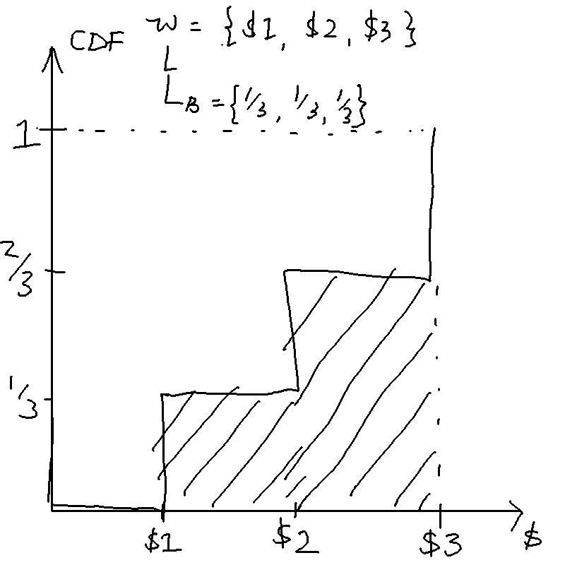

## Introduction

These are notes I (Lieu Zheng Hong) 
wrote for myself while preparing for my Oxford PPE Finals.
Some of my juniors asked for my notes and I am happy to oblige.

These notes are free to all but 
I ask that you do not reproduce them
without first obtaining my express permission.

There are lots of mistakes, omissions, and 
inadequacies in these notes.
I'd love your input to help make these notes better,
by emailing me or
by sending in a pull request at the GitHub repo
[here](https://github.com/lieuzhenghong/ppe-notes/).

---

## Table of contents

[toc]

---

# Some general thoughts

The situation for Micro is unlike that in Macro. There are a lot of excellent
notes written by Bassel and others on the intuition behind general equilibrium,
so these notes will be more exam-focused by giving the key definitions and 
how to solve problems.

# Key definitions and questions to be clear about

## What is the MRS?

- dU/dx / dU/dy = -dy/dx = - py/px

## What is the MRT?

Slope of the PPF

## In a competitive equilibrium with two goods and production, the MRS must equal the MRT !

Because the MRS is how much the consumer is willing to substitute one good for
another, and the MRT is how much one firm can produce one good with another.

But check for corner solutions!

## In a competitive equilibrium, a household maximises when MRS = slope of price line

THe price line is $-\frac{p_x}{p_y}$

## General demands under a Cobb-Douglas utility function

In general, the share of the budget spent on a good is the weight placed on
that good in the utility function. e.g. consider a market for apples, bananas
and cherries. if consumer has an endowment of 10 apples and has utility function

$$ u(A, B, C) = a^\frac{1}{2}b^\frac{1}{4}c^\frac{1}{2} ,$$

his demands will be 

$$ a = \frac{\frac{1}{2} \cdot 10p_A}{p_A}, $$
$$ b = \frac{\frac{1}{4} \cdot 10p_A}{p_B}, $$
$$ b = \frac{\frac{1}{2} \cdot 10p_A}{p_c}. $$

## General demands under a quasilinear utility function

You consume the concave good to the point where the marginal utility of the
concave good equals that of the linear good, then henceforth you consume the
linear good.

So you have for instance

$$ u(c, l) = ln(c) + (1-l), $$

$$ MU(c) = 1/c $$
$$ MU(l) = -1 $$

## What is a competitive equilibrium?

It is an allocation and a vector of prices such that: firms are producing
according to their profit maximising function, consumers are consuming
maximising their utility subject to their budget constraint, and all markets
clear.

## What are the key assumptions for a competitive equilibrium to exist?

- no frictions (no externalities, no tax distortions)
- no market power
- no uncertainty
- no increasing returns to scale (DRS or CRS only)

## Draw an Edgeworth box for the exchange economy.

## Draw a diagram of the Robinson Crusoe economy.

## Draw an Edgeworth box for the economy with two factors of production and two firms (in K,L) space.

## What is the slope/gradient of the price line?

$$-\frac{px}{py}$$

## What do the lines mean in the Edgeworth boxes?

## What is the Stolper-Samuelson theorem?

## Draw an Edgeworth box to illustrate the Stolper-Samuelson theorem.

## What is Rybcynzki's theorem?

## Draw an Edgeworth box to illustrate Rybczynski's theorem.

## What does it mean for an allocation to be Pareto-efficient?

## Does it make sense to say that a competitive equilibrium is Pareto efficient? Why or why not?

## What is the Pareto set?

## What is the Contract curve? How does it differ from the set of all Pareto-efficient outcomes?

## What is the core? 

(the set of allocations that cannot be blocked by any coalition of agents in
the sense that they would increase their utilities by trading only amongst
themselves)

## What is the relationship between the Core, the Contract curve, and the Pareto set?

(The Pareto set is the set of all PE allocations. The contract curve in Alex's
lectures is taken to be synonymous with the set of all PE allocations, but
Bassel takes it to be the subset of the Pareto set that are Pareto-improvements
over the initial allocation. The *core* is the See Bassel's notes for more
details.)

## The competitive equilibrium is always in the core.

## In a large enough (replica) market, the only core outcome is the CE outcome.

## What is the Edgeworth process?

(multiple rounds of decentralised trading between coalitions)

## Does the Edgeworth process always converge to the core? Why or why not?

## What is the UPF?

## What is the First Welfare Theorem (FWT)?

If (x,p) is a competitive equilibrium, then *THE ALLOCATION* (not the
equilibrium!) is Pareto-efficient.

## What is the Second Welfare Theorem (SWT)?

If preferences are nonsatiated, any Pareto-efficient allocation $x$ can be
supported by some price vector $p$ and transfers from an initial allocation
$w$.

## Sketch out a proof of the FWT.

Suppose the competitive equilibrium was not Pareto efficient. Then there must
be a feasible allocation $x^{'}$ such that $x{'}$ is preferred to $x$ for some
i. Then, for that agent i

$$px^{'}_i > px_i $$

and

$$px^{'}_i > p w_i $$

(otherwise shecould have chosen x' from her endowment $w_i$ at competitive
equilibrium prices). But then if we aggregate all the demands, it is clear
that $x^{'}$ cannot actually be feasible.

## Sketch out a proof of the SWT.

## Draw an Edgeworth box to illustrate the FWT.

## Draw an Edgeworth box to illustrate the SWT.

## Draw an Edgeworth box to illustrate how taxing goods and giving the full
	amount creates inefficiency  (lecture 3 slide 26)

## What is the tatonnement process? Describe it.

## What are the two restrictions on aggregate demand in order for the tatonnement process to get us to the price vector that gives us the competitive equilibrium?

- gross substitutes
- WARP

## What is the model of social choice?

(Individuals have a complete and transitive preference ordering over social
states, which when aggregated form a *preference profile* (similar to a
strategy profile). The social planner must find some way to aggregate these
strategy profile into a *societal ranking* of social states)

## What is a social choice rule?

(from a preference profile, produces a complete and transitive social ordering
of social states)

## What makes a good social choice rule?

- Unrestricted domain: social 
- Pareto principle: if everyone prefers x
- Non-dictatorship
- Independence of irrelevant alternatives

## What is a social choice function? How does it differ from a social choice rule? 

(Social choice function selects one best social state)

## What are the big answers in social choice?

- Arrow's theorem (1951) : Suppose there are at least three social states.
	Then there is no social choice rule which satisfies unrestricted domain,
	pareto principle, non-dictatorship, and IIA.
- Black's theorem (1948): If alternatives are one dimension and all voters
	have single peaked preferences, majority voting produces a social choice
	rule, and the majority of votes select the median alternative over another.
- What is liberalism? Respecting peoples' choices: for each player, there is
	at least one pair of alternatives $x$ and $y$ such that if $x$ is preferred
	by $i$, then $x$ must be ranked higher than $y$ in the social choice
	function
- Sen's liberalism paradox 
- Gibbard and Satterthwaite (1973, 1975): Suppose there are at least three
	social states. Then there is no social choice function which is
	strategyproof and respects citizens' sovereignty (every possible ranking of
	social states is possible for some preference profile)

## What is Equivalent Variation (EV)?

income required at old prices to maintain new utility

## What is Compensating Variation (CV)?

income required at new prices to maintain old utility (compensating you)

## With quasilinear preferences, EV = CV = CS (as long as not a corner solution)

## DWL is proportional to ad valorem tax * tax revenue

- More elastic demand or supply => higher DWL
- If demand is more inelastic than supply, then consumer bear most of the tax
	burden, and vice versa.
- Optimal taxation means taxing goods with higher demand elasticities less.
- Draw a diagram to show how public good underprovision occurs.

## What is the Samuelson rule?

(The *sum* of marginal benefits of the public good must be equal to the
marginal cost)

## Explain why the Samuelson rule makes sense intuitively.

## Explain the VCG mechanism. Give an example.

## Give an example to show why the VCG mechanism is strategyproof.

## What is a Pigouvian tax?

## Show how setting price vs setting quantity can affect DWL when marginal benefit is uncertain.

## Show how the deadweight loss is the same regardless of setting price v. setting quantity when the marginal *cost* is uncertain.

## Under Cournot competition, what is the effect on the NE if the marginal cost of one firm decreases?

 (BR curve shifts out, Firm 1 produces more, Firm 2 produces less, Firm 1
 gains, firm 2 loses)

## Under Bertrand competition with differentiated prices, what happens if both firms merge?

Prices increase as the firm takes into account the externalities of other's price 

- What is the best-response curve for Bertrand competition with differentiated
  products? Show that it is increasing in the price the rival sets. (Makes
  sense --- you want to just undercut your opponent)
- Under Bertrand competition, what is the effect on the NE if the marginal cost
  of one firm decreases? (BR curve shifts out, Firm 1 prices higher, Firm 2
  prices higher, both firms gain)

## What are factors affecting the likelihood of collusion?

- Number of firms
- Real interest rate (or discount factor)
- Frequency of sales
- Ease of detection
- Cost of asymmetry (if firms have different costs, low cost firms have
	more to gain by deviating)
- Leniency programs

## What is the Lerner index?

(P-MC) / P

## What is the Herfindahl index?

(sum of squared market shares, in monopoly, 1, in oligopoly 1/n, in PC 0)

## What is double marginalisation?

(When goods are complements, it's better for everyone (consumer AND producer
surplus) if a single company sells all goods. Intuition: if there are multiple
companies, each will try to maximise their profits by increasing the price, but
they don't take into account the negative externality on demand on others)

## Why is it sometimes bad to break up a vertical monopoly?

- Key factor: Whether products are complements or substitutes
- In concentrated markets where goods are complements, it may be better
for everyone if a single company sells all goods
- Breaking up the firm does not increase competition when goods are complements!
- Intuition: If there are multiple companies, each will try to maximize their
profits by increasing the price
- But if they don’t take into account the negative impact on volume for
others, then they will overcharge

## What does it mean for a lottery to FOSD another?

A lottery $L_a$ *first-order* stochastically dominates another $L_b$ if for every
outcome $y$, the probability of getting *at least $y$* is higher under $L_a$
than $L_b$.

First order stochastic dominance: would every expected utility maximiser prefer
a lottery $L_a$ to $L_b$?

A necessary and sufficient condition for one lottery to FOSD another is if the
CDF of that lottery $L_a$ lies below the CDF of $L_b$. That is, if the
probability of lower outcomes is always lower under $L_a$ than $L_b$.

## What does it mean for a lottery to SOSD another?

Would any *risk-averse* or *risk-neutral* utility maximiser (weakly) prefer it?

A lottery $L_a$ *second-order* stochastically dominates another $L_b$ if the
*area* under the cumulative distributive function of lottery $L_a$ is less than
the *area* under the cumulative distributive function of lottery $L_b$ until we
reach the best outcome.

Second-order stochastic dominance: would every risk-averse utility maximiser
choose the lottery over another?

FOSD is a stronger condition: if a lottery FOSDs another, it will definitely
SOSD it too. However, a lottery that SOSDs another will not FOSD another, as
risk-loving types prefer a higher variance.

If $L_a$ SOSD $L_b$ then the expected value of $L_a$ must be equal or higher
than $L_b$, $Ey_a \geq Ey_b$, and for risk-averse types, $E \bar{u_a} \geq E \bar{u_b}$ .

## What's the difference between risk pooling and risk sharing?

## What is the slope/gradient of the isoprofit line?

$$ \frac{1-\pi}{\pi} $$

## What is the gradient of the indifference curve in the state-space diagram?

$$ p/1-p \frac{u^{'}w_N}{u^{'}w_A} $$

## On the certainty equivalent on the state-dependent diagram, why is the gradient of the indifference curve $p/(1-p)$?

## Why is there no pooling contract in the insurance market with unobservable types?

## What is absolute risk aversion?

The Arrow-Pratt coefficient of *absolute risk aversion* is 

$$A(y) = -\frac{u^{''}(y)}{u^{'}(y)}$$

## What is relative risk aversion?

The Arrow-Pratt coefficient of *relative* risk aversion

$$R(y) = -\frac{y u^{''}(y)}{u^{'}(y)}$$

## What is the certainty equivalent?

The certainty equivalent is the outcome $y_c$ that would give the equivalent
utility of the above lottery: that is,

$$u(y_c) = \bar{u}.$$

## What is the risk premium?

The risk premium associated with a lottery is the difference between the
expected value of the outcome, and the certainty equivalent:

$$r = \bar{y} - y_c.$$

## How can we calculate the risk premium without calculating the CE?

It can be shown that a lottery with "small" gambles, the risk premium is given
(approximately) by

$$r(y) = \frac{1}{2} A(y) \sigma^2_z $$

where $\sigma^2_z$ is the variance of the outcomes. Equivalently,

$$r(y)/y = \frac{1}{2} R(y) (\sigma^2_z)/y $$

## What is CARA, CRRA, DARA?

An example of a utility function with constant absolute risk aversion (CARA): 

$$u(y) = a - b e^{(-Ay)} $$

Constant relative risk aversion (CRRA):

$$u(y) = a + b\frac{y^{1-R}}{1-R}$$, R =/= 1

Note that since R(y) = A(y)(y), CARA imples IRRA and CRRA imples DARA.

## Why does CRS mean 0 profit and DRS means positive profits in eqm?

In CRS. Suppose we've optimised $K^{*} and L^(*)$, and we are making positive
profits $\pi^{*}$. But then we can simply scale all inputs by $\lambda$, and
make even more profits, ad infinitum, unless your profits are zero.

In DRS, the worker is paid extra wages up until wage equals marginal cost

MRS: slope of indifference curves
MRT: slope of PPF

## What is the fair insurance condition?

$$-\frac{p}{1-p} = -\frac{1-\pi}{\pi}$$

where the probability of accident is $1-p$ and the premium is purchased at $\pi$.

## What is agency loss/agency cost?

Agency loss is the difference between the expected wage and the certainty
equivalent.

Entirely equivalently, agency cost is defined as the difference in expected
surplus to the principal under unobservable vs observable effort.

## What is premium? How does it differ from premium rate?

Premium is the expected loss P, premium rate is what you pay per unit of cover.

# General Equilibrium

## The big picture

The key idea is that we define this notion of a "competitive equilibrium",
which is an allocation of goods $\textbf{x}$ and a vector of prices
$\textbf{p}$ such that:

1. Consumers maximise utility subject to budget constraints
2. Firms maximise profits
3. All markets clear

For condition 1, we need the Lagrange, the Kahn-Tucker conditions, and the
Envelope Theorem.

For condition 3, this requires that excess demand for each good equal to zero

Finally, we bring in welfare. We bring in the concepts of Pareto-Efficiency,
Kaldor-Hicks efficiency, x Pareto-dominating y, contract curve

Contract curve: traces out the set of points that an agent would be willing to
move to (the set of Pareto-improving points from a person's initial endowment).

- **What do different contract curves look like for different utility functions?**
- Quasilinear utility functions:

and we have some *key results*:
the first and second welfare theorem

- FWT: all CE are PE
- SWT: any PE can be supported by a price vector that is a competitive equilibrium.

*Bassel says: Outline how the proof works for both FWT and SWT, and have a neat
diagram (Edgeworth Box) prepared*.

Assumptions:

- FWT requires some assumptions
- SWT requires some assumptions AND assumption of convex indifference curves

1. take a point that is PE.
2. Find the MRS that slices through the two indifference curves. This is the
	 price line
3. Find a lump-sum transfer, and set some price vector, that brings us from the
	 original point to the desired point.

(Question: if you can do unrestricted lump-sum transfers, why not just transfer
directly to the desired point?)

(Answer: Some goods may be difficult to transfer)

*Bassel says: Talk about the definitions and implications of FWT and SWT. Good
for essay questions.*

*Bassel says: This whole notion of competitive equilibrium doesn't have any
thing about *how* people trade and get to that point. That's why we have
tacked-on a Tattonment process, or reaching a price vector through bartering*

The Edgeworth process gets you to a PE (on the contract curve), but not
necessarily the specific CE supported by the price vector.

*Bassel says: For an essay on general equilibrium, **clarity is key**. Nail
down all the definitions, have a very clear struture of the essay, relate the
concepts to one another in a clear way. Don't mix up questions on existence to
questions on efficiency to questions on price.*

*Prepare chunks of essays, if I need to write on FWT/SWT, exchange economies,
etc.*

The only difference between autarky and trade is that the market clearing
conditions are different.

One wage that clears one market for labour.

If no free mobility, then you have two wages 

## TODO

- draw diagrams for exchange economy
- draw diagram for robinson crusoe eocnomy 
- draw out diagrams for the stolper-samuelson theorem and rybcyznski theorem
- draw diagrams for how trade improves the economy
- draw a diagram for how trade may affect consumers with heterogeneous
	preferences
- Draw an Edgeworth box to illustrate the FWT.
- Draw an Edgeworth box to illustrate the SWT.
- Draw an Edgeworth box to illustrate how taxing goods and giving the full
	amount creates inefficiency  (lecture 3 slide 26)
- draw diagram to show EV vs CV (lecture 6)
- Draw a diagram to show how public good underprovision occurs. (7)

### Optimisation

#### MRS

For any utility function u(x,y) the MRS gives the *slope of the indifference curves* in (x,y) space, and can be found as follows:

$$ du(x,y) = \frac{\partial u}{\partial x}dx + \frac{\partial u}{\partial y}dy = 0$$

$$MRS_{x,y} = dy/dx = \frac{\frac{\partial u}{\partial x}}{\frac{\partial u}{\partial y}}$$

With quasilinear preferences, 

$$U = -\alpha x + \beta ln(y)$$,

$MRS = - \alpha / \beta y$ which depends only on y. 

This means that the marginal rate of substitution is always constant at any
value of x. Meaning to say if you draw a horizontal line, the points that cut
the horizontal line will always give you the same MRS.

#### Hicks demand v Marshallian demand

Marshallian demands are "proper" demands, or demands that optimise the quantity
of good demanded subject to their budget constraint.

Hicks demands are "cost-minimisation" demands

#### Kuhn-Tucker conditions

The Kuhn-Tucker conditions give us the first order conditions for an optimum
when using the Lagrangian to solve a constrained optimisation problem. 

See Bassel's notes, **1 Constrained Optimisation**

#### Envelope Theorem

The Envelope THeorem is a trick we can use for 

See Bassel's notes, **1.5 The Envelope Theorem**

#### Interpretation of the Lagrangian multiplier

The Lagrangian multiplier measures the change in the *optimised value of the
objective when we marginally relax the constraint*.

For regular consumer optimisation

$$ u(x, y) = \alpha log(x) + \beta log(y) - \lambda (p_1 x + p_2 y - I), $$

the Lagrange multiplier is the marginal utility of income. (When we marginally
increase income, what is the change in the utility?)

#### Quasilinear preferences

$$u(x, y) = \alpha x + \beta \phi(y)$$

where $\phi(.)$ is an increasing concave function.

The key property of quasilinear preferences is that the indifference curves
will have the same slope along any line that is parallel to the axis on which
the "linear" good is drawn.

#### Cobb-Douglas preferences

Homothetic: the slope of indifference curves is the same throughout any ray
that passes through the origin.

### Edgeworth boxes

#### Offer curve

- Offer curve
- Pareto set
- Contract curve

#### Contract curve

The contract curve is the set of all Pareto-efficient allocations that give a
higher utility to everyone compared to the endowment point.

#### Pareto set

Consider two agents with the same utility function

$$u(x,y) = ln(x) + 3 ln (y)$$

Now consider two agents with different utility functions:

$$ u_A(x,y) = ln(x) + 3 ln(y) $$
$$ u_B(x,y) = ln(x) + ln(y) $$

Contract curve will "curve" towards A, giving more of good Y to A

*Bassel says: Keep this in mind. The minute you see what the utility functions
are like, that tells you what the contract curves will look like. e.g. In any
competitive equilibrium, A will get a higher relative ratio of good Y/good X
than B.*

$$ u(x,y) = \alpha_x + \beta ln(y) $$

It will always go halfway up the y axis

You want to consume y infinitely more when y is at zero nuntil 1, and when you
have more and more of y, the additional value gets lower and lower until it
reaches less. After a certain point, you only want x. 

So you want all of Y until a certain point, then you only want X.

Income expansion path: keeping the same price level (gradient of the graph),
what is the quantity of x and y demanded?

$$u_A(x,y) = x + 3ln(y) $$
$$u_B(x,y) = x + ln(y) $$

With different quasilinear preferences, the line shifts up

... 

### Competitive equilibrium

#### Walras's Law

The sum of the *value* of the excess demands must equal zero.

Excess demands are defined by the excess goods demanded, so the value is
multiplied by the prices

$$ P_x (Demand_x - Endowment_x) + P_y (Demand_y - Endowment_y) = 0 $$

#### Rybczynski's theorem

Consider an economy with two goods being produced with two factors of
production.

The theorem states that an increase in the supply of one factor will increase
the output of the good that utilises that factor more. For instance, if there
are two factors of production, labour and capital, and there are two goods,
haircuts (labour-intensive) and skyscrapers (capital-intensive), then the
equilibrium output of haircuts will increase if the supply of labour increases.

#### Stolper-Samuelson theorem

Again, consider an economy with two factors of production and two goods being
produced, one of which is capital- and the other labour-intensive.

An increase in the relative price of a good will cause the real return of the
more intensive factor to increase, and decrease the real return of the less
intensive factor.

### Welfare Economics

- First Welfare Theorem
- Second Welfare Theorem

## Consumer optimisation

Bassel's notes are great for this.

## Assumptions of general equilibrium

- No frictions
- No externalities
- No distortionary taxes
- No market power (price-taking firms)

## Types of general equilibrium

1. Exchange economy (two goods, two people with endowments)
2. "Robinson Crusoe" economy: (one producer, one consumer, one good, one factor
	 of production)
3. An economy with one producer, one consumer, one good, but *two* factors of
	 production.
4. 2x2 (multi-industry) economy: two goods being produced, two factors of
	 production, two (types of) companies

## How to solve general equilibrium questions

The key is to ask yourself the following: *What are the goods and what are the
markets*? Then you'll know what needs to clear in equilibrium.

In the simplest case of an exchange economy, there are two goods $x, y$ and two
agents, then you'll need to have 2x2 = 4 equations, and there are 4 unknowns:
$p_1, p_2, x_1, y_1$. Once we have the four demand equations (each agent's
demand for each good), we can then find the prices that will clear the market,
and the equilibrium allocation of goods x and y that will result.

Two market clearing conditions:

In the case of a "Robinson Crusoe" economy, there are two goods, $x$ (the
consumption good) and labour $L$. There are two agents, and two prices $w$ and
$p$. The firm has its own production function, the consumer has his demand
function. From here we can get the four equations:

1. firm's demand for labour,
2. firm's supply of good, 
3. consumer's supply of labour,
4. consumer's demand of good.

Four equations, four unknowns. Again, same thing, plug in to find the prices,
then use the prices to find the eqm allocations.

In the case of an economy with two firms and only one factor of production,
there are the goods $x$, $y$, the factor of production $L$, the prices $p_x$,
$p_y$, and $w$.

Seven equations:

1. firm 1's demand for labour,
2. firm 2's demand for labour,
3. firm 1's supply of x,
4. firm 2's supply of y,
5. consumer's supply of labour,
6. consumer's demand for good x,
7. consumer's demand for good y.

We have seven unknowns (we need to know how demand is split between two
different firms and the consumer):

$L_1, L_2, x, y, p_x, p_y, w$

In the case of an economy with two factors of production, there are three
goods: $x$, $L$, and $K$ and three prices $p$, $w$, $r$.

There are six equations:

1. firm's demand for labour,
1. firm's demand for capital,
2. firm's supply of good x, 
3. consumer's supply of labour,
3. consumer's supply of capital,
4. consumer's demand of good x.

Six equations, six unknowns. Solve to find relative prices, and then plug them
back into the demand and supply functions to find the equilibrium allocations
of labour, capital and good x, and the price vector that clears the markets.

In the case of a multi-industry economy, there are two goods, $x$ and $y$, two
factors of production $K$ and $L$, two rental rates $r$ and $w$, and two prices
$p_1$ and $p_2$. (We ignore the consumer in this case.) The equations are:

1. firm 1's demand for labour,
2. firm 1's demand for capital,
3. firm 1's supply of good X,
4. firm 2's demand for labour,
5. firm 2's demand for capital,
6. firm 2's supply of good Y,
7. consumer's supply of labour,
8. consumer's supply of capital,
9. consumer's demand for good X,
10. consumer's demand for good Y.

The unknowns are $K_1, L_1, K_2, L_2, x, y, r, w, p_x, p_y$. (this seems to
deviate from the treatment in the lectures though. Ask Bassel tomorrow. He
might point me to Mas-Colell.)

Here is the "cookbook approach to finding a competitive equilibrium" in Alex
Teytelboym's lecture notes:

1. Find the demand and supply functions of each agent and for every good as if
	 it’s partial equilibrium.
2. Make sure that these demand and supply functions are only functions of
	 prices. So, for example, get rid of “endowment”
3. For each good in the economy, calculate aggregate demand, aggregate supply,
	 and aggegate endowment. Together they give you an excess demand equation
	 that should be zero in equilibrium, so
	 $$eqn$$
4. Now, you have a market-clearing condition for every good: k equations and k
	 unknowns. Existence theorem tells that a solution exists (phew).  And you
	 only need to solve k - 1 such conditions by Walras’s Law.
5. Solve to find relative prices. Sometimes it helps to fix the price of one
	 good at, say, 1 and solve prices with this good as numeraire.
6. Once you’ve found the equilibrium prices, plug them back into the demand and
	 supply functions to find the equilibrium allocation.  Remember to specify
	 the equilibrium allocation (x in the exchange economy or (x, y) in
	 production economy) AND the equilibrium price vector p.

### Pure exchange economy

Consider a pure exchange economy with two consumption goods, 1 and 2, and two
consumers, A and B. Consumer $a$ has an endowment of 10 goods of unit x,
consumer $b$ has an endowment of 10 goods of unit y, and let the price of good
1 be normalised to 1 and the price of good 2 be $p_y$.

Taking their utility functions to be 

$$ u(x, y) = ln x + ln y, $$

let's write out the four equations and unknowns.

We need to know:

1. A's demand for X;
2. A's demand for Y;
3. B's demand for X;
3. B's demand for Y.

We need to find the price vector $p$ that clears the market. The market
clearing condition is that the demands must sum up to the supply.

To do this, let's solve the Lagrangian for consumer A. He has an endowment of
10 of good X, worth 10 dollars in total. So:

$$ L = ln x + ln y - \lambda (x + py - 10) $$

The Kuhn-Tucker conditions give us:

$$ \frac{\partial L}{\partial x} = 1/x - \lambda (1) = 0 $$
$$ \frac{\partial L}{\partial y} = 1/y - \lambda (p) = 0 $$
$$ \frac{\partial L}{\partial \lambda} = - (x + py - 10) = 0 $$

We solve and obtain the conditional demands, with both player 1 and player 2. These are the quantities each player will demand as a function of the price $p$.

$$ x_1 = 5, y_1 = \frac{5}{p} $$
$$ x_2 = \frac{5}{p}, y_2 = 5 $$

We have obtained the demands. But there will be excess demand unless we set the
correct prices. We know that $x_1 + x_2 = 10$ in order for all markets to clear
(we only need to clear the market for good x in order for the market for good y
to clear as well). So it's clear that $p$ must equal 1.

Now that we've found the price vector, we can simply plug this price vector
back into the conditional demand to get the actual allocations. The competitive equilibrium is thus

$$ p_x = 1, p_y = 1, x_1 = 5, x_2 = 5, y_1 = 5, y_2 = 5.$$

That was how we solved the most basic general equilibrium problem.

### "Robinson Crusoe" economy: economy with one consumer, one producer

#### "Robinson Crusoe" economy with income taxes

In general equilibrium, the taxes have to go back to the consumer.

Normalise the price of good C to 1. The optimisation objective of the consumer
is to maximise $u(C, l)$ subject to 

$$C \leq (1-t)wL + \pi^{*} + twL^{*}$$

Note that $L^{*}$ is in the tax term, you take it as given by getting a
percentage of all tax receipts.

Let the functions be 

$$U = \sqrt(Cl)$$

Claim (verify for tomorrow): 

At the optimum, $C^{*}(k) = (1-t)w^{*}l^{*}(t)$ 

$$w^{*} = \sqrt{\frac{3-t}{1-k}}$$

### Economy with one factor of production but two firms

### Economy with two factors of production and one firm

### 2x2 economy (two goods produced)

See 2016 Q8.

$$ K_1 = L_1 w/2r $$
$$ L_1 = K_1 2r/w $$
$$ K_2 = L_2 2w/r $$
$$ L_2 = K_2 r/2w $$

OK, so these are the conditional factor demands for the wage rate and the
output chosen $y_1$ and $y_2$. How do we get the actual factor demands?

We need to do a profit maximisation equation and find the quantity of $y_1$ and
$y_2$ produced, in order to know how much $L_1$, $K_1$, $K_2$ and $L_2$ is
demanded.

And then we know that markets have to clear, so $K_1 + K_2 = 160$ and $L_1 + L_2 = 200$.

So here we have the following unknowns:

$K_1, L_1, w, r, p_1, p_2$

And we have the following equations:

$$ K_1/L_1 = w/2r $$
$$ K_2/L_2 = 2w/r $$

$$ p_1 = MC_1 = (\frac{w}{2/3})^{2/3} (\frac{r}{1/3})^{1/3} $$
$$ p_2 = MC_2 = (\frac{w}{1/3})^{1/3} (\frac{r}{2/3})^{2/3} $$

And the market clearing conditions

$$K_1 + K_2 = 160$$
$$L_1 + L_2 = 200$$

Markets have to clear

So now we have to solve $w$ and $r$ such that the markets clear. How? Or is it
solving $p_1$ and $p_2$ such that the markets clear?

We have $K_1, K_2, L_1, and L_2$ as functions of $w/p$, the factor price ratio.
Are we done? Not yet, I think we still need to find it in terms of p1 and p2.
After that is done, I think we will have the equilibrium: we have found the
price vector p1 and p2 that results in the labour and capital markets clearing.

### Economies with trade

One factor of production (L), but two goods $x$ and $y$.  To make things
easier, we assume the consumer derives no utility from leisure, so they always
provide 1 unit of labour at the wage $w$. We thus get six equations and six
unknowns:

1. firm 1's demand for labour,
2. firm 2's demand for labour,
3. firm 1's supply of good x,
4. firm 2's supply of good y,
5. consumer's demand for good x,
6. consumer's demand for good y.

$L_1, x, y, p_1, p_2, w$

Now fix the wage level $w$. For every relative price level $p_x/p_y$ we will
get a different level of production of good x and good y. This is basically the
PPF:

#### Edgeworth boxes in trading economies

[TODO]

Instead of indifference curves, we have isoquants, and the rays shooting out of
the origins denote the conditional factor demands. That is to say, at a certain
price level, what is the optimal amount of each factor $K$ and $L$ I should
use?

# Welfare Economics

## VCG mechanism

Suppose the government wants to build a bridge at a cost of $1000.

The government asks each person to report their benefit from the bridge. In
order to keep people honest, the idea is: the more you report, the more you
pay, but only if you are pivotal.

What you pay is the following: you pay the difference in:

Net utility if everyone except you participated - Net utility of everyone else except you *when you participate*

As an example, consider three agents with reported utilities

$$ u1 = 500, u2 = 200, u3 = 700 $$

Since $500 + 200 + 700 > 1000$, the government builds the bridge.

For agent one, the net utility if everyone except him participated would be
zero, as the bridge would not be built (he is *pivotal*). So he pays 0 -
(900-1000) = 100.

For agent two, the bridge would still be built, so the net utility in both
cases is 200, so he pays nothing.

Agent three is pivotal, so he pays 0 - (700-1000) = 300.

However, total tax collected is only 400, which is not enough to pay for the
bridge! In general, there cannot exist a strategyproof mechanism that is budget
balanced and also ensures payoffs > 0 for each player.

The government can coerce people to participate, so the last impossibility
condition may not bite.

## How uncertainty affects the choice of targeting price vs quantity

Set-up: the firm produces at its private marginal cost PMC, and gains some
marginal revenue from selling a good MB. But it also imposes a societal
marginal cost, SMC, on society. It thus overproduces the good.

There are two ways to get the societally optimal level of production: one, set
a quantity *cap*: two, set a *Pigouvian tax* that increases the private
marginal cost to match the societal marginal cost. The equivalence of price and
quantity means that we can reach the societally-optimal level with either
approach.

But what if there is uncertainty about either the marginal benefit or marginal
cost of the externality? If so, taxation vs quotas can have different
consequences. The headline results are as follows:

1. Under *uncertainty over marginal benefit*, a flat marginal cost curve means
	 that choosing taxes over quotas is better (results in less DWL).
2. Under *uncertainty over marginal benefit*, a steep marginal cost curve means
	 that choosing quotas over taxes is better (results in less DWL).
3. Under *uncertainty over societal marginal costs*, setting quotas or taxes
	 result in the same amount of deadweight loss, so it doesn't matter.

The intuition is as follows: A firm's choice of production depends only on its
private marginal benefit and marginal costs. The uncertainty in marginal costs
will not affect the firm's choice of output. In contrast, uncertainty in
marginal benefits either changes the equilibrium output (under taxes) or not
(under quotas) which can result in different deadweight loss depending on the
slope of the SMC curve.

Setting a price is essentially setting a horizontal line equal to MC at that
point. When the marginal cost curve is flat, a big change in quantity produced
actually only deviates from the societal optimum a tiny amount. Figure
\ref{welfare_under_uncertainty} illustrates.

# Risk and Expected Utility

A lottery is a list of pairs, one per state, each comprising a probability and
an outcome:

$$ L = (<\pi_1, y_1>; <\pi_2, y_2>; .... ; <\pi_s, y_s>) $$

Consider a lottery with two possible outcomes $y_1$ and $y_2$, with
probabilities $\pi$ and $1-\pi$. Denote the expected value of the outcome as
$\bar{y}$ and the expected utility, $\pi u(y_1) + (1-\pi) u(y2)$, as $\bar{u}$.

## Certainty equivalent and risk premium

The certainty equivalent is the outcome $y_c$ that would give the equivalent
utility of the above lottery: that is,

$$u(y_c) = \bar{u}.$$

The risk premium associated with a lottery is the difference between the
expected value of the outcome, and the certainty equivalent:

$$r = \bar{y} - y_c.$$

## What does it mean to be risk-averse?

Someone is risk-averse if any of the following are true (the definitions are equivalent):

1. The utility function $u(\cdot)$ is concave
2. The certainty equivalent $y_c$ is less than the expected value of the
	 outcome $\bar{y}$
3. The risk premium is positive.

## Absolute and relative risk aversion

The Arrow-Pratt coefficient of *absolute risk aversion* is 

$$A(y) = -\frac{u^{''}(y)}{u^{'}(y)}$$

and it can be shown that a lottery with "small" gambles, the risk premium is
given (approximately) by

$$r(y) = \frac{1}{2} A(y) \sigma^2_z $$

where $\sigma^2_z$ is the variance of the outcomes.

The Arrow-Pratt coefficient of *relative* risk aversion

$$R(y) = -\frac{y u^{''}(y)}{u^{'}(y)}$$

With small gambles, the risk premium is given approximately by

$$r(y)/y = \frac{1}{2} R(y) (\sigma^2_z)/y $$

An example of a utility function with constant absolute risk aversion (CARA): 

$$u(y) = a - b e^{(-Ay)} $$

Constant relative risk aversion (CRRA):

$$u(y) = a + b\frac{y^{1-R}}{1-R}$$, R =/= 1

Note that since R(y) = A(y)(y), CARA imples IRRA and CRRA imples DARA.

## Drawing indifference curves

We draw indifference curves of the form

$$\pi u(y_1) + (1-\pi) u(y_1) = \bar{u}$$

for some constant $\bar{u}$ and $\pi$ is the probability of outcome $y_1$
occurring. Usually when we draw these indifference curves 

The slope of the indifference curve,

$$ \frac{dx_2}{dx_1} = -\frac{\pi}{1-\pi} \frac{u^{'}(x_1)}{u^{'}(x_2)}$$

and the derivation is in Bassel's notes. Along the certainty line, the slope of
the indifference curve is exactly $\frac{\pi}{1-\pi}$, because the income amounts
are the same.

The certainty equivalent of a lottery $L_a$ is the point C where the
indifference curve through $L_a$ cuts the certainty line.

Additionally, to find $\bar{y}$, or the expected income, we know that 

$$\pi(y_1) + (1-\pi)y_2 = \bar{y}$$

and so the slope of the iso-income line is simply given by

$$ \frac{dy_2}{dy_1} = -\frac{\pi}{1-\pi} $$ by the chain rule.

The risk premium is therefore $CE - \bar{Y}$, which is $C-M$ on the graph.

## First and second-order stochastic dominance

A lottery $L_a$ *first-order* stochastically dominates another $L_b$ if for every
outcome $y$, the probability of getting *at least $y$* is higher under $L_a$
than $L_b$.

First order stochastic dominance: would every expected utility maximiser prefer
a lottery $L_a$ to $L_b$?

A necessary and sufficient condition for one lottery to FOSD another is if the
CDF of that lottery $L_a$ lies below the CDF of $L_b$. That is, if the
probability of lower outcomes is always lower under $L_a$ than $L_b$.

A lottery $L_a$ *second-order* stochastically dominates another $L_b$ if the
*area* under the cumulative distributive function of lottery $L_a$ is less than
the *area* under the cumulative distributive function of lottery $L_b$ until we
reach the best outcome.

Second-order stochastic dominance: would every risk-averse utility maximiser
choose the lottery over another?

FOSD is a stronger condition: if a lottery FOSDs another, it will definitely
SOSD it too. However, a lottery that SOSDs another will not FOSD another, as
risk-loving types prefer a higher variance.

If $L_a$ SOSD $L_b$ then the expected value of $L_a$ must be equal or higher
than $L_b$, $Ey_a \geq Ey_b$, and for risk-averse types, $E \bar{u_a} \geq E \bar{u_b}$ .

The idea of a "mean-preserving spread": something that maintains $Ey$, but
"spreads" the probabilities out so that you are more likely to get very high or
very low values.

For instance, let the outcomes be $1, 2, 3$, and the lotteries be $L_a = [1/3,
1/3, 1/3], L_b = [1/8, 3/4, 1/8]$. Here $L_b$ SOSDs $L_a$ because the means are
the same but the chances of getting a lower outcome in $L_a$ are higher. We can
draw the CDFs:

## Risk-pooling and risk-sharing

The difference between risk-pooling and risk-sharing is that risk-pooling is
about taking multiple independent risks, while risk-sharing is taking one risk
but dividing the payoffs between people

## Insurance

The agent can be in no accident state $w_N$ or an accident state $w_A$. Let the
probability of accident be $1-p$ and no accident $p$.

The agent can purchase a premium from the insurance company at rate $0 < \pi
\leq 1$. In the no-accident state, the agent gets $w_0$ but has to pay a
premium $\pi q$.  In the accident state, the agent loses $L$, but gets
compensated from the insurer, so he obtains $w_0 - L - \pi q + q$.

The agent's utility is thus

$$U(w_N, w_A) = p u(w_N) + (1-p) u(w_A) $$

where

$$w_N = w_0 - \pi q$$
$$w_A = w_0 - \pi q + q$$

Rearranging and eliminating we obtain the budget constraint in state-dependent
preference space, 

$$w_A = [\frac{w_0}{\pi} - L] - \frac{1-\pi}{\pi} w_N $$

Insurance is actuarially fair if the value of the premium is equal to the
expected claims (insurance companies make zero profit). The company's expected
profit is

$$\Pi = p(\pi q) + (1-p)(\pi q - q) = (\pi - (1-p))q $$

If insurance is actuarially fair, the agent *fully insures*: they buy enough
cover such that they get the same payoff in either state. The indifference
curve has a slope of $-\frac{p}{1-p}$ when it passes through the certainty
line, while the insurance line (the line whereby the insurance company makes no
profit) is has a slope of $-\frac{1-\pi}{\pi}$.

The slope of the consumer's indifference curve is gotten in a similar manner to
the MRS. We have the utility function

$$U(w_N, w_A) = p u(w_N) + (1-p) u(w_A).$$

Taking the total derivative and setting it to zero we have

$$U^{'}(w_N, w_A) = p u^{'}(w_N) \partial w_N + (1-p) u^{'}(w_A) \partial w_A = 0$$

Rearrange to get

$$ \frac{\partial w_A}{\partial w_N} = - \frac{p}{1-p} \frac {u^{'}(w_N)}{u^{'}(w_A)}. $$

**Fair insurance condition:**

$$-\frac{p}{1-p} = -\frac{1-\pi}{\pi}$$

[Image in Bassel's notes]

If insurance is actuarially unfair, the agent doesn't fully insure: the slope
of the isoprofit line of the insurer swivels counterclockwise, and the agent
purchases some level of insurance that maximises his utility.

[Image in Bassel's notes]

## Insurance

A zero-profit pooling equilibrium cannot be possible if types are unobservable.
This is because suppose a pooling equilibrium existed. Then an insurer can
offer a cheaper premium that will be taken by low-types only, and would also
make positive profit. (There is a pooling equilibrium with positive profit,
though --- or is there? Ask Bassel)

When types are unobservable, there can be a separating equilibrium giving both
a fair price, but giving only partial cover to the low-types. This partial
cover must be such that it lies below the indifference curve of the contract
offered to high-risk types.

There may not always be a separating equilibrium. It depends on the proportion
if H-type to L-types. If the proportion of low-risk types is high, then the
pooling equilibrium zero profit line is close to that of the L-type zero profit
line, very steep. (Remember, the steeper the zero profit line, the lower the
premium.) There would thus be an incentive to offer a partial pooling contract
that would make a positive profit.

It's a bit odd that there is no pooling and there may not be a separating
equilibrium. In fact, there is a symmetric mixed equilibrium, no pure
equilibrium necessarily exists. See Bassel's notes.

## Separating vs pooling equilibrium

### PYP 2017 Q9: should an agent buy unfair insurance, and how should insurance companies serve both low-risk and high-risk individuals?

**Hugh believes that he is low risk – he locks windows and doors when he leaves
home, and he doesn’t leave candles burning when he goes to bed. He faces
insurance that is actuarially unfavourable, and so decides not to buy any. Is
he acting optimally? How might competitive insurance companies overcome the
problem of serving both low risk and high risk individuals?**

Whether or not Hugh should buy insurance depends on how actuarially
unfavourable the insurance is. If the insurance is somewhat actuarially unfair,
Hugh should buy some insurance but not fully insure. But if the insurance is
very actuarially unfair, Hugh is acting optimally in not buying any insurance.
I will illustrate this with the help of three state-space diagrams.
Competitive insurance providers can serve both low- and high- risk individuals
by offering two different contracts: one high-priced full coverage, the other
low-priced with partial coverage. However, whether or not this is an
equilibrium depends on the proportion of high- and low-risk individuals. A
separating equilibrium can only obtain if the proportion of low-risk
individuals is not too high.

I first set up the insurance model. We model Hugh as an expected utility
maximiser who is somewhat risk-averse. Hugh has some starting wealth
$w_N$. There is some probability of an accident happening with probability
$(1-p)$, whereupon he incurs some loss: his new wealth is $w_A$. Hugh's
expected utility is thus

$$\mathrm{E}U(w_N, w_A) = pu(w_N) + (1-p)u(w_A).$$

We can represent the two possible states of Hugh's wealth in a state space
diagram. The state space diagram represents Hugh's expected utility in
different possible lotteries that he faces. The x-axis represents his wealth in
the no-accident state, while the y-axis represents his wealth in the accident
state. We can also draw an indifference curve, which represents the set of
lotteries Hugh is indifferent between. Importantly, the 45 degree line
represents no lottery at all.

With the state space diagram, we can now see whether Hugh should buy insurance.

Hugh has the option to purchase insurance with a cover of q and a premium $\pi$
per unit of cover. 

Figure \ref{fair_insurance} shows insurance that is actuarially fair. Insurance
is actuarially fair when the company makes zero expected profit: that is, when

$$ \Pi = p(\pi q) + (1-p)(\pi q - q ) = (\pi - (1-p)) q .$$

This means that $\pi = (1-p)$, or the premium per unit of cover is exactly
equal to the chance of an accident. When this is the case, Hugh should fully
insure such that he loses nothing in the accident case.

Figure \ref{unfair_insurance_1} shows how Hugh should still purchase insurance
even if it is not actuarially fair. Here the company is offering cover at a
higher premium $\pi > (1-p)$, which translates to a flatter slope. However,
Hugh should still purchase some insurance as purchasing some insurance will
move him to a higher indifference curve $u_2$ in red, compared to his original
lottery.

Finally, Figure \ref{unfair_insurance_2} shows that Hugh should not purchase
any insurance if the premium is too high. In the figure, the premium is so high
that Hugh would be on a lower indifference curve if he bought any amount of
insurance. In this case, it is optimal not to insure. 

Overall, therefore, whether Hugh is acting optimally depends on the price of
his insurance. The slope of his indifference curve is given by

$$ \frac{d w_A}{d w_N} = - \frac{p}{1-p} \frac{u^{'}(w_N)}{u^{'}(w_A)} $$

and thus if $\pi$ is greater than $\frac{d w_A}{d w_N}$, it is not optimal to
buy any insurance.

We now move on to how competitive insurance companies might overcome the
problem of serving both low- and high-risk individuals. Competitive insurers
must make exactly zero profits on both high and low-risk agents. But

The trick is therefore to offer partial cover with a low premium $\pi_L$ to
low-risk types like Hugh, and full cover with a high premium $\pi_H$ to
high-risk types. Figure \ref{sep_eqm} illustrates. Both types initially face
different lotteries but with the same outcome $w_N$ or $w_A$, denoted as
$\omega$ in the state-space diagram.

The insurance company offers two contracts: one full-coverage at a high premium
$ZP_H$ (in red), and one partial coverage in pink $ZP_L$. Importantly, the
insurer cannot offer full coverage to the low-risk type, because then the
high-risk types would take it up. In this case, the partial coverage means that
H-types prefer the contract meant for them, as the partial coverage lies below
their current indifference curve on the high contract.

However, this separating equilibrium may not exist. If the proportion of
low-risk types is large enough, there is a profitable deviation for insurance
companies to offer a pooling contract anywhere in the shaded region below the
zero-profit pooling line $Z_pool$ (in green). This deviation will be profitable
as it lies below the zero profit line, and both high-risk and low-risk types
will switch as any point in the shaded region lies above the current
indifference curves for both high- and low-risk types.

\pagebreak

## Principal-agent problem

Suppose a risk-neutral principal derives a payoff $y-w$ which depends on
output, which in turn depends on the effort exerted by the agent.

The agent's utility function is some function of his wage minus his effort cost:

$$ U(w, e) = f(w) - e.$$

We assume that effort can only take low or high levels: that is, $e \in {0, 1}$.

Let the probability of a "high" outcome $y_H$ conditional on the agent exerting
effort level 1 be denoted as $p(1)$, *mutatis mutandis* for effort level 0.
That is, $p(1) = P(y = y_H | e= 1)$ and $p(0) = P(y = y_H | e=0)$.
Additionally, we demand that $p(1) > p(0)$.

The principal wants to maximise his expected profit by choosing a contract
$(w^L, w_H)$ which induces an effort level $e$ so as to maximise the following
profit function:

$$\Pi - (1-p(e))(y^L - w^L) + p(e)(y^H - w^H)$$

The agent has both a *participation* and an *incentive* constraint. The
participation constraint ensures that the agent's reservation utility must be
lower than his wage when he exerts either high or low effort, i.e. it is better
to work than not at all. The incentive constraint is that $u(1) > u(0)$, i.e.
it's better to exert high effort than low effort.

The incentive constraint can be written as follows:

$$ p(1)u(w^H) + (1-p(1))u(w^L) - 1 \geq p(0)u(w^H) + (1-p(0))u(w^L) $$

The agent will prefer to exert high effort to low effort when the expected
utility from high effort exceeds the expected utility from low effort.

To induce high effort, the principal must offer a low wage that is low enough
to satisify the incentive constraint. We rearrange the incentive constraint and
take inverse function on both sides to obtain

$$w^L \leq u^{-1}(u(w^H) - \frac {1}{p(1) - p(0)})$$

It must also offer a wage high enough to satisfy the participation constraint:

$$p(e)u(w^H) + (1-p(e))u(w^L) \geq \bar{u}$$

### Agent is risk neutral

Effectively set b=1 since risk-sharing is not a concern.

## Agency cost

Agency cost is defined as the difference in expected surplus to the principal
under unobservable vs observable effort.

## 2016 PYP: Reference essay for principal-agent problems (all cases)

**A risk-neutral principal wants to hire an agent to undertake a project. What
considerations does the principal take into account when designing the
optimal contract?  (For illustration purposes, you may assume that there are
just two possible levels of gross profit, and two levels of effort that the
agent can exert.) Compare the optimal risk-sharing contracts when effort is
observable and when it is not: if the principal wants to induce different
effort levels in these two situations, who is better or worse off? If on the
other hand the principal wants to induce the same effort level in these two
situations, is anyone better or worse off?**

### Introduction

In every case, the contract offered to the agent must satisfy the
*participation constraint*: the contract must be attractive enough to the agent
for it to take up the contract. Additionally, when the agent is risk-averse and
effort is unobservable, the agent will also need to satisfy the
*incentive-compatibility constraint*: the expected utility accrued to the agent
must be greater when exerting the desired level of effort. In this essay, I set
up the basic principal-agent model and lay out the PC and IC. I show that the
principal is worse off in two cases: 1) when the principal wants to elicit
high-effort regardless of observability; 2) when the principal wants to elicit
high-effort in the observable state but low-effort in the unobservable state.

### Basic model set up

Suppose a risk-neutral principal derives a payoff $y^{S}-w^{S}$ which depends
on the output level $y^{S}$, and the state-dependent wage it pays to the agent
$w^{S}$. The output level in turn depends on the agent's exerted effort. Here
we assume that effort can only take low or high levels: that is, $e \in {0,
1}$.

Let the probability of a "high" outcome $y_H$ conditional on the agent exerting
effort level 1 be denoted as $p(1)$, *mutatis mutandis* for effort level 0.
That is, $p(1) = P(y = y_H | e= 1)$ and $p(0) = P(y = y_H | e=0)$.
Additionally, we demand that $p(1) > p(0)$: if the agent exerts high effort,
the probability of a "high" outcome increases.

The agent's utility function is some function of his wage minus his effort cost:

$$ U(w, e) = f(w) - e(e).$$

The principal wants to maximise his expected profit by choosing a
state-dependent contract $(w^L, w_H)$ which induces the effort level $e$ that
maximises the following profit function:

$$\Pi = (1-p(e))(y^L - w^L) + p(e)(y^H - w^H)$$

### Model analysis

Here we assume that the agent is risk-averse. If the agent is risk-neutral, it
does not matter whether effort is observable or not, and nobody is any worse
off.

#### Observable effort

The agent has both a *participation* and an *incentive* constraint. The
participation constraint ensures that the agent's reservation utility must be
lower than his wage when he exerts either high or low effort, i.e. it is better
to work than not at all. The incentive constraint is that $u(1) > u(0)$, i.e.
it's better to exert high effort than low effort.

When effort is observable, the incentive constraint is irrelevant. The
principal can simply make wage conditional on effort, and will set

$$ (w | e) = \bar{u} + e(e), $$

that is, the wage conditional on effort level just equals the agent's
reservation utility plus the effort incurred. The principal can additionally
set the wage conditional on its undesired effort to equal zero. 

The principal prefers to induce high effort if and only if the expected payoff
from inducing high effort is greater:

$$ p(e = 1)(w | e = 1)y^H (1-p(e=1))(w | e = 1)y^L >
p(e = 0)(w | e = 0)y^H (1-p(e=0))(w | e = 1)y^L, $$

or equivalently,

$$ p(1)y^H + (1 - p(1))y^L - w(1) > p(0)y^H + (1-p(0))y^L - w(0), $$

where $w(\cdot)$ is the wage paid to the agent if he exerts a particular effort level.

#### Unobservable effort

When effort is unobservable, the principal can no longer make wage conditional
on effort. The principal must make wage conditional on outcome instead, paying
$w^L$ when the outcome is low and $w^H$ when the outcome is high.

These wages $w^L$ and $w^H$ must ensure that both the PC and IC are satisfied.

Under unobservable effort, the participation constraint can be written as
follows, for either high or low effort:

$$p(e = 1)u(w^H) + (1-p(e=1))u(w^L) - e_1 \geq \bar{u}$$
$$p(e = 0)u(w^H) + (1-p(e=0))u(w^L) - e_0 \geq \bar{u}$$

##### Inducing low effort when effort is unobservable

If the principal wants to induce low effort, there is no change from the
unobservable case. The principal can pay a fixed wage $w = w^H = w^L$ such that
the participation constraint for low effort is satisfied with equality:

$$p(e = 0)u(w^H) + (1-p(e=0))u(w^L) - e_0 = \bar{u}$$

This simplifies to

$$u(w) - e_0 = \bar{u}, $$

which is exactly the PC in the case with observable effort. Note that because
$e_1 > e_0$, if the PC for low effort is satisfied with equality, the PC for
high effort will never be satisfied. So the principal is guaranteed to get low
effort.

##### Inducing high effort when effort is unobservable

When effort is unobservable the principal must set wages $w^H, w^L$ such that
the IC is satisfied. The incentive constraint can be written as follows:

$$ p(1)u(w^H) + (1-p(1))u(w^L) - 1 \geq p(0)u(w^H) + (1-p(0))u(w^L), $$

That is to say, the agent will prefer to exert high effort to low effort when
the expected utility from high effort exceeds the expected utility from low
effort. This means that the difference between the low wage and the high wage
must be high. To induce high effort, the principal must offer a low wage that
is low enough to satisfy the IC. We rearrange the incentive constraint and take
the inverse to obtain

$$w^L \leq u^{-1}(u(w^H) - \frac {1}{p(1) - p(0)})$$

As usual, it must also offer a wage high enough to satisfy the participation
constraint:

$$p(e=1)u(w^H) + (1-p(e=1))u(w^L) - e_1 \geq \bar{u},$$

in other words, that the certainty equivalent of the wage when exerting high
effort must give the agent at least its reservation utility.

#### Effects of unobservable effort on welfare 

The agent can never be worse off (or indeed, better off) because the principal
always gives him a contract or a fixed wage that gives him utility exactly
equal to his reservation utility.

If the principal wants to induce L effort in both states, then nobody is worse
off. As I have shown, the principal can give exactly the wage needed to satisfy
the lower participation constraint in both cases.

If the principal wants to induce H effort in both states, then the principal is
worse off because of agency cost. Under observable effort the principal needs
to pay a wage $(w | e = 1)$ that exactly satisfies the participation constraint
$(w|e =1) - e_1 = \bar{u}$.  Under unobservable effort it must also satisfy the
participation constraint $p(e=1)u(w^H) + (1-p(e=1))u(w^L) - e_1 = \bar{u}.$ In
both cases the certainty equivalent of the wage contract gives the agent a
reservation utility $\bar{u}$.  But because the agent is risk-averse, the
expected income of the lottery must exceed the certainty equivalent. This is
why the principal is worse off: it must pay a low wage low enough to
incentivise high effort, but it must raise wages to compensate the agent's risk
aversion as a result.

If the principal wants to induce H in the observable case but L in the
unobservable one then it must be the case that the agency cost is greater than
the increased expected surplus from inducing high effort. That must mean the
principal is worse off.

Finally, it cannot be the case that the principal wants to induce L effort in
the observable case but H effort in the unobservable case, because of a result
akin to WARP: inducing H effort in the unobservable case gives strictly less
payoff than inducing H effort in the observable case, so if the principal
already prefers L in the observable case he will certainly prefer L in the
unobservable case.

## Signaling

Spencerian (1973) signaling game. Unlike screening, here it's the 

### Basic setup

The setup of the game is as follows: 

1. Nature assigns each worker either *High* ($\theta_H$) with probability
   $\lambda$ or *Low* ($\theta_L$) type with probability $(1-\lambda)$.
2. Each worker chooses education level $e$ increasing in education. The cost of
   education is $\frac{e}{\theta}$, so High-types find it less costly.
3. Each company thus specifies a *wage schedule*: some function $F(e)
   \rightarrow w$ mapping education to wage.
4. Each worker's payoff is $w(e) - \frac{e}{\theta}$ and each company's payoff
   is $\theta - w(e)$.

The key is to find all the Perfect Bayesian Equilibria (PBE) of the game and
show that some are ruled out by the Intuitive Criterion. Recall in the PBE we
must specify *beliefs* that are consistent with the strategies actually taken.

### Pooling equilibrium

Let's first look at a pooling equilibrium. In a pooling equilibrium, both types
set a common effort level $e^{*}$, and the company pays wages equal to the
expected productivity of the two types of workers. 

In this equilibrium, the firm's belief that 

$$\mu(\theta_H | e^{*}) = \lambda, $$

and 

$$\mu(\theta_H | \textrm{anything else}) = 0. $$

Its wage schedule must therefore be something along the lines of:

$$ \lambda \theta_H + (1-\lambda) \theta_L  \quad \textrm{if} \quad e = e^{*}; $$
$$ \theta_L \quad \textrm{otherwise} $$

We can represent this in a diagram with wage on the y-axis and effort on the
x-axis.  The green line represents the wage schedule that the firm pays, and
the lines labeled L and H respectively are the indifference curves of low- and
high- ability workers respectively. (We can draw them in the regular convex
fashions WLOG). Note that in this diagram better indifference curves lie to the
north-west of worse ones. We can see that the indifference curves for H-types
are flatter than for L-types.

We can see that there is no profitable deviation for either type. Given that
firms pay the same amount $\theta_L$ for any higher effort, higher effort is
obviously not profitable. What about lower effort? The dotted indifference
curves denote the indifference curve each type of worker would be on if they
deviated and chose zero effort. At this pooling equilibrium, both types of
workers would be worse off.  But this depends on $e^{*}$. We must thus check
that it is better for low-productivity workers to exert this pooling level of
effort. That is,

$$ \theta_L - 0 \leq \lambda(\theta_H) + (1-\lambda)\theta_L - \frac{e^*}{\theta_L}, $$

or, rearranging to make $e^{*}$ the subject of the formula,

$$ 0 < e^{*} \leq \lambda(\theta_H - \theta_L) $$

### Separating equilibrium

In such an equilibrium, the firms have the belief

$$\mu(\theta_H | e \geq e_H) = 1 , $$

and 

$$\mu(\theta_H | e < e_H) = 0. $$

They thus pay

$$ \theta_L \quad \textrm{if} \quad e < e_H; $$
$$ \theta_H \quad \textrm{if} \quad e \geq e_H; $$

It must be the case that low-productivity workers find it less profitable to
exert that high amount of effort. That is, 

$$ \theta_L - 0 \geq \theta_H - \frac{e_H}{\theta_L}, $$

It must also be the case that high-productivity workers find it less profitable
to exert no effort. That is,

$$ \theta_L - 0 \leq \theta_H - \frac{e_H}{\theta_H}, $$

Rearranging to make $e_H$ the subject of the formula, and combining the two
equations, we obtain

$$(\theta_H - \theta_L)\theta_L \leq e_H \leq (\theta_H - \theta_L)\theta_H.$$

It's worth noting that the the wage schedule the firm pays doesn't have to be
exactly what I wrote. Here in Eso's slides the wage goes to $\theta_L$ even
when $e > e_H$, whereas in my treatment I have that the wage is $\theta_H$
above $e_H$. It doesn't matter --- it's a bit like an "off-path" equilibrium.

### The Intuitive Criterion rules out all pooling equilibria and non-minimally separating equilibria

The Intuitive Criterion says that if anyone deviates you should assume they are
the type which could potentially gain from that deviation rather than the type
that couldn't possibly gain.

Pooling equilibria cannot be possible in this game (It is possible with other
payoff functions). Why? Suppose we are at the pooling equilibrium. Then there
is some effort level, $e^{'}$, where only a H-type has an incentive to deviate
by exerting that level of effort $e^{'}$ and receiving a high wage. The diagram
illustrates. A L-type would be worse off because that effort would be too
costly. If that's the case, then the Intuitive Criterion tells us that
$\mu(\theta_H | e = e^{'}) = 1$, and so we have a profitable deviation.

The Intuitive Criterion tells us that non-minimally separating equilibria
cannot exist. A non-minimally separating equilibria is an equilibria where
$e_H$ is higher than it "needs" to: that is, where the inequality condition for
L-types preferring to exert no effort,

$$ \theta_L - 0 \geq \theta_H - \frac{e_H}{\theta_L}, $$

holds with strict inequality.

Consider the effort level $e^{'} < e_H$ such that the inequality condition
binds with equality. Because it binds with equality, the Intuitive Criterion
once again tells us that $\mu(\theta_H | e = e^{'}) = 1$, and so we have a
profitable deviation for H-types to exert less effort.

### Mixed semi-separating equilibria

### A competitive separating equilibrium may not exist!

The key in a competitive separating equilibrium is for firms to make zero
profit. If the amount of effort is not continuous, but comes in discrete
quantities, this may not be possible.

# PYPs

## 9. "When prospective employees are able to signal their ability, competitive employers are no better off, employees with lower productivity are definitely worse off, and even employees with higher productivity might be worse off.” Do you agree? Does it follow that removing the ability to signal would result in a Pareto improvement?

- Competitive employers no better off: agree. Always 0 profit.
- Employees with lower productivity worse off: true without adverse selection,
  weakly false otherwise.
- Employees with higher productivity possibly worse off: if they were
  previously not signalling, now they have to signal, which can be costly.
  Whether or not they are worse off depends on the relative *cost* of the
  signal and the *proportion* of H- to L- types. If the proportion of H_types
  is high, and the cost of the signal is high, then the separating eqm can be
  worse-off for H types compared to the relatively high-paying pooling eqm.
- No it doesn't follow that removing signalling would be a PI because higher
  productivity employees can actually be better off. Evidently not a Pareto
  improvement if employees with higher productivity (can be) better off with
  signaling!
- Extension 1: adverse selection (if H-types have high reservation utility such
  that the pooling eqm of no effort cannot be sustained)
- Extension 2: non-costly signaling (if H-types have 0 or even negative
  signalling cost while L-types have some signaling cost)

### Introduction

### Basic model setup

### Model analysis

### Extensions: adverse selection and non-costly signaling.

## 9. There is a project with an uncertain outcome (high or low) that depends on the level of effort (high or low) exerted by whoever undertakes it – the high outcome is more likely when effort is high than when effort is low. If a social planner were making the decision, she would want high effort to be exerted. However, there is a risk-neutral principal that owns the project, and an agent who will undertake it on their behalf. If the agent is also risk neutral, explain what the principal would do and why. What level of effort will be exerted? From now on, assume that the agent is risk averse. When effort is observable, what level of effort will the principal specify, and how will they determine the wage? When effort is not observable, will the principal want to specify the same level of effort?

### Basic model setup

There is a project with an uncertain outcome $y^H$ or $y^L$ depending on the
agent's exerted effort.  Here we assume that effort can only take low or high
levels: that is, $e \in {0, 1}$.

Let the probability of a "high" outcome $y_H$ conditional on the agent exerting
effort level 1 be denoted as $p(1)$, *mutatis mutandis* for effort level 0.
That is, $p(1) = P(y = y_H | e= 1)$ and $p(0) = P(y = y_H | e=0)$.
Additionally, we demand that $p(1) > p(0)$: if the agent exerts high effort,
the probability of a "high" outcome increases.

The agent's utility function is some function of his wage minus his effort cost:

$$ U(w, e) = f(w) - e_e.$$

The social planner wishes to maximise social welfare. He thus chooses the level
of effort such that social welfare is maximised. In this case, the level of
effort that would be chosen is high. That means that 

\begin{equation}
(1-p(1))y^L + p(1)y^H -w(1) + f(w(1)) - e(1) > (1-p(0))y^L + p(0)y^H - w(0) + f(w(0)) - e(0),
\end{equation}

or in other words that the total surplus (output less effort costs incurred) is
greater when high effort is exerted compared to when low effort is exerted.

In contrast, the principal wants to maximise his expected profit by choosing a
state-dependent contract $(w^L, w_H)$ which induces the effort level $e$ that
maximises the following profit function:

$$\Pi = (1-p(e))(y^L - w^L) + p(e)(y^H - w^H). $$

The principal prefers to induce high effort if and only if the expected payoff
from inducing high effort is greater:

$$ p(e = 1)(w | e = 1)y^H (1-p(e=1))(w | e = 1)y^L >
p(e = 0)(w | e = 0)y^H (1-p(e=0))(w | e = 0)y^L, $$

or equivalently,

$$ p(1)y^H + (1 - p(1))y^L - w(1) > p(0)y^H + (1-p(0))y^L - w(0), $$

where $w(\cdot)$ is the wage paid to the agent if he exerts a particular effort level.

Note that this is *exactly* the same condition as the social planner's, because
when the PC binds with equality, the principal pays a wage $w(\cdot)$ such that
$f(w(\cdot)) = e(\cdot)$ (plus some reservation wage). Therefore, $w(\cdot) =
e(\cdot)$, and the terms fall out.

## 2018 Q8. What is risk aversion? What do we mean when we say that Greg is more risk averse than Jamal? How might we test whether or not that assertion is true? What does “lottery A is more risky than lottery B” mean? How might we show this in theory, and in practice?

Risk aversion is the slope of the indifference curve in state-dependent space. It 

Greg is more risk avers

## 2015 Q10. Pat argues, “Sure, I don’t like risk. But if I always choose the option with the higher expected value, over the long run the wins and losses will more or less cancel out, except that I will end up getting a higher payoff on average. So it is irrational to be averse to risk.” Evaluate Pat’s argument.

### Basic model

Pat's argument goes along the following lines:

Suppose Pat starts off with $10 and has a utility function

$$U(w) = \sqrt(w).$$

He is offered a lottery of gaining $2 or losing $1 each with 50% probability. The
expected value of this lottery is 

$$0.5 * 2 + 0.5 * (-1) = 0.5 .$$

But his certainty equivalent is

$$ 0.5 * \sqrt{9} + 0.5 * \sqrt{11} = 3.158 < 3.162 = \sqrt{10}.$$

So he would not take the lottery.

But what if he is offered a *series* of lotteries? Over the long run, perhaps
there are two lotteries in a row. Then his CE would be :

$$ 0.25 * \sqrt{8} + 0.5 * \sqrt{11} + 0.25 * \sqrt{14} = 3.330 > 3.162 = \sqrt{10}.$$

So it's a risk pooling argument: the probability of the median outcome is
higher. And so in the long run it would make sense to accept the lottery if Pat
is assured of similar future lotteries.

"It is irrational to be averse to risk": what does that *actually* mean? Recall
that risk aversion really just means decreasing marginal utility of wealth. But
there is a second definition, more "pedestrian": that is that a risk-averse
person would not take a fair (or even somewhat positive EV) lottery. Pam's
argument is that: even if you are risk-averse in definition (1), if you think
of lotteries as a series of lotteries, you should not be risk averse according to
definition (2).
